# UI/UX概論

## 第1章　Webが動くしくみとUI/UXの前提知識

### Section 1-1　インターネットとは何か

インターネットとは、世界中のコンピュータ同士がデータをやり取りできるようにつながった巨大なネットワークです。
現在ではスマートフォン、タブレット、パソコン、ゲーム機、テレビなど、あらゆる機器がインターネットにつながっています。
しかし、その本質はとてもシンプルです。インターネットはあくまで 「データを送る」「データを受け取る」という仕組みにすぎません。

World Wide Web（WWW）の誕生は、インターネットの歴史において画期的な出来事でした。これにより、情報の共有とアクセスが格段に容易になり、私たちの日常生活やビジネスに大きな影響を与えることになりました。

1.ネットワーク（Network）とは？

まず「インターネット」という言葉を理解する前に、もっと基本の ネットワーク を理解する必要があります。
ネットワークとは、複数のコンピュータが互いに情報をやり取りできる状態を指します。
例えば、
- 学校のパソコン室
- 会社のオフィス
- 家のWi-Fiに接続されたスマホやPC

といったインターネットに接続された電子機器はすべてネットワークを構成しています。

ネットワークの種類：LAN と WAN

一言にネットワークと言ってもいくつかの種類があります。それがLAN（Local Area Network）とWAN（Wide Area Network）の２つです。

LAN（Local Area Network）	限られた範囲のネットワーク（家・学校・会社など）
WAN（Wide Area Network）	国や地域など “広い範囲” を結ぶネットワーク

LAN同士がつながり、さらに世界中のネットワークが接続され続けた結果、巨大なWANが形成されました。
これが インターネット です。また、インターネットをひと言で表すなら、ネットワーク（LAN）同士が連結した“ネットワークの集合体”と言えます。世界中の企業、大学、個人が持つLANが、ケーブルや電波、海底ケーブルなどで繋がった結果、私たちは世界中の様々な情報をデータとして、やり取りができるようになっています。

クライアントとサーバ

インターネットを理解するうえで必ず知っておくべき概念として、データを要求する側の"クライアント"とデータを提供する側の"サーバ"があります。私たちが日頃当たり前に行っているWebサイトを表示するとき、実施にはスマホやパソコン（クライアント）からサーバに「○○のページをください」と要求（リクエスト）をサーバが「はいどうぞ」とデータを応答（レスポンス）するというシンプルなやり取りが行われています。
Webデザインやプログラミング、UI/UXを学ぶ上では、この「データの流れ」を掴むことが最初の一歩になります。

クライアント	スマホやパソコンのブラウザ
サーバ		Webサイトの情報が置かれたコンピュータ

各ファイルの拡張子

要求（リクエスト）と応答（レスポンス）のやり取りが行われているとき、そのファイルが何のプログラミング言語で書かれたファイルのなのかを拡張子で判断して、ブラウザに表示されたり、データの処理が行われます。

ファイル種類の一例
ファイルの種類			拡張子			ファイル名列
HTMLファイル			.html			index.html
CSSファイル			.css			style.css
JavaScriptファイル		.js			script.js
Javaファイル			.java			main.java
PHPファイル			.php			home.php

インターネットが成り立つ理由

インターネットは世界中のコンピュータ同士がつながった巨大なネットワークですが、ただ“つながっている”だけでは通信はできません。人間同士が会話するには 同じ言語 が必要なように、コンピュータ同士が通信するには 共通の約束事（プロトコル） が必要です。その代表が TCP/IP と呼ばれる仕組みです。
このTCP/IPの仕組みは初心者にとって難解であるため、ここでは「インターネット中のすべての通信は、TCP/IP という共通言語で行われている」ということだけ覚えてください。

2．Web とインターネットの違い

多くの人は「インターネット」と「Web」を混同して使っていますが、この2つは全く別物です。
インターネットとは、さまざまなコンピュータ同士を結ぶ 通信インフラ（道や高速道路） のようなものであり、Webとは、
Webサイトやメール、オンラインゲーム、動画配信サービス、SNSなどあらゆるサービスがインターネット上で動くサー
ビスのひとつひとつであり、その中でもWebは、ブラウザを使って情報を閲覧する仕組みのことを指します。

Webを支える3つの基本技術

Webは次の3つが揃って初めて成立します。

- URL（Webページの住所）
- HTTP（データのやり取りのルール）
- HTML（ページの内容を記述する言語）

これらを1つずつ理解していけば、Webの正体が見えてきます。

> **POINT**
> 例えとして、インターネットは道路全体、webは道路を走る車の1種類と言える
> URL、HTTP、HTMLの３つの基本を理解することでWebを理解できる

3．IPアドレス・ドメイン・DNS の役割

Webを見るとき、必ず「通信相手を探す」プロセスが必要になります。そのときに活躍するのが、IPアドレス・ドメイン
- DNSという3つの仕組みです。

IPアドレス：インターネット上の住所

インターネットの世界でデータを送るためには、相手の住所（IPアドレス）を必ず指定する必要があります。

例：192.168.10.5

IP は TCP/IP の一部で、「データをどこへ届けるか」を決める“住所担当” の役割を持ちます。TCP/IP の “IP” がこの住所の技術であり、「IPアドレス」という名前になっています。人間には覚えづらいですが、コンピュータにとっては明確な住所になっており、PCやスマホなどの電子機器を始め会社のオフィスで使用されている複合機やデータセンターに設置されているサーバーなど、データを要求したり提供したりするコンピュータ毎にIPアドレスが付与されています。
また、会社のオフィスや学校など限られた範囲のネットワーク（LAN）で使用されるIPアドレスをローカルIP、国や地域など “広い範囲” を結ぶネットワーク（WAN）で使用されるIPアドレスをグローバルIPとも言いますが、一般的にIPアドレスというとLANで使用されるローカルIPを指していることが多いです。

ドメイン：人間が覚えやすい名前

”192.168.10.5”のようなIPアドレスを覚えるのは大変なので、人間が覚えやすい形で名前をつけたものが ドメイン です。
企業名や店舗名、サービス名をドメインにすることができます。
また、「.com」や「.jp」はトップドメイン（TLD）と言われ、インターネット上の住所に分類がされており、私達人間でいうところの”苗字”の様な役割を持っています。

例：
google.com
nhk.or.jp
example.jp

DNS：インターネットの電話帳

DNS（Domain Name System）は、ドメイン名をIPアドレスに変換するための仕組みです。例えばブラウザで「google.com」と入力したとき、私たちの目には見えないインターネットの中では次のようなやりとりが一瞬で行われます。

1.ブラウザ
→ 「google.comのIPアドレスを教えて」
2.DNS
→ 「142.250.196.206 だよ」
3.ブラウザ
→ そのIPアドレスへアクセス
4.GoogleのサーバがWebページを返す

この”名前から数字の順書”の変換が、DNSの役割です。

> **POINT**
> Webを見るとき、必ず「通信相手を探す」プロセスが必要になる
> IPアドレス	インターネット上の相手の住所
> ドメイン	IPアドレスを人間が覚えやすい形にしている
> DNS		ドメインをIPアドレスに変換するための仕組み

4.URL

URL（Uniform Resource Locator）は、Web 上のリソース（ページ・画像・ファイルなど）にアクセスするための住所 です。
ブラウザは URL を手がかりに、どこへアクセスすべきか、何を取得すべきかを判断します。
URLは、大きく ”スキーム、ドメイン、パス、パラメータ”の4つのパーツ に分解して理解できます。

スキーム（scheme）

スキームは、「どの方法（プロトコル*）で通信するか？」を指定する部分 です。Web では主に HTTPS または HTTP （保護なしバージョン）の2 種類が使われます。
スキームの次には、オーソリティが続きます。これはスキームから :// の文字パターンで区切られます。
*プロトコルとは、コンピューターネットワーク上でデータを交換または転送するための一連の手順です。

ドメイン（Domain）

ドメインは、「どのサーバにアクセスするか？」を示す住所の名前 です。
ブラウザはこのドメインを DNS に問い合わせて、最終的に IP アドレス（数字の住所）に変換します。

パス（Path）

パスは、「そのサーバの中のどの場所（ページ）か」を表す部分 です。初期の Web では物理フォルダの位置を表していましたが、現在は多くの場合、サーバ側のルーティング（処理の道順）として使われています。
Webサイトは階層構造になっているので、パスを見るだけでそのページがサイト内のどの場所にあるのかおおまかな内容が予測できることも多いです。

クエリパラメータ（Query Parameter）

クエリパラメータは、「ページに渡す条件・絞り込み内容」 を指定する部分です。?item=12とcolor=blueは検索条件となり、 条件が複数ある場合は&でつなぎます。EC サイト、検索フォーム、ログインなど、動的ページでは必ずと言っていいほど利用されます。

> **POINT**
> URLはWeb上のリソースにアクセスするための住所
> URLを分解して考えられると、Webサイト構造の理解が飛躍的に深まる

5．Webブラウザはどうやってページを表示しているか

私たちがスマートフォンやパソコンで Web ページを開くとき、裏側では 複数の技術が連携して“ページを取ってくる” 動作が行われています。URL を入力してから画面が表示されるまでの流れを、①DNS → ②TCP/IP → ③HTTP → ④描画 の順に整理して理解します。

（1） URL を受け取る（ユーザーの入力）

ユーザーがブラウザに”https://example.com/news”のような URL を入力すると、ブラウザは「このサイトを表示する準備」を開始します。しかしこの時点では、ブラウザはまだ “どのコンピュータにアクセスすればいいか” を知りません。

(2) DNSで“サーバの住所（IPアドレス）”を調べる

URL の中には ドメイン名（例：example.com） が含まれていますが、インターネットでは 数字で表される IP アドレス が必要です。そこで、ブラウザは DNS に問い合わせます。

DNSの流れ
１．ブラウザ	「example.com の IP アドレスはどこ？」
２．DNS	「203.0.113.45 です」
３．ブラウザ	「ありがとう、そこにアクセスしよう！」

この “名前 → 住所” の変換を行っているのが DNS（Domain Name System）です。

(3) TCP/IP が“データを確実に送り届ける”

IP アドレスが分かったら、ブラウザはサーバへデータを送ります。しかしデータはそのまま送るのではなく、以下の2つのルールで処理されます。

◎TCP（Transmission Control Protocol）
役割：データを小さく分割し、順番どおり・確実に届ける
TCP が行うこと：
- データを細かいパケット（小包）に分ける
- 各パケットに番号を付ける
- 届いたかどうか確認する
- 壊れたら再送する
- サーバ側で組み立て直す
→ 郵便で言えば、小包毎に分けて確実に届ける仕組み

◎IP（Internet Protocol）
役割：そのパケットを“目的地のサーバ”に運ぶ
IP が行うこと：
- 宛先の IP アドレスを確認
- ルータがパケットをリレーして運ぶ
- サーバに到達させる
→ 郵便で言えば、住所を見て届ける仕組み

TCPは小包に分割して確実に届け、IPは住所（IPアドレス）へ届けるようなものであり、この TCP/IP が土台にあるためWeb ページが確実に表示されるのです。

(4) HTTP が“ページをください”とやり取りする

TCP/IP によってサーバに安全にデータが届くと、今度は HTTP（Hypertext Transfer Protocol） というルールに従って会話が始まります。

● ブラウザ → サーバ（HTTP リクエスト）
「/news のページを送ってください！」

ブラウザは必要な情報を明確に伝えます。

● サーバ → ブラウザ（HTTP レスポンス）
「はい、これが HTML と CSS と JavaScript のデータです」
さらに、次のような ステータスコード も返されます。

コード	意味
200	正常に取得成功
404	ページが存在しない
500	サーバ内部エラー

UX設計において 404 や 500 の画面デザインは重要です。

(5) ブラウザが受け取ったデータを“画面に描画する”

HTML / CSS / JavaScript を受け取ったブラウザは、次の順序でページを表示します。

１．HTMLを解析して画面の構造を作る
２．CSSを適用してデザインを整える
３．JavaScriptを実行して動きをつける
４．必要な画像や追加データを読み込む

といった処理を高速で行い、最終的に画面として表示します。

６．まとめ

Webが表示されるとき次のことが全て一瞬で、裏側で起こっています。

① URL入力
② DNS：ドメイン→IPに変換
③ TCP：データを小包に分割
④ IP：サーバへ届ける
⑤ HTTP：ページをください！（HTTP リクエスト）
⑥ HTML/CSS/JS が返ってくる（HTTP レスポンス）
⑦ ブラウザが描画して表示

UI/UX の観点で重要なポイント

UX は「画面のデザイン」だけでなく通信の仕組みに強く依存しているため、ゆくゆくは次のような観点も意識した設計や機能改善を行っていくことが必要になってきます。今は「このようなポイントがある」とだけ覚えてください。

- API や画像が重いと「TCP/IP の段階」が遅くなる
- DNS の応答が遅いと体感速度が悪化
- HTTP レスポンスが遅いと“読み込み中”が長くなる
- JavaScript が重いと「描画フェーズ」で固まる
- キャッシュがあると非常に速くなる（UX向上）

### Section 1-2　Webの歴史

World Wide Web（WWW）の誕生は、インターネットの歴史において画期的な出来事でした。これにより、情報の共有とアクセスが格段に容易になり、私たちの日常生活やビジネスに大きな影響を与えることになりました。

インターネットの基礎

インターネットは、もともと米国国防総省のARPA（後のDARPA）によって1960年代に開発されたARPANETに端を発します。このネットワークは、複数のコンピュータを遠隔地で接続し、情報を共有するために設計されました。当初の目的は、戦時における安全かつ信頼性の高い通信手段を提供することでしたが、その後の発展を通じて、学術機関や研究機関にも利用が広がりました。

インターネットの基本的な仕組みは、データをパケットという小さな単位に分割して送信し、受信側で再構成するというもので、この技術により、データの効率的かつ信頼性の高い転送が可能となりました。

1970年代から1980年代にかけて、TCP/IPというプロトコルが標準化され、これが現在のインターネットの基盤となっています。この標準化は、異なるネットワーク間の相互接続を可能にし、グローバルなインターネットの出現に大きく寄与しました。

ARPANET（アーパネット）

1969年、米国防総省のARPA（Advanced Research Projects Agency）は、初のパケット通信ネットワークであるARPANETアーパネットを立ち上げました。
ARPANETは、分散したネットワーク間でデータを送受信する技術の礎を築き、インターネットの直接的な前身となりました。

ARPANETの初期ネットワーク図　出典: 　wikipedia

TCP/IP プロトコル の開発

1970年代後半、ロバート・カーンとヴィントン・サーフによって開発されたTCP/IP（Transmission Control Protocol/Internet Protocol）プロトコルは、異なるネットワーク間の通信を可能にする技術（コンピュータがインターネット上でデータを安全かつ正確にやり取りするための仕組み）として重要な役割を果たしました。
TCP（Transmission Control Protocol）は、データを小さなパケットに分けて送り出し、相手側でそれを元通りに組み立てます。IP（Internet Protocol）は、そのパケットがどこへ向かうべきかを指定する住所のような役割を果たします。このプロトコルのおかげで、異なる種類のコンピュータやデバイス（パソコン、スマホ、サーバーなど）が同じネットワーク上でやり取りできるようになり、今日のインターネットの基盤として機能し続けています。

TCP/IPとは？通信プロトコルの階層モデルを図解で解説 | ITコラム　出典: アイティーエム株式会社

インターネットの技術的背景

インターネットは世界中のコンピュータやネットワークを接続する巨大なネットワークのことで、情報をやり取りするためのインフラです。1960年代にアメリカ国防総省のARPANETプロジェクトとして始まり、徐々に学術機関や政府機関に広がっていきました。1980年代には、インターネットプロトコル（IP）とトランスミッションコントロールプロトコル（TCP）が標準化され、現在のインターネットの基盤が築かれました。

WWWの誕生

WWWは、1989年にスイスのCERN（欧州原子核研究機構）で働いていたティム・バーナーズ＝リーによって発明されました。当時、研究者たちは大量の情報を効率的に共有する方法を探しており、バーナーズ＝リーの提案がその解決策となりました。

ハイパーテキスト

ハイパーテキストは、文書内の特定の部分を他の文書にリンクさせる技術です。これにより、情報間の相互参照が容易になり、複雑な情報体系を整理して理解しやすくすることができます。

Hypertext Editing System (HES) IBM 2250 ディスプレイ・コンソール　出典: wikipedia

WWWの起源

WWW（ワールド・ワイド・ウェブ）の起源は、1940年代から60年代にかけて提唱された概念と技術にそのルーツを持っています。

ヴァネヴァー・ブッシュの「メメックス」や、ダグラス・エンゲルバートの「オーグメンテーション」といった先駆的なアイデアは、人間の知識や情報を整理し、効率的にアクセスするための基盤を構築しました。特に、エンゲルバートのハイパーテキストやコンピュータマウスの発明は、後にWWWが誕生する際の重要な技術的要素となりました。

メメックス

1945年、アメリカの科学者ヴァネヴァー・ブッシュは、「As We May Think」という論文で、知識を整理し、簡単にアクセスできる「メメックス」という概念を提唱しました。これは、後のハイパーテキストやウェブのアイデアの先駆けとなりました。明に繋がりました。

オーグメンテーション

1960年代、ダグラス・エンゲルバートは、コンピュータを用いて人間の知識を拡張するという「オーグメンテーション（Augmentation）」のアイデアを推進しました。彼のチームは、世界初のコンピュータマウスを発明し、テキストを相互にリンクするハイパーテキストの基本概念を実現しました。

エンゲルバートが開発した初期のコンピュータマウス　出典: wikipedia

### Section 1-3　WWWの初期の発展と普及

WWWの導入は、1990年代初頭に急速に広がり、多くの企業や個人がウェブサイトを立ち上げるようになりました。これにより、インターネットは一部の専門家のものから、一般大衆が利用できるものへと変貌を遂げました。

初期ブラウザとその進化
初期のウェブブラウザは、インターネットの一般化に大きく貢献しました。1990年にティム・バーナーズ＝リーが開発した「WorldWideWeb」は、最初のウェブブラウザであり、同時にウェブエディターでもありました。このブラウザにより、ユーザーはウェブページを閲覧し、ハイパーリンクを通じて他のページへと移動することが可能になりました。

その後、1993年にリリースされたMosaicは、初めてのグラフィカルユーザーインターフェースを持つブラウザで、画像の表示が可能でした。Mosaicは非常に人気を博し、後にNetscape Navigatorとして進化し、1990年代のウェブの普及に大きく貢献しました。続いて、マイクロソフトがInternet Explorerをリリースし、ブラウザ市場で激しい競争が繰り広げられました。これらのブラウザは、次々と新機能を導入し、ウェブの視覚的体験を豊かにしました。1990年代末から2000年代初頭にかけては、標準化と互換性の向上が進み、ウェブの利便性が飛躍的に向上しました。

WorldWideWeb

ティム・バーナーズ＝リーが開発した最初のウェブブラウザは「WorldWideWeb」と名付けられました。このブラウザは、ハイパーテキストを表示するだけでなく、ウェブページの作成も可能なエディタとして機能しました。

世界で一番最初のブラウザの名は「WorldWideWeb」　出典: GIGAZINE

Mosaic

1993年、NCSA（National Center for Supercomputing Applications）で開発されたMosaicブラウザは、グラフィカルユーザーインターフェース（GUI）を備えた最初のブラウザであり、ウェブの普及に大きく貢献しました。
Mosaicはテキストだけでなく、画像も表示できる画期的な機能を持っていました。

NCSA Mosaicブラウザのスクリーンショット　出典: wikipedia

ブラウザ戦争

MosaicをベースにしたNetscape Navigatorが、1994年に登場し、瞬く間に市場を席巻しました。
このブラウザは、インターネットの普及とともに広く利用されるようになり、商業用ウェブの発展を支えました。
その後、MicrosoftはInternet Explorer（IE）をリリースし、Netscapeに対抗しました。
1990年代後半には、IEとNetscapeの間で「ブラウザ戦争」と呼ばれる激しい競争が繰り広げられました。

Internet Explorerのスクリーンショット　出典: Neowin

ブラウザ戦争の影響

この競争は、ウェブ標準の制定や技術革新の加速をもたらし、現在の多様なウェブエクスペリエンスの基盤を築きました。

ブラウザ戦争の影響

この競争は、ウェブ標準の制定や技術革新の加速をもたらし、現在の多様なウェブエクスペリエンスの基盤を築きました。

初期のウェブサイト

初期のウェブサイトは、主にテキストで構成されており、デザインはシンプルで、リンクを通じて情報を探しやすくすることが最優先されていました。MosaicやNetscapeの登場により、ウェブサイトに画像が導入されるようになり、ウェブの視覚的な魅力が増しました。これにより、コンテンツの多様化が進み、ウェブはよりリッチなメディアとなりました。

時系列で振り返る「ウェブサイト、進化の歴史」　出典:INFO CUBIC

CSSの誕生
1996年に発表されたCSS（Cascading Style Sheets）は、ウェブページのデザインとレイアウトを分離するためのスタイルシート言語です。これにより、ウェブデザインはより柔軟で美しいものとなり、コンテンツとデザインの分離が実現しました。

https://washimo-web.jp/　出典:WaShimo

動的コンテンツの導入
JavaScriptやFlashなどの技術が導入されることで、ウェブページは静的なコンテンツから動的なコンテンツへと進化しました。
これにより、ユーザーインタラクションが増え、ウェブサイトの可能性が大きく広がりました。

HTML中のJavaScript　出典:wikipedia

### Section 1-4　現代のウェブ技術への影響と教訓

WWWの初期の発展は、現代のウェブ技術に多大な影響を与えました。当時の技術革新と試行錯誤は、今日のウェブがどのように機能し、どのように利用されているかに深く関わっています。

初期ブラウザとその進化

初期のインターネットとウェブの発展には、多くの試行錯誤が伴いました。
技術的な課題だけでなく、標準化やセキュリティの問題、ユーザーエクスペリエンスの最適化など、多岐にわたる課題に直面しました。例えば、初期のウェブサイトはブラウザによる表示の違いや、回線速度の遅さなど、技術的制約によってデザインが制限されていました。
また、セキュリティの重要性も早期に認識され、暗号化技術やセキュアな通信プロトコルの開発が進みました。
これらの初期の試行錯誤から得られた教訓は、今日のウェブ標準の確立や、ユーザビリティとアクセシビリティの向上に大きく貢献しています。初期の失敗と成功は、インターネットとウェブが今日のように進化するための貴重な経験となりました。

オープンスタンダードの重要性

オープンスタンダードの重要性
オープンスタンダードは、技術の発展と普及を促進し、互換性を維持するために重要です。WWWの発展においても、HTMLやCSS、HTTPなどのオープンスタンダードが採用され、ウェブ全体の一貫性と相互運用性が確保されました。

ユーザビリティとアクセシビリティ

初期のウェブデザインから学んだもう一つの重要な教訓は、ユーザビリティとアクセシビリティの重要性です。全てのユーザーがウェブを使いやすくするためのデザインと技術の実装が求められました。文字サイズや色のコントラスト、ナビゲーションの明確さなど、ユーザビリティに配慮したウェブデザインは、ユーザーの体験を向上させるための基本要素となりました。

出典https://basixs.com/times/columns/web-accessibility

セキュリティの課題とその対応

初期の脅威: 初期のウェブでは、セキュリティがまだ十分に確立されておらず、データの盗難やハッキングなどの脅威が存在していました。

現代の対策: SSL/TLSの導入やHTTPSの普及により、ウェブ通信のセキュリティが強化され、ユーザーのプライバシー保護が進みました。

## 第2章　Web制作基礎知識

### Section 2-1　Web制作の基本概念とプロセス

Web制作は、ウェブサイトやウェブアプリケーションの構築を含む複雑なプロセスであり、成功するためには基本的な概念と制作フローを理解することが不可欠です。ここでは、Web制作の基本概念、プロセス、必要な技術を詳細に学びます。

Web制作のプロセス

Web制作は、プロジェクトの成功に向けた計画から始まり、デザイン、開発、テスト、そして最終的な公開と保守に至る一連の段階的プロセスを経て進行します。
このプロセスは、初期の計画段階でプロジェクトの目標やターゲットユーザーを明確にすることからスタートします。これにより、Webサイトが期待通りの成果を上げられるようにするための基盤が形成されます。次に、ワイヤーフレームやプロトタイプを使用して、サイトのレイアウトや機能を具体化し、ユーザビリティを確認します。

開発フェーズでは、フロントエンドとバックエンドの開発が並行して行われ、Webサイトの外観と内部機能が実装されます。フロントエンド開発では、HTML、CSS、JavaScriptを使用してユーザーインターフェースを構築し、バックエンド開発では、データベースの設計やサーバーの構築を行います。テストと品質保証フェーズでは、全体的な機能やユーザビリティ、ブラウザ間での互換性が確認されます。最終的に、Webサイトはサーバーにデプロイされ、公開されますが、公開後もサイトの保守や更新が必要です。
このプロセス全体を通じて、各段階での慎重な計画と実行が、Web制作プロジェクトの成功に不可欠です。どの段階も無視できないものであり、各フェーズでの作業が次のフェーズの基盤を形成します。これにより、最終的な製品がユーザーのニーズを満たし、プロジェクトの目標を達成できるようになります。以下はWeb制作のプロセスになります。

①目的の設定

Webサイト制作の初期段階では、サイトの目的や目標を明確にすることが必要です。目的には、情報提供、商品販売、サービス提供などが含まれます。目標設定により、サイトの構造や機能が決定します。
例えば、Eコマースサイトでは、商品カタログや購入プロセスを重視することになります。

②ターゲットユーザーの特定

ユーザーリサーチを通じて、ターゲットユーザーの特性やニーズを把握します。ユーザーの行動パターンや期待に基づいて、サイトのデザインや機能を設計することが重要です。例えば、若年層をターゲットにしたサイトでは、トレンドに敏感なデザインやインタラクティブな機能が求められるかもしれません。

③要件の整理とドキュメント化

具体的な機能要件やデザイン要件を整理し、ドキュメント化します。このドキュメントは、プロジェクトの指針として使用され、開発チームとクライアントとの合意形成に役立ちます。要件定義書には、ページ構成、機能一覧、ユーザーフローなどが含まれます。

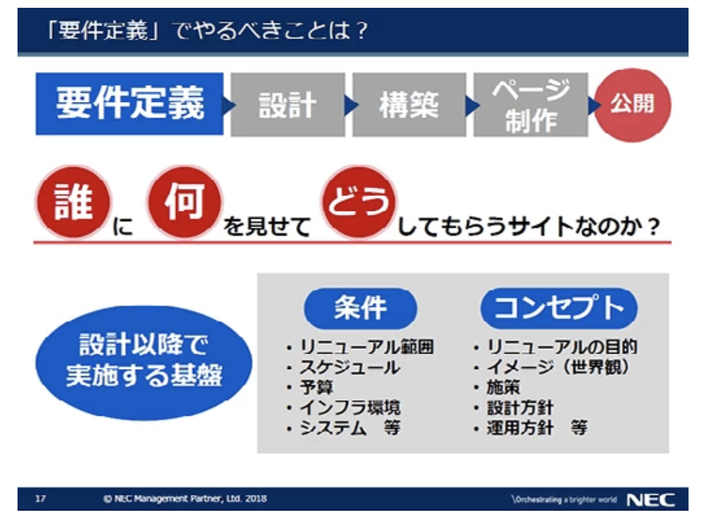
要件定義でやるべきこと　出典Web担当者Forum

④ワイヤーフレームの作成

ワイヤーフレームは、ウェブページのレイアウトと構造を視覚化するための下書きです。これにより、サイトの情報構造やナビゲーションの計画が可能になります。ワイヤーフレームの作成においては、主要なコンテンツエリアやナビゲーションメニューの配置を決定します。

ワイヤーフレームとは？ Webサイト制作で大切なページ構成を確認しよう　出典つなweB

⑤プロトタイプの設計とテスト

プロトタイプは、ウェブサイトのインタラクティブなモデルです。ユーザーのフィードバックを得るために、プロトタイプを使ってテストを行い、デザインの有効性を確認します。プロトタイプは、ユーザーインターフェースの流れや機能を実際に体験できるようにします。

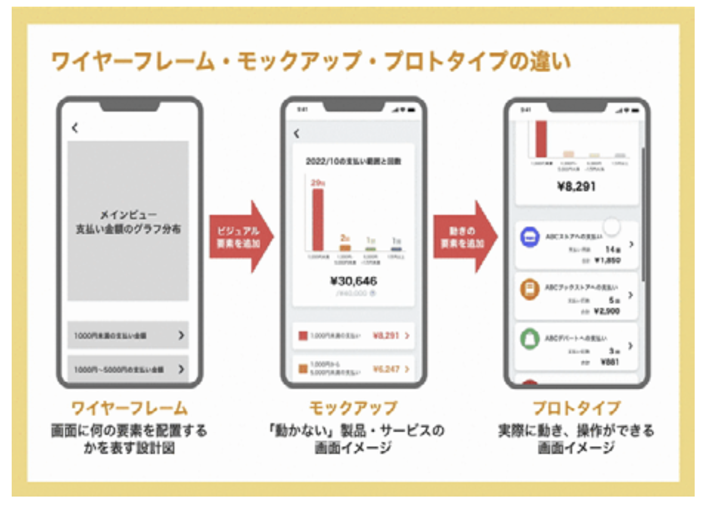
事例でやり方がわかる！プロトタイピングとユーザー評価　出典：株式会社エクサ

⑥フロントエンド開発

フロントエンド開発は、ユーザーが直接触れる部分のコーディングを行います。HTML、CSS、JavaScriptを使用して、デザインを実際のウェブページとして実装します。HTMLでページの構造を作り、CSSでスタイルを適用し、JavaScriptでインタラクティブな機能を追加します。

⑦バックエンド開発

バックエンド開発は、ウェブサイトのサーバーサイドの機能を構築します。データベースの管理やサーバーの設定、APIの開発などが含まれます。例えば、ユーザー登録やログイン機能を提供するためのサーバーサイドロジックを構築します。

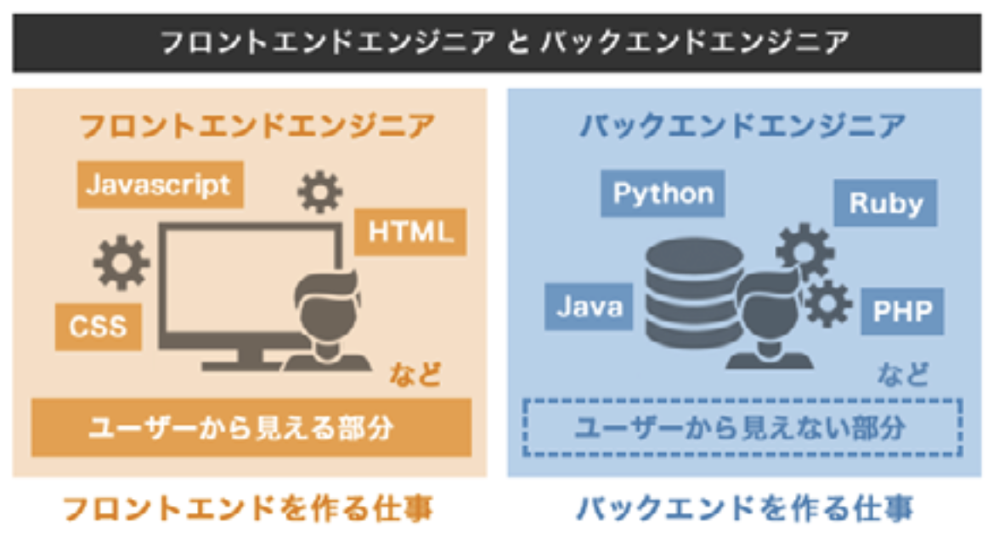
Webエンジニアとの違い　出典：プログラマカレッジ
⑧データベース設計

データベース設計は、データを効果的に管理するための設計プロセスです。データベースの構造やテーブルの設計を行い、データの保存と取得を効率化します。正規化やインデックスの設定が含まれることがあります。

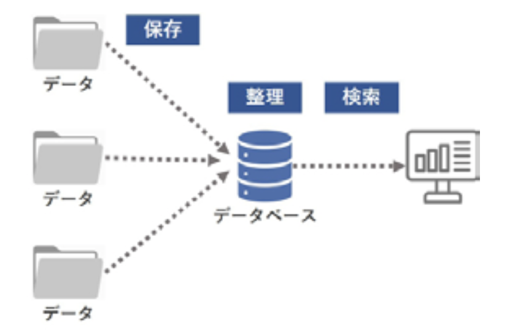
データベースとは？　出典：NTT東日本

⑨機能テストとユーザビリティテスト

機能テストでは、ウェブサイトがすべての機能要件を満たしているかを確認します。ユーザビリティテストでは、ユーザーがサイトを使いやすいかどうかを評価します。ユーザビリティテストでは、実際のユーザーにサイトを使用してもらい、フィードバックを集めることが重要です。

⑩クロスブラウザテストとレスポンシブデザイン

クロスブラウザテストは、異なるブラウザでの表示や動作の互換性を確認します。レスポンシブデザインは、異なるデバイスや画面サイズでの表示を最適化する手法です。メディアクエリを使用して、異なる画面サイズに合わせてレイアウトを調整します。

⑪公開（サーバーへのデプロイ）

ウェブサイトを公開するために、サーバーにファイルをアップロードし、ドメインを設定します。デプロイメントプロセスを適切に管理し、サイトの稼働を開始します。デプロイ後も、サーバーの設定やセキュリティ対策が重要です。
具体例: デプロイ作業には、FTPやSFTPを使用してファイルをサーバーにアップロードする方法、Gitを用いてリモートリポジトリにコードをプッシュする方法などがあります。CI/CD（継続的インテグレーション/継続的デリバリー）ツールを使用して、デプロイプロセスの自動化を行うことも可能です。

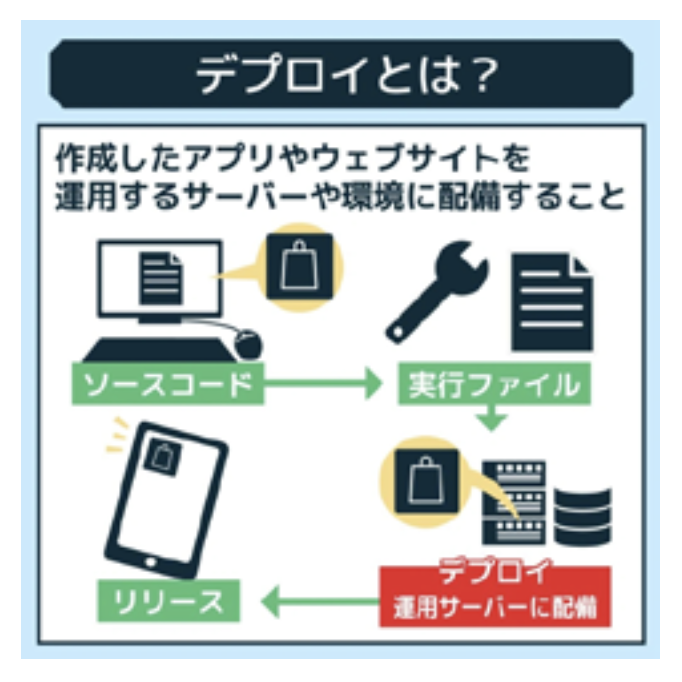
デプロイとは？　出典：JITERA
⑫保守と更新

サイトが公開された後も、定期的な保守や更新が必要です。これには、セキュリティパッチの適用、コンテンツの更新、バグ修正などが含まれます。保守作業は、サイトの安定性とセキュリティを維持するために不可欠です。また、新しい機能の追加やデザインの改良も行われることがあります。

定期的なバックアップの実施や、ユーザーからのフィードバックを基にした改善作業も重要です。また、サイトのパフォーマンス監視やSEOの最適化も保守作業の一部として行われるべきです。

### Section 2-2　Web制作の主要技術とツール

Web制作には、様々な技術とツールが用いられます。ここでは、主要な技術とツールを紹介し、それぞれの役割について説明します。

HTML

HTMLは、ウェブページの構造を定義するためのマークアップ言語です。基本的な要素には、ヘッダー、パラグラフ、リンク、画像などが含まれます。
HTML5では、要素やマルチメディアのサポートが追加されています。例えば、<header>や<footer>タグはページの意味的なセクションを定義するために使用されます。また、<video>や<audio>タグは、ページ内にメディアコンテンツを埋め込むために利用されます。

具体例

HTMLを使用して、基本的なウェブページの構造を作成する方法には、見出しを<h1>タグで設定し、段落を
タグでマークアップすることが含まれます。また、ナビゲーションメニューを<nav>タグで作成し、リンクを<a>タグで追加します。

HTML5の新機能

HTML5では、フォームの新しい入力タイプ、ネイティブの音声・動画サポート、Canvas APIなどが導入されています。これにより、よりリッチなユーザーエクスペリエンスが提供可能です。例えば、新しいフォーム入力タイプ（<input type=”date”>）を使用することで、日付選択が簡単に実装できます。Canvas APIを使用すると、クライアントサイドで動的なグラフィックスやアニメーションを描画することができます。

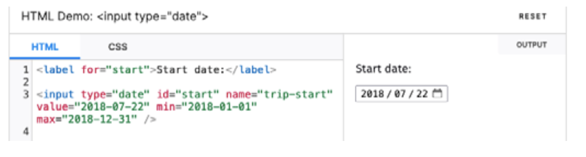

CSS

CSS（Cascading Style Sheets）は、HTMLの構造にスタイルを適用するための言語です。
色、フォント、レイアウトなどを設定し、ウェブページの外観を制御します。CSSでは、セレクタを使用してHTML要素にスタイルを適用します。スタイルシートには、外部スタイルシート、内部スタイルシート、インラインスタイルシートの3つのタイプがあります。外部スタイルシートは、複数のページで共通のスタイルを適用する際に使用されます。

具体例

CSSを使って、ページの見出しに特定のフォントや色を適用する方法には、次のようなコードがあります。

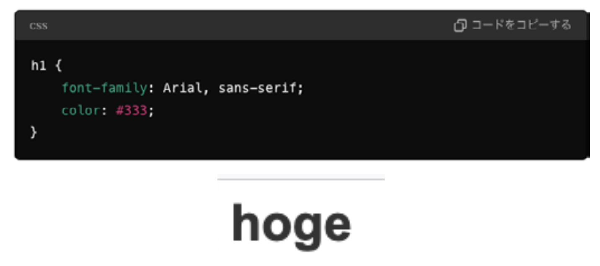

レイアウトとレスポンシブデザイン

CSS GridやFlexboxを使ったレイアウト設計により、複雑なレイアウトも簡単に作成できます。CSS Gridは2次元のレイアウトシステムで、行と列を使ってレイアウトを構築します。Flexboxは1次元のレイアウトシステムで、アイテムの配置と整列を容易にします。レスポンシブデザインでは、メディアクエリを使用して異なるデバイスに対応するデザインを作成します。メディアクエリを使用すると、デバイスの画面サイズや解像度に基づいて異なるスタイルを適用できます。
ｘ

JavaScript

JavaScriptは、ウェブページに動的な機能を追加するためのスクリプト言語です。
基本的な構文、データ型、制御構造などを理解し、インタラクティブな要素を実装します。JavaScriptのデータ型には、文字列、数値、配列、オブジェクトなどがあり、それぞれのデータ型に対する操作方法を理解することが重要です。また、制御構造としては、条件分岐やループ処理があり、これらを使用して動的なコンテンツを生成します。

具体例

JavaScriptでボタンがクリックされたときにアラートを表示するコード例は次の通りです。

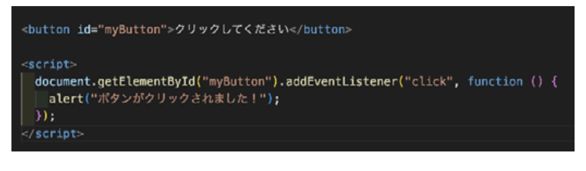

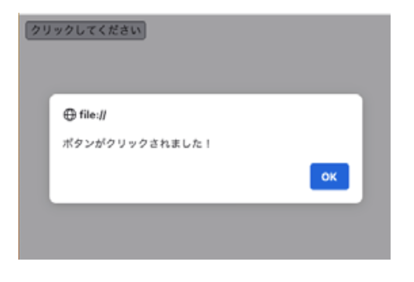

トレンドと新技術

モバイルファーストデザインは、最初にモバイルデバイス向けのデザインを作成し、その後にデスクトップやタブレット向けに拡張するアプローチです。このアプローチにより、最小限の画面スペースで最も重要な情報を優先的に提供できます。レスポンシブデザインにおいても、モバイルデバイスを考慮することで、ユーザー体験を最適化します。

具体例

モバイルファーストデザインを実装する際には、シンプルで直感的なナビゲーションメニューを設計し、タッチ操作に適したボタンサイズやスペーシングを設定します。また、画像やコンテンツの読み込みを遅延させることで、モバイルデバイスでのパフォーマンスを向上させます。

パフォーマンス最適化の手法

ウェブサイトのパフォーマンスを最適化するための手法には、画像の圧縮、コードの最小化、キャッシュの活用、非同期のリソース読み込みなどがあります。画像圧縮ツールやCDN（コンテンツ配信ネットワーク）を使用して、サイトの読み込み速度を向上させることができます。また、JavaScriptやCSSのファイルを最小化することで、HTTPリクエストの回数やファイルサイズを削減し、パフォーマンスを改善します。
サイトのパフォーマンスを測定するためには、GoogleのPageSpeed InsightsやWebPageTestなどのツールを利用します。これらのツールは、サイトのパフォーマンスを分析し、改善のための具体的なアドバイスを提供します。

アクセシビリティ

アクセシビリティの重要性：アクセシビリティは、すべてのユーザーがウェブサイトを利用できるようにするための設計原則です。視覚障害者や聴覚障害者、身体障害者など、さまざまな障害を持つユーザーに配慮したデザインを行います。

アクセシビリティのガイドライン（例: WCAG）に従い、視覚的なコントラスト、キーボードナビゲーション、スクリーンリーダー対応などを実装します。

具体例

アクセシビリティを考慮したウェブサイトでは、画像に代替テキストを提供することで、スクリーンリーダーを使用しているユーザーにコンテンツの意味を伝えることができます。また、キーボードのみでナビゲート可能なサイト構造を設計し、すべてのユーザーがアクセスできるようにします。

ユーザー体験の向上

良好なユーザー体験（UX）は、ユーザーがサイトを使いやすく感じ、目的を達成できるかどうかに大きく関わります。UXデザインには、ナビゲーションの簡潔さ、コンテンツの明確さ、ビジュアルデザインの一貫性などが含まれます。ユーザーのフィードバックを元に、使いやすさを向上させるための改善を行うことが重要です。

UXデザインを改善するためには、ユーザーの行動データやフィードバックを分析し、ユーザーのニーズや課題を特定することが必要です。プロトタイピングやユーザビリティテストを通じて、実際のユーザーがどのようにサイトを利用するかを観察し、改善策を導き出します。

プロトタイピングは、何のため？　出典：SELECK [セレック]

## 第3章　UI/UXの基礎知識

### Section 3-1　UIとUXの違い

まず「UI」と「UX」はよく混同されますが、明確に区別して考える必要があります。

UI（User Interface）

ユーザーインタフェース（UI）とは、ユーザーとシステム・製品の接点（＝見た目や操作部分）です。ボタン・メニュー・入力フォーム・画面デザイン・配色などが該当します。言い換えれば、「ユーザーが実際に触れる部分」です。

UI（User Interface）

ユーザーエクスペリエンス（UX）とは、ユーザーが製品やサービスを通じて得る「体験全体」です。UIを含みますが、それだけではなく、「使う前・使っている間・使った後」の感情・印象・満足度を含みます。たとえば、「使いやすい」「わかりづらい」「また使いたい」と感じる部分がUXです。

> **POINT**

UIは“手段”、UXは“結果”。
良いUIはUXを支える要素のひとつですが、UXそのものではありません。

UXを構成する要素（GarrettのUX 5層モデル）

アメリカの情報設計家 Jesse James Garrett は、UXを5つの層で整理しました。このモデルは、UXを構築的に理解するうえで非常に有用です。

１.戦略層（Strategy）
製品・サービスを通して何を達成したいのか（ビジネス目標）とユーザーは何を求めているのか（ユーザー目標）
を定義する段階。
例：求人サイトなら「応募数を増やす」がビジネス目標、「条件で仕事を探したい」がユーザー目標。

２.要件層（Scope）
どの機能やコンテンツを提供すべきかを具体化する段階。
例：「検索機能を設ける」「マイページ機能を追加する」など。

３.構造層（Structure）
情報の整理・画面遷移・操作の流れを設計する段階。いわゆる「情報アーキテクチャ（IA）」の設計。
例：トップ→カテゴリ一覧→詳細ページ→応募フォーム、という階層設計。

４.骨格層（Skeleton）
レイアウト・ナビゲーション・UIパーツなど、画面の骨組みを設計する段階。
ワイヤーフレームで具体的な構成を示す。

５.表層（Surface）
色、フォント、アイコンなど、視覚デザイン・感覚的印象の最終段階。
ブランドイメージや情緒的価値もここで表現される。

UX設計の基本プロセス

UX設計は「ユーザー中心設計（Human-Centered Design, HCD）」の流れで行います。
調査：ユーザーの行動や課題を観察・インタビューで把握
分析：ペルソナ・シナリオなどでユーザー像をモデル化
設計：要件整理・情報構造・ワイヤーフレーム作成
試作・評価：プロトタイプを使ってテストし、改善を繰り返す

この一連の流れを通じて、「使いやすく・わかりやすく・満足度の高い体験」をデザインします。

UI/UX設計のゴール

UXのゴールは「ユーザーが目的をスムーズに達成し、良い印象を持つこと」です。そのためには、以下の視点が重要です。
使いやすさ（Usability）：操作のわかりやすさ・誤操作の少なさ
有用性（Usefulness）：ユーザーの目的に合っているか
信頼性（Credibility）：安心感・信頼できる見た目や動作
満足感（Satisfaction）：気持ちよく使える感覚や達成感

UXとはデザインの“感性”だけでなく、“科学的に設計・検証する対象”でもあります。

### Section 3-2　ユーザー調査手法（観察・インタビュー）

なぜユーザー調査が必要か

UX設計の第一歩は「ユーザーを知ること」です。多くのプロジェクトでは「自分たちの想定するユーザー」を前提に設計しますが、実際にはユーザーの行動や考え方は想定と異なることが多いです。
ユーザー調査（User Research）は、「ユーザーはどんな状況で」「何を期待して」「どんな課題を感じているか」を把握するために行います。調査を行うことで、設計時の思い込みを防ぎ、実際の利用文脈を理解できるため、UX改善の根拠を得られるという効果があります。

主な調査手法の分類

ユーザー調査は大きく 定性調査 と 定量調査 に分かれます。
定性調査
内容：観察・インタビューなど。ユーザーの行動や意図を深く理解
目的：「なぜそう感じるのか」を知る

定量調査
内容：アンケート・ログ分析など。数値で傾向を把握
目的：「どの程度そう思うか」を測る

UX設計の初期段階では、まず「定性調査」で生の声や行動を理解することが重要です。

観察（オブザベーション）

観察は、ユーザーが実際にサービスを使う様子を見て、行動や感情を記録する手法です。
観察のポイントは次の3点です。

①実際の利用環境で行う（フィールド調査）：現場での行動はリアルな課題を映し出す。
②非介入的に観察する：ユーザーの自然な行動を崩さない。
③発言・操作・迷いの瞬間を記録する：後で課題分析に使う。

記録例
「検索ボックスを2回クリックした」「入力途中で止まって周囲を見た」「完了後に“終わった”とつぶやいた」
など、行動の裏にある心理を推測できるようにする。

インタビュー調査

ユーザーの考え方・背景・動機を直接聞き出すための手法です。
構成例（セミ構造化インタビュー）
導入：自己紹介・目的の説明・同意確認
行動質問：「最近、〇〇を使ったのはいつですか？」
感情質問：「そのとき、何が一番困りましたか？」
改善質問：「こうだったら良いと思う点はありますか？」

インタビューのコツとしては以下の様な点があります。
「なぜ？」を2～3回繰り返して深掘りする
誘導せず、相手の言葉を尊重する
メモだけでなく、録音・録画（許可の上）を活用する

### Section 3-3　ペルソナと構造化シナリオ法

ペルソナとは

ペルソナ（Persona）とは、典型的なユーザー像を具体的な人物として設定したものです。単なる「想定ユーザー」ではなく、実際の調査データをもとにした代表的モデルです。

ペルソナ設定の目的
チーム全員が共通のユーザーイメージを持てる
意思決定を「誰のために？」で一貫させる
デザインの優先順位を明確にする

ペルソナの項目例
名前・年齢・職業・性格
行動パターン（いつ・どこで・どんなデバイスで使うか）
ニーズ・不満・モチベーション
代表的な発言（例：「手続きはスマホで完結したい」）

構造化シナリオ法とは

構造化シナリオ法（Structured Scenario Method）は、ユーザーが特定の状況でどのように行動し、何を感じ、どんな結果に至るかをシナリオ（利用状況の物語）として描く手法です。
これは単なるストーリーではなく、行動（Action）や思考・感情（Motivation）、背景（Context）を構造的に記述する点が特徴です。

シナリオの3レベル

下記の様に、ユーザー体験を多層的に整理して設計に活かします。

１．利用シナリオ（User Scenario）
ユーザーが目的を達成するまでの流れを物語として記述
例：「Aさんは外出先で空き時間にアプリを開き、勉強を始める」

２．機能シナリオ（System Scenario）
システムがどのように応答し、ユーザーを支援するかを記述
例：「アプリは前回の続きから学習画面を自動で表示する」

３．操作シナリオ（Interaction Scenario）
具体的なUI上の操作と反応を記述
例：「Aさんが“再開する”ボタンを押すと、アニメーションが再生される」

シナリオ作成のステップ

①調査データの整理：観察・インタビューで得た行動・課題を抽出
②ペルソナを設定：典型的な1〜2名の代表像を作成
③行動シナリオを描く：ペルソナが目標を達成するまでの流れを物語化
④問題点と改善ポイントを明示：どこで迷うか、どんな支援が必要かを特定
⑤設計に反映：要件やUI設計に具体的に落とし込む

まとめ

UX設計では「データ」だけでなく、「物語」が重要です。ペルソナとシナリオを通して、ユーザーの体験をチーム全員が共有できる形式に変換します。これにより、デザインが単なる表層装飾ではなく、「ユーザーの行動と感情を支援する設計」になります。

## 第4章　デザインの基本概念

### Section 4-1　デザインとは何か

デザインの定義

デザインとは、特定の目的や目標を持って計画的に創造されるプロセスであり、視覚的、物理的なアウトプットを生み出すことです。
デザインは、機能性、美観、使いやすさ、感情的な影響など、さまざまな要素を考慮しながら進められます。

デザインの目的は多岐にわたり、単なる視覚的な美しさだけでなく、機能性、使いやすさ、ユーザー体験、ブランド価値を向上させるなど、下記のように様々な側面を含みます。

【1問題解決】

デザインの最も基本的な目的は、ユーザーのニーズや課題を特定し、それに対する解決策を提供することです。ユーザーインターフェース（UI）の改善や製品の使いやすさを向上させるなど、ユーザーの利便性を追求します。

【2美的価値の提供】

デザインは視覚的な美しさや魅力を提供します。美的価値は人々の感情や行動に影響を与え、製品やブランドの魅力を高めます。例えば、グラフィックデザインやプロダクトデザインは、視覚的な魅力と機能性を両立させることが求められます。

【3ユーザーエクスペリエンスの向上】

デザインは、ユーザーが製品やサービスを使用する際の体験を向上させることを目的としています。使いやすさ、楽しさ、満足感などが重要な要素であり、良いユーザーエクスペリエンスは顧客の忠誠度を高めます。

【4ブランドの確立と差別化】

デザインは、企業や製品のブランドイメージを確立し、競合他社との差別化を図るために重要です。強力なブランドデザインは、認知度を高め、消費者の信頼を築きます。ロゴデザインやパッケージデザインは、その一例です。

【5情報の効果的な伝達】

デザインは、情報をわかりやすく、効果的に伝えるための手段です。視覚的な要素を通じて、複雑な情報をシンプルに伝えることができ、理解を深め、意思決定をサポートします。

デザインは、これらの多様な目的を通じて、単なる視覚的な装飾を超えた広範な役割を果たしています。
それは、問題解決、美的価値の提供、ユーザーエクスペリエンスの向上、ブランドの確立、情報伝達など、多くの側面で社会や経済、文化に貢献しています。

デザインの起源

デザインの起源は古代にまで遡ります。
古代エジプトやギリシャ、ローマでは、建築物や工芸品に高度なデザインが施されていました。

中世ヨーロッパでは、ゴシック建築や写本装飾がデザインの代表例となり、ルネサンス期にはレオナルド・ダ・ヴィンチなどの著名な芸術家が、科学と芸術を融合させたデザインを生み出しました。

産業革命以降、デザインは工業製品にも広がり、アーツ・アンド・クラフツ運動やバウハウス（ドイツに設立された、工芸・写真・デザインなど総合的な教育を行った学校）などがデザインの教育や実践に革新をもたらしました。

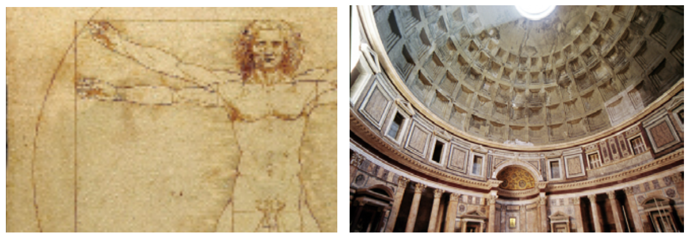

ウィトルウィウス的人体図　出典:wikipedia　　　　　　ハドリアヌス帝が作ったパンテオンの内部　出典: wikipedia

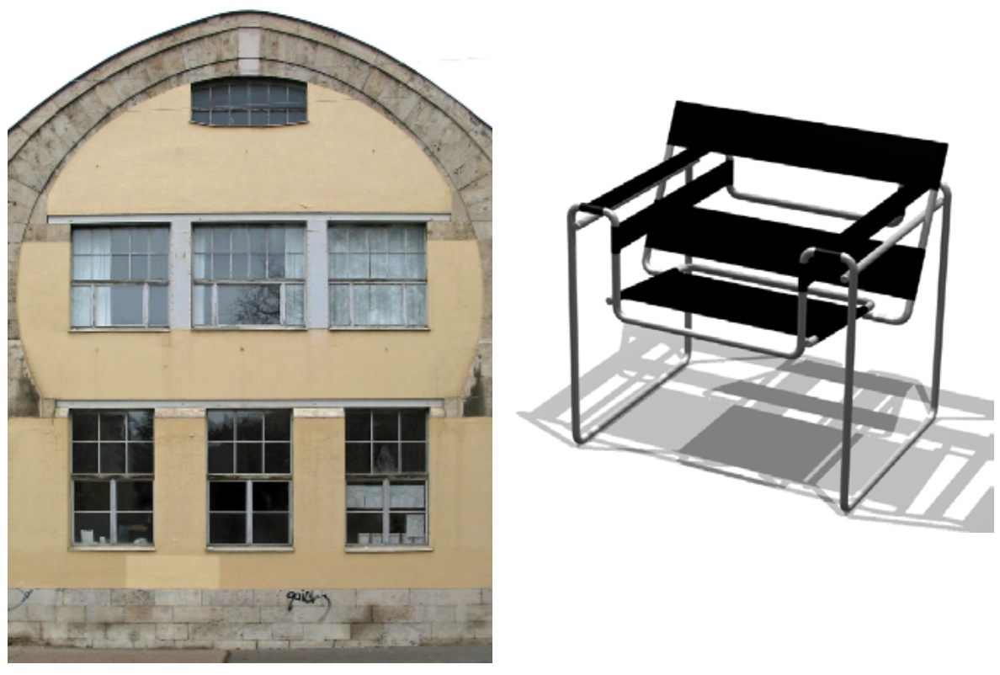
バウハウス ヴァイマル校出典: wikipedia　 　　　　　　　　　　　　　　　　　　　　マルセル・ブロイヤーのワシリー・チェア　出典:wikipedia

デザインのプロセス

デザインは一連の計画的なステップを経て進行します。デザインのプロセスは一般的に以下のように構成されています。

【1リサーチとインスピレーション】

問題を理解し、デザインのインスピレーションを得るための調査を行います。調査には、市場調査、ユーザーインタビュー、競合分析などが含まれます。

【2アイデア生成とコンセプト開発】

アイデアをスケッチし、デザインコンセプトを形成します。この段階では、多くのアイデアを出し、最も適したコンセプトを選びます。

【3プロトタイピング】

初期の試作を作成し、アイデアを具体化します。プロトタイプは、ユーザーやステークホルダーに対してアイデアを視覚的に示すために重要です。

【4テストとフィードバック】

プロトタイプをテストし、ユーザーからのフィードバックを収集します。この段階で問題点を発見し、改善を行います。

【5最終デザイン】

フィードバックを基に最終的なデザインを完成させます。この段階では、詳細な設計や技術的な要件を満たすための調整が行われます。

デザインの重要性

デザインは単なる視覚的な装飾ではなく、社会や経済、文化に大きな影響を与える力を持っています。以下は、デザインの重要性を具体例です。

【1社会的影響力】

デザインは社会において重要な役割を果たします。例えば、情報の伝達を容易にし、教育や啓発活動に役立てることができます。公共空間のデザインは、人々の生活の質を向上させることができます。

【2経済的価値】

良いデザインは製品やサービスの付加価値を高め、企業の競争力を強化します。デザインの力でブランドの認知度を高めることができ、結果的に売上や利益の向上に繋がります。

【3文化的価値】

デザインは文化の表現手段でもあります。地域や国のアイデンティティを反映したデザインは、その文化を広め、保存する役割を果たします。伝統工芸品や建築様式などがその例です。

【4イノベーションの推進】

デザインは新しいアイデアやソリューションを生み出す源泉です。創造的なデザインプロセスは、技術革新や新しい市場の開拓を促進します。
デザインの未来

技術の進化とともに、デザインも常に進化しています。AIやVR、ARなどの新しい技術は、デザインの方法や可能性を広げています。
また、サステナビリティやインクルーシブデザインなど、社会的課題に取り組むデザインも注目されています。デザインは、未来の生活を豊かにするための重要なツールであり続けるでしょう。

サステナビリティ（持続可能性）

サステナビリティとは、現在の世代が将来の世代のニーズを満たす能力を損なうことなく、自分たちのニーズを満たすことを意味します。環境、経済、社会の三つの側面で持続可能な発展を目指す概念です。デザインにおいてサステナビリティは、環境に優しい素材や製造プロセスを採用し、資源の無駄を最小限に抑えることを指します。

【例】
エコデザインの家具: 再生可能な木材を使用し、有害な化学物質を使わずに製造された家具。
エネルギー効率の高い建物: 断熱材や省エネ機器を使用し、エネルギー消費を抑えた建築物。

リサイクル可能な製品: プラスチック製品がリサイクル可能な材料で作られており、使用後にリサイクルされることを前提としてデザインされている。

インクルーシブデザイン（包括的デザイン）

インクルーシブデザインとは、すべての人々が利用可能な製品や環境をデザインすることを目的としています。これには、年齢、性別、能力、文化背景などの違いを考慮し、多様なユーザーが利用できるようにすることが含まれます。

【例】
バリアフリーデザインの公共施設: 車椅子ユーザーが利用できるスロープや広いドアが設置されている建物。

ユニバーサルデザインの製品: 誰でも使いやすい形状のドアノブや簡単に操作できる家電製品。

多言語対応のウェブサイト: 複数の言語で情報が提供されており、異なる言語を話すユーザーがアクセスできるウェブサイト。

### Section 4-2　デザインの要素について

デザインの要素とは、視覚的な作品やプロジェクトを構成する基本的な要素を指し、デザイナーが効果的にコミュニケーションするために使用されます。ここでは、主なデザインの要素（６要素）について説明します。

ライン（線）

ライン（線）はデザインにおいて非常に基本的かつ重要な要素です。
境界を作成し、方向性や動きを示すために使用されます。ラインは形や輪郭を定義し、視覚的な流れを導く役割を果たします。

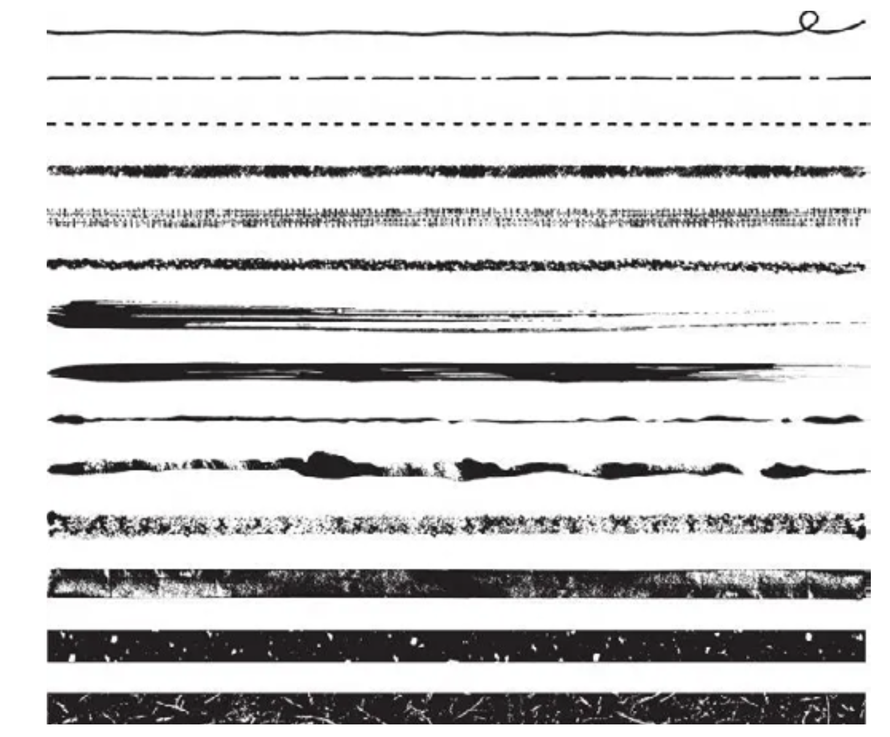
デザインにおける線は様々な密度や曲線を持つ 出典： Adobe Stock Photo

シェイプ

シェイプはデザインの構成要素として重要で、物体や領域の輪郭を定義します。
視覚的なエレメントを整理し、識別可能にするために使用されます。

幾何学的シェイプ（Geometric Shapes）: 円、四角、三角など。

規則的で安定した印象を与える。

有機的シェイプ（Organic Shapes）: 自然な形、流動的な輪郭。

自然な美しさや柔らかさを表現。

抽象的シェイプ（Abstract Shapes）: シンボルやアイコンなど。

抽象的で簡略化された形。

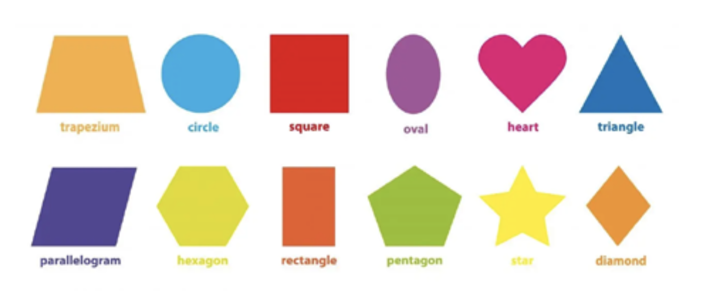
デザイナーが利用できる多くの幾何学的なシェイプには、円、長方形、正方形、楕円、ハート型、3角形、平行四辺形、不等辺四辺形、6角形、5角形、星形、菱形などがある　出典： Adobe Stock Photo

カラー（色）

色は感情や気分を強く伝える要素であり、視覚的な魅力を高めます。デザインにおいて重要な要素であり、特定の感情や反応を引き起こすために使用されます。
色相（Hue）: 色の種類。
例えば、赤、青、黄。

明度（Value/Brightness）: 色の明るさ。

明るい色は軽快感を、暗い色は重厚感を与える。

彩度（Saturation）: 色の鮮やかさ。

高彩度はエネルギーや活力を、低彩度は落ち着きや洗練を示す。

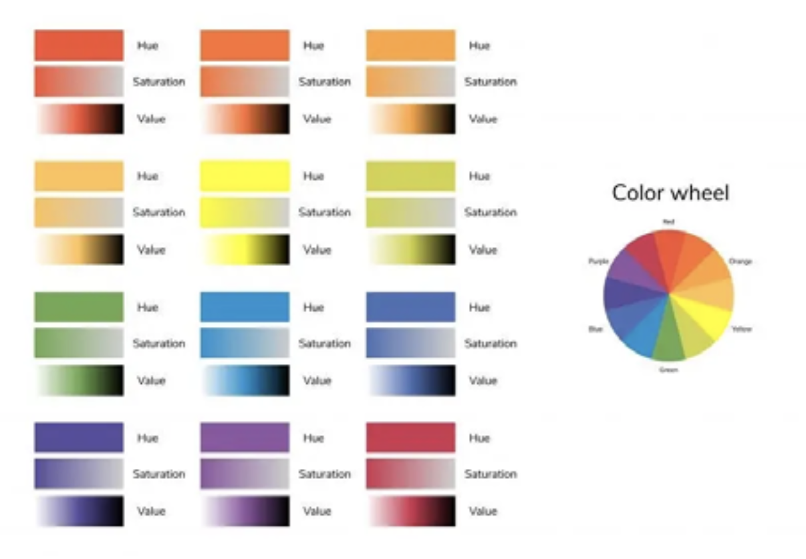
カラーホイールを使うと、色相、彩度、明度の違いを確認できる 出典： Adobe Stock Photo

テクスチャー（質感）

質感は物体の表面の感触や見た目の質感を表現します。視覚的な深みや興味を追加し、デザインをよりリアルに感じさせるために使用されます。

視覚的質感（Visual Texture）: 見るだけで感じる質感。

例えば、画像やパターン。

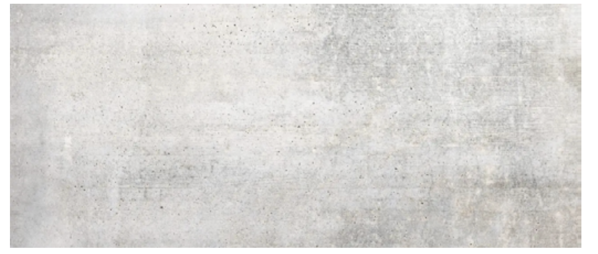
石のテクスチャの背景はより堅く殺伐とした感覚をつくり出す 出典： Adobe Stock Photo

綿の布地の背景が柔らかさと心地よさの感覚を生じさせる 出典： Adobe Stock Photo

触覚的質感（Tactile Texture）: 実際に触って感じる質感。

例えば、紙や布。

タイポグラフィ

タイポグラフィはデザインにおけるテキストの視覚的なスタイルと配置を指し、情報の読みやすさや視覚的な魅力を高めるために重要です。

フォント（Font）

セリフ（Serif）: 文字の端に装飾的な線があるフォント。伝統的でフォーマルな印象を与える。

サンセリフ（Sans-serif）: 文字の端に装飾がないフォント。モダンでクリーンな印象を与える。
スクリプト（Script）: 手書き風のフォント。個性的でエレガントな印象を与える。

サイズ（Size）

大きさによって視覚的な階層を作り、重要な情報を強調する。
ヘッディング、サブヘッディング、本文のサイズをバランス良く使い分ける。

行間（Line Spacing / Leading）

行と行の間のスペース。適切な行間は読みやすさを向上させる。
狭すぎると詰まりすぎて読みにくく、広すぎると視線の流れが途切れる。

文字間（Letter Spacing / Kerning）

文字と文字の間のスペース。特定のフォントやデザインに合わせて調整することで視覚的なバランスを保つ。

配置（Alignment）

左揃え、右揃え、中央揃え、均等揃えなど。テキストの配置によって視覚的な秩序を作り出す。
読みやすさや美しさに影響を与えるため、適切な配置を選択することが重要。

色（Color）

テキストの色は背景とのコントラストを考慮して選ぶ。
重要な情報を強調するために異なる色を使うことがある。

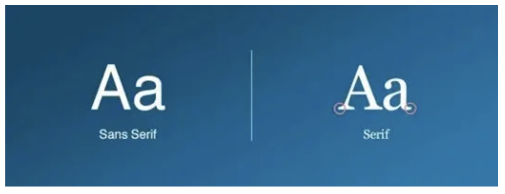
タイポグラフィはある感情を想起させたり視覚的な階層をつくり出すために重要 出典： ImpactPlus

### Section 4-3　デザインの原則について

「デザインの原則」は、デザインにおいて効果的かつ美しい結果を得るための基本的なルールです。
これらの原則は、視覚的な要素をどのように配置し、組み合わせるかに関するルールであり、デザインが単なる要素の寄せ集めではなく、機能性と美しさとまとまりのある一貫性を兼ね備えたデザインとなるように導きます。以下に、代表的なデザインの原則について、説明します。

ユニティ（統一）

統一は、デザイン内の全要素が一貫性を持って協調し合うことで、デザイン全体がまとまりのある一つのデザイン（作品）として認識されるようにするルールです。要素がバラバラに見えず、全体が一体感を持つことで、視覚的な安定感と美しさを生み出します。

カラー（カラーパレット）の統一

一貫したカラー（カラーパレット）を使用することで、デザイン全体に調和をもたらし、統一感を確保します。

フォントの一貫性

同じフォントスタイルや書体を使用することで、テキスト部分に統一感を持たせます。

レイアウトの統一

グリッドシステムや整列を使用して、デザイン要素を整理し、全体が調和するように配置します。

エンファシス（強調）

強調は、デザインの中で特定の要素を際立たせ、視覚的な注目を集める方法です。これにより、デザイン全体の中で最も重要な部分に見る人の視線を誘導し、メッセージや目的を明確に伝えることができます。強調を実現する方法には下記があります。

コントラスト

異なる色、サイズ、形状、テクスチャなどを使用して、他の要素との違いを強調します。たとえば、暗い背景に明るい色を使ったり、小さいテキストの中に大きなタイトルを配置したりします。

位置

重要な要素を目立つ位置に配置します。視覚的に最初に目に入る場所（通常は中央やトップ）に配置することで、自然とその部分に視線が集まります。

サイズ

重要な要素を他の要素よりも大きくすることで、視覚的な優先順位を示します。たとえば、ポスターのタイトルを大きく表示し、サブタイトルや本文を小さくすることで、タイトルが強調されます。

色

特定の色を使って要素を目立たせます。たとえば、モノクロのデザインの中に鮮やかな色を使った要素を入れると、その要素が際立ちます。

形状や形

他の要素とは異なる独自の形状や形を使って、視覚的に目立たせます。丸い形状が多い中で四角い形状を用いると、その四角い要素が強調されます。

テクスチャ

他の要素と異なるテクスチャを使って、視覚的なインパクトを与えることも効果的です。滑らかな要素の中にザラザラとしたテクスチャを加えると、その部分が目立ちます。

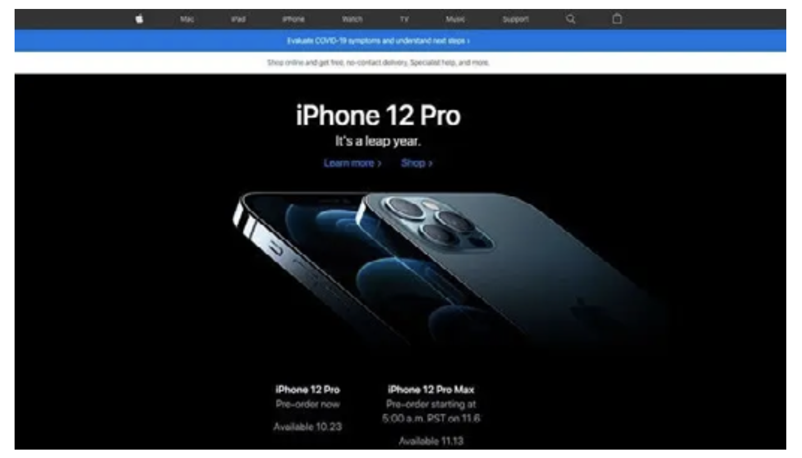
製品と重要な情報がページの先頭に表示されユーザーに注目させるよう、意図的にデザインされている。　出典: Apple

ハイアラーキー（階層）

階層は、デザインにおいて異なる要素に優先順位を付け、それに応じた視覚的な配置を行うことです。これにより、見る人が自然に重要な情報から順に視線を移動できるようになります。階層を構築する方法は下記があります。

サイズ

重要な情報を大きな文字で表示し、次に重要な情報をより小さな文字で表示するなど、サイズの違いを用いて階層を示します。

色

強調色を使って重要な要素を目立たせ、視線を誘導します。例えば、明るい色や目立つ色を使うことで、重要な部分を強調します。

位置

ページの上部や中央など、視線が最初に向かいやすい場所に重要な情報を配置し、自然な視線の流れを作ります。

スペース

要素間に適切な空間を設けることで、情報が混み合わないようにし、階層を視覚的にわかりやすくします。余白を使って重要な部分を目立たせることができます。

フォントスタイル

異なるフォントや太字・斜体などのスタイルを使って、情報の重要度に応じた階層を作ります。

階層を適切に設定することで、見る人が情報を整理して受け取ることができ、メッセージを効果的に伝えることが可能になります。特に、複雑な情報が含まれるデザインやウェブサイト、ポスターなどでは、階層を使って視線の流れをコントロールし、重要な情報が見落とされないようにすることが重要です。

例

ウェブページ: ヘッダーには大きなタイトルやナビゲーションメニューを配置し、サブヘッダーや本文はそれよりも小さいサイズで表示することで、情報の優先順位を明確にします。
新聞のレイアウト: 一面に大きな見出しと写真を配置し、サブ見出しや詳細な記事は小さめのフォントや下部に配置することで、自然な読み進め方を導きます。
階層はデザインの中で重要な要素を強調し、情報の流れを整理するための基本的なルールであり、他のデザイン原則（強調やバランス）とも密接に関連しています

スケール（比率）

スケールは、デザイン要素の大きさを調整することにより、重要な情報を際立たせたり、視覚的な優先順位を作ったりする手法です。異なるスケールの要素を組み合わせることで、デザインに深みやダイナミズムを加えることができます。スケールの役割は下記の通りです。

強調

重要な要素を大きくすることで、他の要素との比較でその部分を目立たせます。たとえば、大きなヘッドラインや画像を使って、視線を自然に引きつけることができます。

階層

異なるスケールの要素を配置することで、情報の優先順位や流れを視覚的に示すことができます。大きい要素が重要度が高く、小さい要素が補足情報であることを示すことが一般的です。

視覚的なインパクト

スケールを操作することで、デザインに劇的な効果を生み出し、見る人の注意を引くことができます。極端に大きな要素と極端に小さな要素を組み合わせると、視覚的な興味を喚起します。

例

ポスターや広告: イベントのタイトルやキャッチフレーズを大きく配置し、詳細情報を小さな文字で表示することで、視線を最初に重要な情報に引きつけます。

ウェブデザイン: ヒーローイメージ（画面上部に大きく配置された画像やビジュアル）を使って、訪問者の視線をまずそのビジュアルに集め、その後に小さなテキストやボタンへ誘導します。

書籍のレイアウト: 章のタイトルを大きく配置し、本文を小さめに設定することで、章の始まりを明確に示し、テキストの流れを視覚的に整理します。

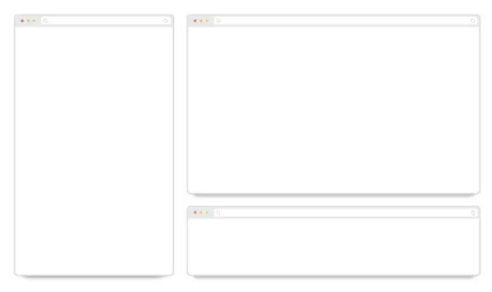
サイズ変更が可能であることを示す 3 つの異なるサイズのブラウザ画面出典: アドビ

コントラスト（対比）

ントラストは、異なる要素を比較して、目立たせたり、視覚的な焦点を作り出したりするための手法です。色、形、大きさ、テクスチャなどの違いを強調することで、デザインの中で重要な要素を際立たせることができます。下記はコントラストを実現するための方法です。

色のコントラスト

異なる色を組み合わせることで、要素が目立つようにします。たとえば、明るい背景に暗いテキストを配置することで、テキストが読みやすくなります。補色（色相環で反対側に位置する色）を使うと強いコントラストが得られます。

明暗のコントラスト

明るい色と暗い色を組み合わせて、視覚的な差異を作ります。例えば、白い背景に黒い文字を配置すると、高いコントラストが得られます。

サイズのコントラスト

大きさの違いを使って、要素の重要度を示します。大きな要素と小さな要素を組み合わせることで、視線を引きつけることができます。

形状のコントラスト

異なる形状やパターンを使用して、要素の違いを際立たせます。例えば、円形と四角形を組み合わせることで、視覚的に目立つコントラストが生まれます。

テクスチャのコントラスト

異なるテクスチャを使って、要素の違いを強調します。滑らかな表面と粗い表面を組み合わせることで、視覚的な興味を引きます。

例

ウェブサイト: 重要なボタンやリンクに強い色のコントラストを使用して、ユーザーの注意を引きつける。
ポスター: 大きなタイトルと小さなサブタイトルのサイズコントラストを使って、情報の優先順位を示す。
印刷物: 明るい背景に暗いテキストを配置して、テキストの可読性を高める。

コントラストは、デザイン内で視覚的な焦点を作り、要素の違いを際立たせるために非常に重要です。色、サイズ、形状、テクスチャの違いを活用することで、デザインがより効果的で魅力的なものになります。

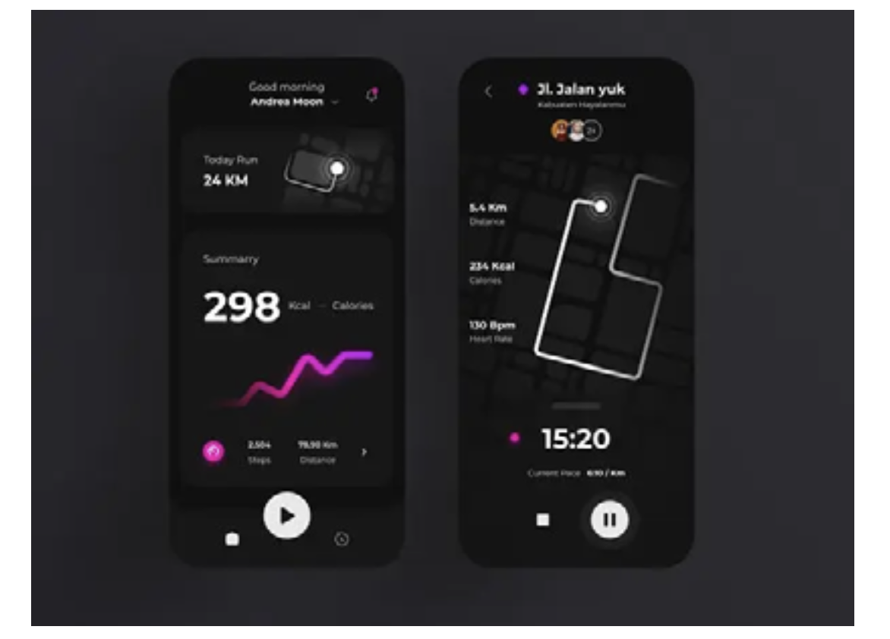
コントラストによりユーザーの注意がテキストに向けられる　出典: voxy St

リピート（繰返し）

繰り返しは、デザイン内で同じ要素やパターンを意図的に繰り返すことで、一貫性を持たせたり、視覚的なリズムや調和を生み出す手法です。繰り返しを用いることで、デザインに統一感を持たせ、見る人に強い印象を与えることができます。

繰り返しは、デザインにおいて一貫性と調和をもたらし、視覚的なリズムを作り出すための重要な手法です。これにより、デザイン全体がまとまりを持ち、受け手にとって理解しやすく、記憶に残りやすくなります。

繰り返しを実現する方法には以下があります。

色の繰り返し

同じ色を使って、デザイン内で一貫性を持たせます。たとえば、ウェブサイトのボタンや見出しに同じカラーパレットを使用することで、視覚的な調和を図ります。

フォントの繰り返し

同じフォントやフォントスタイルを使用して、テキストの部分に統一感を持たせます。たとえば、すべての見出しに同じフォントを使い、本文には別のフォントを使うことで、情報の階層を示すことができます。

形状やパターンの繰り返し

同じ形状やパターンを繰り返すことで、デザインにリズムや一貫性を持たせます。たとえば、アイコンやグラフィック要素を繰り返し配置することで、デザイン全体に統一感を与えることができます。

テクスチャの繰り返し

同じテクスチャを使用して、デザインの一部に統一感や視覚的な興味を持たせます。たとえば、背景やボタンに同じテクスチャを使うことで、デザインに深みを加えることができます。

レイアウトの繰り返し

同じレイアウトのパターンを使って、ページやスライド間で一貫性を持たせます。たとえば、すべてのページに同じヘッダーやフッターを使用することで、デザイン全体の統一感を保ちます。

例

ウェブサイト: 同じカラースキームやフォントスタイルを使って、ナビゲーションメニューやボタンをデザインし、統一感を持たせます。
広告デザイン: 同じビジュアルスタイルやパターンを繰り返すことで、ブランドのアイデンティティを強調します。
印刷物: パンフレットや冊子で、同じレイアウトやデザイン要素を繰り返して、統一感を持たせます。

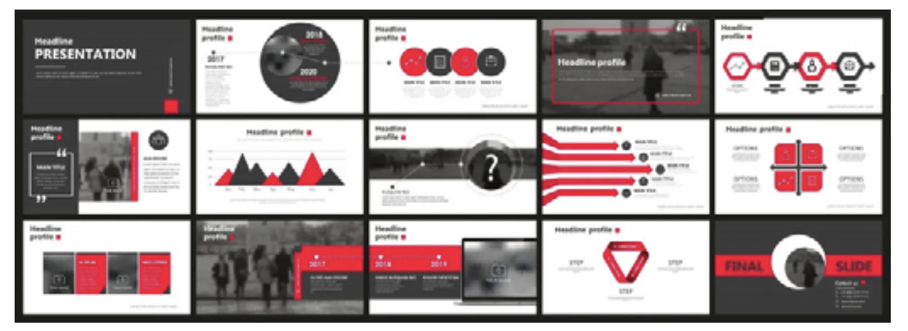
デザイン要素の繰り返しを示す 15 のスライド　出典: アドビ

## 第5章　タイポグラフィ

### Section 5-1　タイポグラフィの基本

タイポグラフィは、文字のデザインと配置に関する技術と芸術を指します。デザインの中で重要な要素であり、適切なタイポグラフィは情報の可読性を高め、視覚的な魅力を引き出します。

フォント

フォントは、デジタルまたは印刷物で使用される文字のデザインスタイルを指し、タイポグラフィの基本要素のひとつです。フォントは、テキストの可読性や視覚的な印象に大きな影響を与えるため、デザインにおいて非常に重要です。明朝体、ゴシック体、丸ゴシック体、装飾書体、セリフ体、サンセリフ体、スクリプト体、ラウンデッド体、デコラティブ体など、多くの種類があります。

フォントファミリー

特定のデザインスタイルを持つフォントの集合体で、同じ基本デザインに基づく異なるスタイルやウェイト（太さ）が含まれています。フォントファミリーを使用することで、デザインに統一感を持たせつつ、異なる強調や役割を持たせることができます。

スタイル

レギュラー: 標準的なフォントスタイル。基本のデザインで、本文や長文に最適です。
ボールド: 強調されたスタイル。重要な情報や見出しに使用します。
イタリック: 傾斜のあるスタイル。引用や強調に使用されることが多いです。
ライト: 軽やかで細いスタイル。サブヘッディングやデザイン要素に使用します。
セミボールド: ボールドよりも少し軽めの強調。適度な強調が可能です。

ウェイト

ウエイトは、フォントの太さを示します。一般的には、Thin（細い）から Black（非常に太い）までの範囲があります。
ウェイトの例: Light、Regular、Medium、Bold、Black。

幅

フォントの幅は、文字の横幅の広さを指します。通常、標準の幅に加えて、Extra Condensed（非常に狭い）や Extra Expanded（非常に広い）などがあります。

バージョン

同じフォントファミリー内でも、バージョンによってデザインの細部や特徴が微調整されることがあります。これには、オリジナルデザインのアップデートや改良が含まれます。

統一感の保持

フォントファミリーを使うことで、デザインに一貫性を持たせることができます。同じファミリー内の異なるスタイルを組み合わせることで、視覚的な調和が得られます。

強調と階層の表現

デザイン内で情報の階層を表現するために、フォントファミリーの異なるスタイルを使用します。たとえば、本文にはレギュラー、見出しにはボールド、引用にはイタリックを使用することで、情報の重要性や関係性を明確にすることができます。

ブランドのアイデンティティ

一貫したフォントファミリーの使用は、ブランドのアイデンティティを強調します。特定のフォントファミリーを使用することで、ブランドの認知度を高めることができます。

ユーザビリティの向上

さまざまなウェイトやスタイルを使うことで、テキストの読みやすさを向上させることができます。適切なフォントスタイルを選ぶことで、ユーザーが情報を簡単に読み取ることができるようにします。

デザインの目的

デザインの目的やコンテンツの種類に応じて、フォントファミリーを選びます。例えば、ビジネス文書にはクリーンでプロフェッショナルなサンセリフ体、クリエイティブなプロジェクトにはユニークなディスプレイ体を選ぶことがあります。

ブランドのトーンとスタイル

ブランドのトーンやスタイルに合わせてフォントファミリーを選びます。エレガントで高級感のあるブランドには、セリフ体の美しいデザインが適しているかもしれません。

読みやすさと可読性

フォントファミリー内の各スタイルが、異なる用途やコンテンツに対して読みやすさを提供することを確認します。特に、長文や印刷物では、可読性の高いスタイルを選ぶことが重要です。

ライセンスとコスト

フォントファミリーの選択時には、ライセンスやコストも考慮する必要があります。商用利用や大規模なプロジェクトに適したライセンスを持つフォントファミリーを選ぶことが求められます。

まとめ

フォントファミリーは、デザインの統一感や階層、ブランドアイデンティティを確立するための重要な要素です。異なるスタイルやウェイトを効果的に使用することで、デザインの目的に合わせた視覚的な魅力を引き出すことができます。フォントファミリーの選択は、デザインの質を高め、ユーザーにとって使いやすいコンテンツを提供するために重要なステップになります。

> **POINT**
> タイポグラフィとフォントは、どちらも文字のデザインに関わりますが、異なる概念です。

タイポグラフィ

文字の配置やデザインの技術で、フォントの選択、文字の間隔、行間、レイアウトなど、文字を美しく、読みやすく、効果的に配置する方法に焦点を当てます。

フォント

特定の文字のデザインスタイルを指します。タイポグラフィの実践に使用される具体的なツールです。

明朝体の例

筆のような太さの変化と装飾的な末端を持ち、長い縦線で読みやすさを提供する。日本の印刷物や正式な文書に適しています。

フォントの例　出典: アドビ

ゴシック体の例

均等な太さとシンプルなデザインが特徴。現代的でクリーンな印象を与え、読みやすさが高い。

フォントの例　出典: アドビ

丸ゴシック体の例

文字の端が丸く、柔らかく親しみやすい印象を与える。カジュアルで親しみやすいデザインが特徴。

フォントの例　出典: アドビ

装飾書体の例

デザインや装飾が豊富で、視覚的に目立つ印象を持つ書体。特別な用途やデザインのアクセントとして使用されます。

フォントの例　出典: アドビ

セリフ体の例

文字の端に装飾線（セリフ）があり、伝統的で正式な印象を与える。読みやすさが高く、印刷物や正式な文書に適しています。

フォントの例　出典: アドビ

サンセリフ体の例

セリフ（装飾線）がないシンプルでクリーンなデザイン。現代的で視認性が高く、デジタルメディアや短いテキストに適しています。

フォントの例　出典: アドビ
スクリプト体の例

手書き風で流れるようなデザインが特徴。エレガントで装飾的な印象を与え、招待状や特別なデザインに適しています。

フォントの例　出典: アドビ
ラウンデッド体の例

文字の角が丸く親しみやすい印象を与えるデザイン。カジュアルでフレンドリーな雰囲気。子供向けのデザインに適しています。

フォントの例　出典: アドビ

デコラティブ体の例

装飾的でユニークなデザインが特徴。特別なタイトル、ロゴに使用される。通常は読みやすさよりもデザインの強調が重視されます。

フォントの例　出典: アドビ

### Section 5-2　タイポグラフィの使い方

タイポグラフィは、前述の通り、文字のデザインと配置に関わる技術で、視覚的に魅力的で読みやすいコンテンツを作成するために使用されます。タイポグラフィには以下の基本要素を考える必要があります。

フォントの選択

フォントの選び方は、デザインの印象や可読性に大きな影響を与えます。また、フォントの組み合わせによってデザインに深みを持たせることができます。

目的に応じた選択

フォントは、コンテンツの目的やトーンに合わせて選びます。フォーマルなビジネス文書にはセリフ体（例：Times New Roman）を、カジュアルなコンテンツにはサンセリフ体（例：Helvetica）を使用します。

実例: ブランドのロゴには個性的なフォントを、企業のウェブサイトには標準的なフォントを選ぶことで、ブランドのアイデンティティとウェブサイトの可読性を確保します。

ターゲットオーディエンス

フォントは、ターゲットオーディエンスの年齢層や好みに合わせて選びます。

選び方: 若い層向けのデザインでは、モダンでスッキリとしたフォントを使用し、ビジネス向けにはプロフェッショナルな
印象のフォントを使用します。

実例:	子供向けの書籍には、丸ゴシック体など親しみやすいフォントを、専門的なレポートには堅実なセリフ体を使用し
ます。

フォントの組み合わせ

異なるフォントを組み合わせることで、デザインに視覚的な階層を作り出します。

組み合わせ方: 	見出しと本文で異なるフォントを使用し、対比を活用します。例えば、見出しにボールドのサンセリフ体、
本文に軽めのセリフ体を使用することが効果的です。

実例:		マーケティング資料では、見出しに強調されたフォントを使用し、本文に読みやすいフォントを使用する
ことで、情報が整理されます。

文字間隔（カーニング）

文字間隔（カーニング）は、文字と文字の間にあるスペースを指し、テキストの視認性と美しさに大きく影響します。

カーニングの目的

読みやすさ: 	文字間隔を適切に調整することで、文字が詰まりすぎず、視覚的にバランスが取れるようになります。
美しさ:		文字間隔を調整することで、デザインがより洗練され、美しく見えます。

調整方法

デフォルト設定: 多くのフォントはデフォルトで適切なカーニングが設定されていますが、特定のデザインや用途によって
調整が必要な場合があります。
狭すぎる場合: 	文字が密集して見えると、読みづらく感じることがあります。特に大文字の組み合わせや、文字の形状に
よっては狭すぎることがあります。
広すぎる場合: 	文字が離れすぎると、テキストが断絶して見えることがあります。長いテキストや大きな見出しで特に注
意が必要です。

具体的な調整例

タイトルや見出し: 強調や視覚的なインパクトを高めるために、カーニングを少し広げることがあります。
ロゴやブランド名: ブランドのアイデンティティを強調するために、カーニングを調整して文字が均等に見えるようにします。

行間（リーディング）

行間（リーディング）は、テキストの行と行の間にあるスペースで、テキストの読みやすさに直接影響します。

リーディングの目的

読みやすさ: 	行間が適切に設定されることで、テキストが目に優しく、スムーズに読むことができます。
視覚的な分離: 	行間を調整することで、テキストが視覚的に整理され、情報がわかりやすくなります。

調整方法

デフォルト設定: 通常、フォントサイズに応じた標準的な行間が設定されていますが、コンテンツの種類やデザインによっ
て調整が必要です。
狭すぎる場合: 	行間が狭いと、行が重なり合い、読みづらくなることがあります。
特に長文の場合は、狭い行間が視認性を低下させる可能性があります。
広すぎる場合: 	行間が広すぎると、テキストが断絶して見え、情報がつながらなくなることがあります。
適度な行間を確保することが大切です。

具体的な調整例

長文のテキスト: 書籍や記事など、長いテキストでは、行間を広めに設定して読みやすくします。
ウェブサイトやプレゼンテーション: スクリーン上での視認性を高めるために、行間を適度に調整し、情報が見やすくなるようにします。
吾輩は猫

吾輩は猫

吾輩は猫

吾輩は猫

サイズ

フォントサイズは、デザインやレイアウトにおいてテキストの可読性や視覚的なインパクトを決定する重要な要素です。
フォントサイズの選定は、デザインの目的やコンテキストに応じて慎重に行う必要があります。

フォントサイズの基本

フォントサイズは、テキストの大きさを表し、通常はポイント（pt）で測定されます。1ポイントは約0.35ミリメートルです。

ピクセル（px）の活用:デジタルデザイン:
ウェブデザインやアプリケーションで使用する際は、ピクセル単位での指定が最も直感的です。
例えば、16pxの本文フォントは多くのデバイスで読みやすいサイズとされます。

ポイント（pt）の活用:印刷物:
印刷物ではポイント単位がよく使われます。例えば、12ptのフォントサイズは多くの印刷物で標準的なサイズです。

Qの活用:印刷物の微調整:
フォントサイズの微調整が必要な場合にQ単位が役立ちますが、デジタルデザインではピクセル単位が主流です。

サイズの選定

見出し: 		強調するために大きなサイズを使用します。例えば、見出しやタイトルは24pt以上のサイズが一般的です。
本文:		読みやすさを重視して中程度のサイズを使用します。一般的には10pt〜12ptが推奨されます。
脚注や注釈: 	補足情報や脚注には小さめのサイズを使用します。一般的には8pt〜10ptが適切です。

フォントサイズの影響

可読性: 		   大きすぎるサイズ: テキストが圧倒されることがあり、ページのデザインがバランスを欠く場合があり
ます。大きすぎると、行間や文字間隔も調整する必要があります。

小さすぎるサイズ:読みにくくなることがあります。特に印刷物や長文では、十分なサイズを選ぶことが重要です。
視覚的な階層:	  見出しとサブヘッド: フォントサイズの差を利用して、情報の階層を明確にします。見出しは本文より
も大きく、サブヘッドは見出しよりも少し小さくすることで、視覚的に階層を作ります。
強調:		  特定の情報や強調したいポイントには、サイズを変えて目立たせることができます。

サイズの調整とバランス

デザインの一貫性:	フォントサイズの統一: デザイン全体で一貫したサイズの使用が重要です。
見出し、本文、補足情報のサイズを統一することで、デザインの整合性を保ちます。
余白とスペーシング:	フォントサイズを変更することで、余白や行間も調整が必要です。適切なスペーシングを確保し、
テキストが視覚的に整うようにします。
印刷物:			印刷物では、一般的にフォントサイズは10pt〜12ptが標準ですが、視認性を考慮して調整が
必要です。
デジタルスクリーン:	スクリーン上では、ディスプレイの解像度やユーザーの視力に応じてサイズを調整します。
例えば、ウェブサイトの本文は16px（約12pt）程度が一般的です。

フォントサイズの選定ガイドライン

テストとフィードバック: デザインの途中でフォントサイズを変更し、実際にどのサイズが最も読みやすいかをテスト、
ユーザーのフィードバックを収集し、最適なサイズを選定します。
アクセシビリティ: 	フォントサイズを適切に設定することで、視覚に障害のあるユーザーにも配慮することがで
きます。アクセシビリティに配慮したデザインが求められます。
デザインツールの活用:	デザインソフトウェアやツールを活用して、フォントサイズを調整し、リアルタイムでデザイン
の変化を確認します。

吾輩は猫　吾輩は猫　吾輩は猫

太さ（ウェイト）

フォントの太さ、またはウェイト（weight）は、文字の太さや重さを表す要素で、デザインの視覚的なインパクトや強調に大きく関与します。フォントウェイトの調整によって、テキストの可読性、強調、デザインの階層が決まります。以下に、フォントウェイトの詳細とその調整ポイントを述べます。

フォントウェイトの基本

フォントウェイトは、文字の太さを表すもので、通常は数値（例えば 100 から 900）や用語（例えば Light, Regular, Bold）で示されます。数字が大きいほど、文字が太くなります。

Thin（100）: 		非常に細いフォント。軽やかで洗練された印象。
Light（300）: 		軽めのフォント。繊細で上品な印象。
Regular（400）	:	標準的な太さ。バランスが取れた見やすさ。
Medium（500）: 	中程度の太さ。視認性が良好で、多くの用途に適している。
Bold（700）: 		太めのフォント。強調や目立たせる際に使用。
Black（900）: 		非常に太いフォント。極端な強調やタイトルで使用。

フォントウェイトの影響（可読性）

細いウェイト: 	小さなサイズや薄いラインで使用する場合、細いフォントは視認性が低くなることがあります。
特に小さいサイズでは、細いフォントが読みにくくなる可能性があります。
太いウェイト: 	大きなサイズや視覚的に強調したい部分で使用する場合、太いフォントは読みやすく、強調効果が
高まります。

フォントウェイトの影響（視覚的な階層）

見出しと本文: 	見出しには太いフォントを使用して目立たせ、本文には標準または軽いフォントを使用して視認性を
確保します。
強調: 		重要な情報や注目させたい要素には、太いフォントを使用して視覚的に強調します。

フォントウェイトの影響（デザインの印象）

細いウェイト: 現代的でエレガントな印象を与え、ミニマリストなデザインに適しています。
太いウェイト: 力強く、インパクトのある印象を与え、力強さや信頼性を示すために使用されます。

フォントウェイトの選定と活用（目的に応じた選定）

タイトルや見出し: 	太いフォント（BoldやBlack）を使用して、視覚的に目立たせ、重要性を強調します。
本文: 			標準のウェイト（RegularやMedium）を使用して、長時間読んでも疲れにくいようにします。

フォントウェイトの選定と活用（デザインの一貫性）

統一感: 同一デザイン内でウェイトを統一し、テキストの階層や強調を一貫して使用します。
過度な太さの使用は視覚的にバランスを欠くことがあります。

フォントウェイトの選定と活用（カスタマイズ）

デザインの調整: 特定のデザインニーズに合わせてフォントウェイトを調整します。
例えば、ブランドのアイデンティティに合わせたカスタムウェイトを使用することもあります。

実践例

タイポグラフィの実践例として、さまざまなデザインシーンでの具体的な活用方法を以下に示します。

ウェブサイトのデザイン

見出し: 		大きなフォントサイズと太いウェイト（例: 24px Bold）でページのタイトルやセクション見出しを目立
たせます。
本文: 		中程度のフォントサイズと標準のウェイト（例: 16px Regular）で読みやすいテキストを提供します。
リンクやボタン: 明確なコントラストを持つフォント（例: 16px Medium）でアクションを促します。
デザインの意図: 情報を階層的に整理し、ユーザーが簡単にナビゲートできるようにします。

印刷物のデザイン

カバーデザイン: 	タイトルには大きく太いフォント（例: 48pt Bold）を使用し、目立たせます。
見出しとサブヘッド: 	セクションタイトルに中程度のフォントサイズと太さ（例: 24pt Medium）で明確に区分します。
本文: 			読みやすいフォントサイズと軽いウェイト（例: 12pt Regular）で長文を掲載します。
デザインの意図: 	読者が情報を一目で把握しやすく、全体として視覚的に引き込まれるようにします。

ブランドアイデンティティ

ロゴ: 		ブランドの個性を表現するためにカスタムフォントや特定のフォントウェイトを選択
（例: スクリプト体の太いウェイトでエレガントさを表現）。
名刺: 		ブランドカラーとフォントを統一し、適切なフォントサイズ（例: 名前は14pt Bold、役職は10pt
Regular）で情報を整理します。
デザインの意図: ブランドのイメージを確立し、視覚的に一貫したメッセージを伝えること。

広告キャンペーン

キャッチコピー: 太く目立つフォント（例: 36px Bold）で注意を引くキャッチコピーを使用します。
詳細情報:	小さめのフォントサイズ（例: 14px Regular）で詳細を記載し、視覚的な階層を作ります。
デザインの意図: 消費者の注意を引き、重要な情報を強調することで効果的な広告メッセージを伝えること。

アプリのインターフェース

ナビゲーションバー: 	フォントサイズ（例: 18px Bold）とコントラストでナビゲーションメニューを目立たせます。
通知やメッセージ: 	中程度のフォントサイズ（例: 16px Regular）でユーザーへの通知やメッセージを表示します。
デザインの意図: 	ユーザーがアプリを直感的に操作できるように、重要な情報とアクションを強調すること。

参考例

Webを中心に、タイポグラフィ・フォントを有効的に活用した例を以下に記載します。Webに限らず、日常で目にする様々なデザインに意識してみましょう。

https://hakubaku-zatsu.jp/　出典: 雑っていいこと | はくばく

https://travel.yamakoshi.place/　出典: つながる山古志

https://www.junonline.jp/special/ropepicnic_pino_collaboration/
出典: ロペピクニックの 2024 Spring catalog が公開！

https://inazumaflash.com/
出典: 林士平のイナズマフラッシュ – 公式サイト

https://hiyachu-tabeyo.studio.site/
出典: hiyachu-tabeyo

https://sculpture.tamabi.ac.jp/home
出典: 多摩美術大学 彫刻学科研究室オフィシャル

https://guruguru-shakashaka.jp/
出典: 塩をまぜるみせ ぐるぐるしゃかしゃか

https://pasur.co.jp/
出典: PASUR

https://miraken.lamm.tokyo/
出典: 未来の生物のための文化研究会

https://monokoto-lab.jp/
出典: モノコトLab. | TKエンジニアリング株式会社

https://www.tokyu-land.co.jp/recruit/graduate/
出典: 東急不動産株式会社 | Recruit Site | 新卒採用サイト

https://www.plazastyle.com/heartsup2024/
出典: HEARTS UP 2024 | PLAZA

## 第6章　レイアウトとグリッドシステム

### Section 6-1　レイアウトの基本

レイアウトは、情報を整理して視覚的に伝えるための重要なデザイン手法です。適切なレイアウトは、視覚的な魅力を高めるだけでなく、ユーザーが情報を効率的に理解しやすくするための基盤を提供するものです。

レイアウトの目的

レイアウトの主な目的は、情報を整理して視覚的に伝達することです。
デザイン要素（テキスト、画像、グラフィックなど）を効果的に配置することで、ユーザーが直感的に情報を理解できるようになります。

視覚的なバランスと調和

レイアウトは、デザイン要素間のバランスを取ることで、視覚的な調和を保ちます。適切なバランスが取れていると、デザインが安定して見え、視覚的な不快感が軽減されます。

視線の誘導

レイアウトは、ユーザーの視線を特定の順序で誘導するために使用されます。重要な情報を目立たせるために視線の流れをデザインに取り入れることで、ユーザーが重要なポイントにすぐにアクセスできるようになります。

レイアウトの重要性

視覚デザインにおいて不可欠な要素であり、デザイン全体の成功を左右します。効果的なレイアウトは、視覚的な魅力だけでなく、情報伝達の効率やユーザー体験の質を大きく向上させます。

効果的なコミュニケーション

レイアウトは、メッセージを効果的に伝えるためのツールです。情報が適切に整理され、視覚的に分かりやすく配置されていると、ユーザーはその情報を迅速に理解しやすくなります。

視覚的な興味を引く

適切なレイアウトは、視覚的な興味を引き、ユーザーをデザインに引き込む効果があります。視覚的に魅力的なレイアウトは、ユーザーの注意を引き、コンテンツに対する関心を高めます。

ブランドイメージの強化

一貫したレイアウトを使用することで、ブランドのイメージを強化することができます。統一感のあるレイアウトは、ブランドの一貫性を保ち、プロフェッショナルな印象を与えます。

レイアウトのパターン

レイアウトにはいくつかの基本的なパターンがあり、それぞれ異なる目的に応じて使用されます。以下は、一般的なレイアウトパターンの概要です。

Z型レイアウト

ゼット型レイアウトは、主に視線の動きがZ字型を描くことを前提としたパターンです。これは、ユーザーが自然に画面上を左から右、上から下へと視線を動かす傾向があることを利用しています。このパターンは特に、シンプルなデザインや情報の流れを強調したい場合に効果的です。

特徴:	視線が自然に流れるように情報を配置。
トップバーにロゴやメニュー、センターにメインコンテンツ、ボトムバーに連絡先情報などを配置することが多い。

適用例:	広告バナー、ランディングページ、ニュースレター

F型レイアウト

F型レイアウトは、特にテキスト中心のウェブページや長文の記事でよく使用されるパターンです。ユーザーはまず、画面上部の横ラインを読み、次にその下にある横ラインを読み、最後に左側の縦ラインを流し読みする傾向があります。

特徴:	ユーザーが最も視線を移動させるF字型のエリアに、重要な情報を配置する。
長文コンテンツやリスト形式の情報に適している。
適用例:	ブログ記事、ニュースサイト、オンラインドキュメント

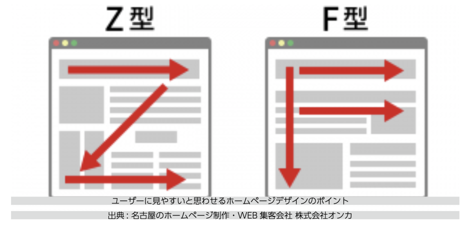

グリッドレイアウト

グリッドレイアウトは、複数のコンテンツ要素を整然と配置するために、グリッド（格子）システムを使用するパターンです。これは、一貫性と秩序をもたらし、デザイン全体に統一感を持たせるのに役立ちます。グリッドは、均等にスペースが分割された列と行で構成され、コンテンツが視覚的に整列されるようにします。

特徴:	ユーザーが視覚的に整理された情報にすばやくアクセスできる。
柔軟なデザインが可能であり、さまざまなデバイスでの表示にも対応しやすい。
適用例:	フォトギャラリー、ポータルサイト、商品一覧ページ

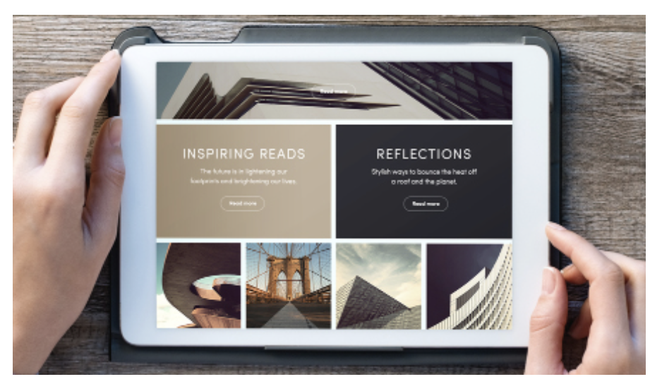
レスポンシブ対応グリッドレイアウトの作成方法
出典: アドビ

対称レイアウト

対称レイアウトは、デザイン要素を左右対称に配置するパターンです。これにより、バランスが取れた整然とした印象を与えることができます。対称性は、調和と安定感を強調するデザインに適しており、ユーザーに心地よい感覚を提供します。

特徴:	バランスが取れた調和のとれたデザイン。シンプルでフォーマルな印象を与える。
適用例:	コーポレートサイト、ポートフォリオ、ブランディングサイト

非対称レイアウト

非対称レイアウトは、要素を均等に配置せず、視覚的な興味や動きを作り出すパターンです。これは、ダイナミックで個性的なデザインを作りたい場合に有効です。適切にバランスを取りながら、あえて不均衡な要素配置をすることで、視覚的な緊張感を生み出すことができます。

特徴:	動的で現代的な印象を与える。視覚的なインパクトを高め、ユーザーの関心を引きつける。
適用例:	クリエイティブな広告、アート関連サイト、イベントポスター

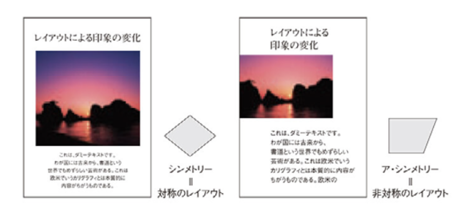
印刷いろいろコラム
出典: セザックス株式会社

カード型レイアウト

カード型レイアウトは、情報を小さなカードの形で区分けし、それぞれを独立したコンテンツブロックとして表示するパターンです。これにより、情報が整理され、ユーザーは一目で複数のコンテンツにアクセスすることができます。カードは通常、グリッドに配置されることが多いです。

特徴:	モジュール化されたコンテンツに適している。レスポンシブデザインとの相性が良く、モバイルフレンドリー。
適用例:	ソーシャルメディアフィード、製品カタログ、ポータルサイト

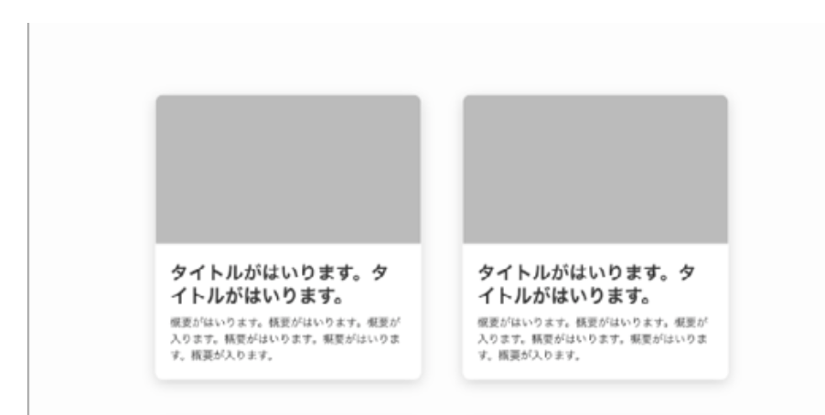
コーディングの解説】HTMLとCSSでカードグループをつくる
出典: eclairのブログ

フルスクリーンレイアウト

フルスクリーンレイアウトは、ページ全体にわたって1つの要素やコンテンツを強調するパターンです。これにより、視覚的なインパクトが非常に強く、特定のメッセージをユーザーに明確に伝えることができます。

特徴:	強烈な視覚効果を持ち、特定のコンテンツを強調。ミニマリズムデザインやプレゼンテーションに適している。
適用例:	ランディングページ、プレゼンテーション、アート作品の展示

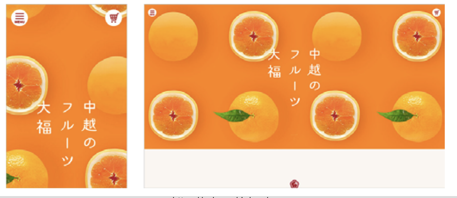
https://nakagoshi.shop/
出典: フルーツ大福のお取り寄せ｜金沢 和菓子処 中越

レイアウトの実践

レイアウトの基本を理解した上で、実際のデザインに応用することが重要です。効果的なレイアウトを作成するための具体的な手法や考慮すべきポイントについては以下の通りです。

目的とターゲットユーザーの理解

レイアウトを作成する際に最も重要なのは、デザインの目的とターゲットユーザーを明確に理解することです。これにより、レイアウトの方向性が決まり、どのように要素を配置するべきかが見えてきます。

> **POINT**
> デザインの目的：広告、教育、情報提供、エンターテイメントなど、何を達成したいのか。
> ターゲットユーザー：年齢層、性別、興味関心、デバイスの使用状況など。

例:
若年層をターゲットとしたファッションサイトでは、ビジュアルが重視され、インタラクティブな
要素が多く含まれることが一般的です。

情報の優先順位を設定

レイアウトの実践においては、情報の優先順位を設定することが不可欠です。どの情報が最も重要であり、ユーザーにまず伝えるべきかを決めることで、レイアウトの骨格が形成されます。

> **POINT**
> 視覚的階層（Visual Hierarchy）: 重要な情報を目立たせるために、フォントサイズ、色、配置を調整します。
> 呼び込み要素: 			ヘッドラインやキーイメージなど、ユーザーの目を引く要素を戦略的に配置。

例:
eコマースサイトでは、製品の写真や価格が最も目立つ位置に配置され、補助情報（レビュー、説明文など）は
その下に続きます。

グリッドシステムの活用

グリッドシステムを使用することで、レイアウトに一貫性と秩序をもたらすことができます。グリッドは、要素の配置をガイドする視覚的な基盤となり、デザイン全体に統一感を与えます。

> **POINT**
> 列と行の設定: 		グリッドは通常、複数の列と行から構成され、コンテンツを均等に配置します。
> マージンとパディング: 	要素間のスペースを適切に設定することで、レイアウトが見やすく、整然とした
> 印象になります。

例:
雑誌のレイアウトでは、テキスト、画像、広告をグリッドに沿って配置することで、ページ全体にバランスと
リズムが生まれます。

余白（ホワイトスペース）の効果的な利用

余白（ホワイトスペース）とは、コンテンツ間に意図的に設けられた空間のことです。この空間は、要素を分離し、全体のデザインを呼吸させる役割を果たします。

> **POINT**
> 集中力の向上: ホワイトスペースを活用することで、重要な要素が際立ちユーザーの注意を引きやすくなります。
> デザインの洗練: 余白を適切に使用することで、デザインがシンプルでエレガントに見えるようになります。

例:
高級ブランドのウェブサイトでは、余白を多く取ることで製品がより引き立ち、ブランドイメージの高級感が
強調されます。

一貫性とリズムの維持

レイアウト全体で一貫性とリズムを維持することは、ユーザー体験を向上させるために不可欠です。一貫性は、デザインの信頼性とプロフェッショナリズムを高め、リズムはユーザーに心地よい感覚を提供します。

> **POINT**
> 繰り返しの使用: 同じスタイルや要素を繰り返し使用することで、デザインに統一感が生まれます。
> バランスの調整: テキストと画像、コンテンツと余白のバランスを適切に調整します。

例:
コーポレートサイトでは、各ページに同じナビゲーションバーやフッターを配置し、一貫したユーザー体験を
提供します。

レスポンシブデザイン

現代のデザインでは、さまざまなデバイスで美しく機能するレスポンシブデザインが求められます。レスポンシブデザインは、画面サイズに応じてレイアウトが自動的に調整されるように設計されています。

> **POINT**
> メディアクエリの使用: 	　 CSSのメディアクエリを使用して、異なるデバイスごとにレイアウトをカスタ
> マイズします。
> フルイドグリッドシステム: グリッドシステムをフルイド（流動的）に設計し、画面サイズに応じて列の幅を
> 調整します。

例:
ニュースサイトでは、デスクトップ版では複数の列を使用し、モバイル版では単一の列に再配置されることが
一般的です。

まとめ

レイアウトの実践は、デザインの成功に不可欠な要素です。目的に応じた適切なパターンを選び、ユーザーのニーズに合わせた情報配置を行うことで、視覚的に魅力的で使いやすいデザインを実現できます。また、テストとフィードバックを通じて継続的に改善することで、より効果的なデザインが生まれます。

### Section 6-2　グリッドシステム

グリッドシステムは、デザインにおいて要素を秩序立てて配置するための基盤として重要な役割を果たします。特にウェブデザインや印刷デザインでは、グリッドシステムを活用することで、レイアウトに一貫性とバランスを持たせることができます。

グリッドSの基本

グリッドシステムとは、ページや画面上の要素を整理して配置するために使用される、垂直および水平のガイドラインのことです。これらのガイドラインは、テキスト、画像、その他のデザイン要素を均等に配置するための目安となり、デザイン全体に整然とした印象を与えます。

> **POINT**
> グリッドは、複数の列と行で構成される。
> デザインに統一感と秩序をもたらす。
> ユーザーが情報を効率的に視認できるように配置を調整する。

例:
新聞や雑誌のレイアウトは、多くの場合、グリッドシステムを利用して記事、写真、広告を整然と配置
しています。

グリッドSの種類

グリッドシステムにはさまざまな種類があり、それぞれの用途に応じて適切なグリッドを選択することが重要です。以下に、一般的なグリッドの種類を紹介します。

単純グリッド

単一の列や行に基づいた最も基本的なグリッドシステム。
主にシンプルなレイアウトに適しています。

例: ブログの単一カラムレイアウト。

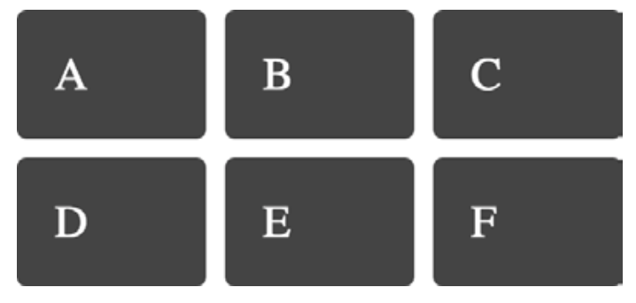

https:/gridbyexample.com/examples/出典: Grid by Example

多列グリッド

複数の列を持つグリッドシステムで、コンテンツを複数のセクションに分けることができます。列の数や幅を調整してレイアウトを変更、情報を分類し、視覚的なバランスを保つのに役立ちます。

例: ニュースサイトや雑誌のレイアウト。

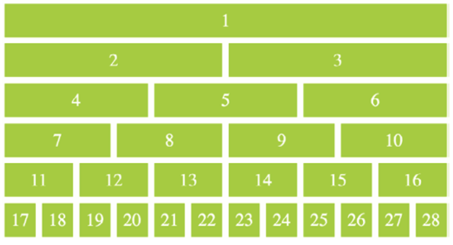

https://www.quackit.com/css/grid/examples/css_12_column_grid_examples.cfm　出典: CSS 12 Column Grid Examples

モジュラーグリッド

縦横に均等均等に分割されたモジュールから成るグリッドで、一貫性と整然さを提供する。サイズや形状が自由に調整可能です。複雑なレイアウトやデータ表示に適しており、テキストと画像の組み合わせが多い場合に使用されます。

例: ダッシュボードやカタログのレイアウト。

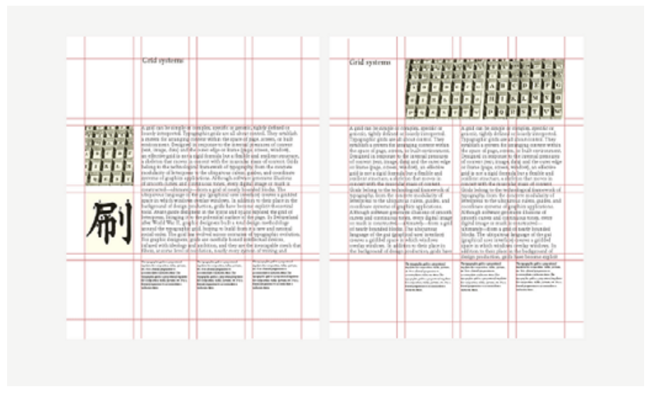

https://bootcamp.uxdesign.cc/module-and-its-meaning-in-space-modular-grid-b884d3209d1d
出典: Module and its meaning in space. Modular grid. | by Muhammed Bayram | Bootcamp

階層グリッド

要素の重要度や階層構造に基づいて、グリッドが柔軟に構成されるタイプ。
コンテンツの優先順位に応じて、異なるサイズのセルが配置されることが多いです。

例: ポートフォリオサイトやアートギャラリーのレイアウト。

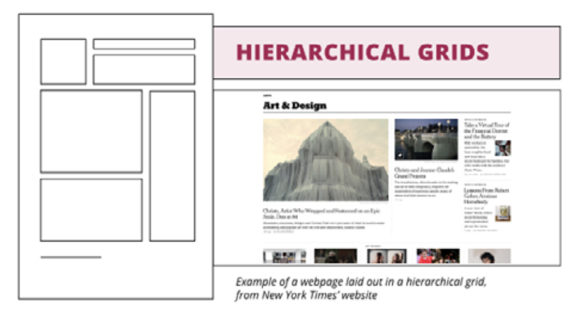
https://sherpablog.marketingsherpa.com/design-2/marketing-101-what-are-grids-design/
出典: Marketing 101: What are grids (design)? | MarketingSherpa Blog

まとめ

単純グリッド:		 シンプルなレイアウトで、少数の列や行を使用して整然としたデザインを提供。
多列グリッド:		 複数の列から成り、柔軟なレイアウトが可能で、複雑な情報の整理に使用。
モジュラーグリッド: 	均等に分割されたモジュール単位で構成され、視覚的一貫性を保つために使用。
階層グリッド: 		階層的に配置された複数のレベルのグリッドを使用し、情報の重要性や関係性に応じた
レイアウトを提供。

グリッドSの使用方法

グリッドシステムを効果的に使用するためには、いくつかの重要なステップを踏む必要があります。以下に、基本的な使用方法を紹介します。

グリッドの選択

デザインの目的やコンテンツの量に応じて、適切なグリッドシステムを選択します。
シンプルなレイアウトには単純グリッドを、複雑な情報構造にはモジュラーグリッドや階層グリッドを使用します。

列と行の設定

グリッド内の列と行の数を決定し、それに基づいてコンテンツを配置します。

ガイドラインの設定

グリッドシステムに基づいて、要素を配置するためのガイドラインを設定します。これにより、要素の位置が統一され、デザインに一貫性が生まれます。

マージンとガターの設定

要素間の余白（マージン）と列間のスペース（ガター）を設定します。これにより、要素が密集せず、視認性が向上します。

調整と反復

要素をグリッドに配置した後、視覚的なバランスや情報の優先順位を考慮して微調整を行います。デザインが完成するまで、何度か反復して調整することが重要です。

グリッドSのメリット

グリッドシステムを使用することで、デザインにいくつかのメリットが生まれます。

統一感

グリッドに沿って要素を配置することで、ページ全体に統一感が生まれます。これにより、ユーザーがページをスムーズに読み進めることができます。

効率的なデザイン

グリッドシステムを使用することで、デザインの作成が効率化されます。ガイドラインに従って要素を配置するだけで、整ったレイアウトが実現できます。

レスポンシブデザインへの適用

グリッドシステムは、レスポンシブデザインに適しています。デバイスの画面サイズに応じてグリッドが再配置され、最適なレイアウトが維持されます。

例:
他列（12）列グリッドを使用したウェブサイトでは、デスクトップでは複数の列を表示し、モバイル
デバイスではそれらの列が再配置されて単一の縦長レイアウトになります。

グリッドSの限界と柔軟性

グリッドシステムは非常に便利ですが、全てのデザインに対して硬直的に適用すべきではありません。場合によっては、グリッドを無視したり、柔軟に変更したりすることで、より創造的で効果的なデザインを作成できることがあります。

> **POINT**
> グリッドに固執しすぎると、デザインが平凡になりやすい。必要に応じてグリッドを崩し、独自性や
> インパクトを持たせることも重要です。特にアート作品やクリエイティブなプロジェクトでは、グリ
> ッドにとらわれない自由な発想が求められることが多いです。

例:
クリエイティブな広告キャンペーンでは、グリッドに縛られないダイナミックなレイアウトが使用
されることが多いです。

## 第7章　色彩基礎１

### Section 7-1　色の定義と分類

色は視覚的な体験を豊かにし、私たちの感情や反応に深い影響を与えます。色の定義と分類は、デザインやアート、日常生活の中で色を効果的に活用するための基盤になります。

色相（Hue）

色相は色の「種類」を示す基本的な要素であり、色相環を用いて視覚的に色の関係性を示します。色相は色の識別に不可欠であり、色の名前やカテゴリーを決定します。

色相環

色相環（Hue Circle）は、色を体系的に分類し、色同士の関係性を視覚的に理解するためのツール　です。色相環は、色の「種類」や「性質」を示す基本的な要素であり、色の識別や組み合わせに役立ちます。
色相環は、色彩理論において色の関係性や組み合わせを視覚的に表現するための円形の図です。色相環は、色の「種類」や「性質」を示し、色の識別や調和に役立ちます。以下は、色相環の主要な構成要素です。
ここでは、マンセル色相環に関して説明します。マンセル色相環は色を三次元的に理解するための体系であり、色相、明度、彩度の要素で構成されています。色相環の原色5つと中間色５つで主要10色相としていて、それぞれが色彩の基本的な要素を形成しています。

マンセル色相環　出典: 　武蔵野美術大学 造形ファイル

原色

赤は色相環の一端を形成し、情熱やエネルギーを象徴します。視覚的に強い影響を持ち、警告や重要なメッセージを伝えるために使用されることが多いです。
使用例: 警告標識、セールの広告、情熱的なデザイン。

黄は色相環の中心に位置し、明るさや幸福感を表現します。視覚的に目立ち、注意を引くために使用されることが多いです。
使用例: 警告表示、明るいデザイン、エネルギッシュな広告。

青は色相環の一端を形成し、冷静さや信頼性を象徴します。リラックスや安心感を提供し、ビジネスや公式な場面でよく使用されます。
使用例: コーポレートブランディング、公式な文書やデザイン。

緑は黄と青の中間色で、自然や調和を表現します。安心感やリラックスを与え、環境や健康に関連するデザインで使用されます。
使用例: 環境保護のキャンペーン、リラクゼーションのデザイン。

紫は赤と青の中間色で、神秘性や創造性を表現します。芸術や宗教的な場面でよく使用され、深みや高貴さを示します。
使用例: 高級ブランドのデザイン、宗教的な儀式。

中間色

赤と黄の混合によって得られる色で、エネルギーや暖かさを表現します。陽気で活力に満ちた印象を与えます。
例: 活気のあるデザインや広告、暖かい色合いのインテリア。

黄と緑の混合によって得られる色で、自然やフレッシュさを感じさせます。清潔感や新鮮さを表現します。
例: 環境関連のデザインやヘルスケアのビジュアル。

青と緑の混合によって得られる色で、落ち着きや平和を感じさせます。自然やリラクゼーションのテーマで使用されます。
例: スパやリラクゼーション施設のデザイン、海や湖のイメージ。

青と紫の混合によって得られる色で、深みや神秘性を表現します。創造性や高貴さを感じさせます。
例: 高級ブランドやアート関連のデザイン、幻想的なビジュアル。

赤と紫の混合によって得られる色で、豊かさや深い感情を表現します。情熱や高貴さを強調します。
例: 高級感のあるデザインや、エレガントな装飾、情熱的なテーマ。

捕色

色相環の反対側に位置し、互いに強調し合う色です。補色は視覚的なコントラストを提供し、デザインでの強調に役立ちます。例: 赤と緑、青とオレンジが補色の関係にあります。

具体例: 赤と緑の組み合わせはクリスマスのカラーとして有名で、視覚的な強調が効果的です。

トライアド

色相環上で均等に配置された三つの色で、バランスの取れたカラースキームを作り出します。

配色の基本「トライアド・テトラード配色」について　出典: 　株式会社アンジェ・リュクス

テトラード

相環上で4色を選び、互いに均等に配置された色の組み合わせを意味します。これにより、色のバリエーションが豊かで、視覚的にバランスが取れた配色が得られます

配色の基本「トライアド・テトラード配色」について　出典: 　株式会社アンジェ・リュクス

明度（Value/Brightness）

明度は色の「明るさ」を示し、色がどれだけ白に近いか、または黒に近いかを示します。明度はデザインにおいて色の視覚的な効果に大きな影響を与えます。

明度の測定

白: 明度が最大で、全ての光を反射します。明るさの基準として使用され、清潔で明るい印象を与えます。
例: ホワイトボードやパーツのデザインに使用される白色。

黒: 明度が最小で、全ての光を吸収します。暗さの基準として使用され、重厚感や神秘性を表現します。
例: フォーマルな場面での黒いスーツや背景。

グレースケール: 白から黒までの連続的な明度の変化を示し、色の明るさや暗さを理解するために使われます。
例: モノクロ写真やグレースケールのデザインで使用されるスケール。

明度スケールの例

空色: 明るい青で、空や水を連想させ、爽やかさや広がりを感じさせます。晴れた日の空の色が代表例です。
紺色: 暗い青で、深さや落ち着きを表現します。ビジネススーツや公式な場面でよく見られる色です。

物体色の明るさを表す「明度」　出典: 　プラスカラーズ
彩度（Saturation）

彩度は色の「鮮やかさ」を示し、色がどれだけ純
粋で強いかを表します。高彩度の色はより鮮やかで、低彩度の色はくすんで見えます。彩度は視覚的な強さや影響を決定する要素です。

色の三属性（色相・明度・彩度を理解すると色がわかる！）　出典: 　色彩101

高彩度

色が純粋で視覚的に強調され、目立つ効果を持ちます。広告やデザインで注目を集めるために使用されます。
例: 鮮やかな赤い広告や強い色合いのパッケージ。

https://www.webcreatorbox.com/inspiration/vivid  出典:  Intro | Musique émergente

低彩度

色がくすんで見え、落ち着いた印象を与えます。背景やサブカラーに使用されることが多いです。
例: パステルカラーや落ち着いたトーンのデザイン。

https://www.saninji.jp/nostalgic/greenyakumocp/  出典:  緑やくも色リバイバル運行&歴代カラー勢揃い記念 宿泊キャンペーン

### Section 7-2　色の物理的性質

色の物理的性質は、色がどのように発生し、どのように私たちの目に届くかを理解するための重要な要素です。色の物理的性質には、光の三原色や加法混色、減法混色などが含まれます。

光の三原色(RGB)

RGBモデルは、赤 (Red)、緑 (Green)、青 (Blue) の三色の光を組み合わせることで、他のすべての色を表現します。加法混色に基づいており、主にディスプレイや照明に使用されます。

加法混色

理論: 赤、緑、青の光を組み合わせることで、他の色が生成されます。全ての光を加えることで白色に近づきます。例: コンピュータやテレビのディスプレイで色を表示するためにRGBモデルが使用されます。

色の合成: 赤と緑を組み合わせると黄色、青と緑を組み合わせるとシアン、赤と青を組み合わせるとマゼンタになります。これにより、さまざまな色の組み合わせが可能になります。

実例
ディスプレイ: コンピュータやテレビのスクリーンでは、RGBモデルを使用して色を表示し、色の合成や調整が行われます。

LED照明: RGBのLEDライトを使用して、異なる色の光を生成し、さまざまな色の表現が可能です。

光と色の三原色】RGBとCMYKの違いを超わかりやすく解説  出典: 321web

減法混色

減法混色は、光の一部を吸収し（つまり減らし）、残った光を反射することで色が見える仕組みです。印刷物では、紙に塗られたインクが特定の波長の光を吸収し、残った光が反射されることで色が認識されます。

シアン (Cyan): 赤の光を吸収し、青緑色を反射します。
マゼンタ (Magenta): 緑の光を吸収し、ピンク紫色を反射します。
イエロー (Yellow): 青の光を吸収し、黄色を反射します。
ブラック (Key): 全ての光を吸収し、黒を生成します。

純粋な黒はCMYのインクをすべて混ぜても理論上は作れますが、実際には黒のインクを使用して深い黒を再現します。

実例:
印刷: CMYKモデルは、ポスター、パンフレット、雑誌、新聞などのカラー印刷に使用されます。各色のインクが層ごとに重ねられて色が生成されます。

デザイン: グラフィックデザインや印刷物の色設計において、CMYKモデルは重要な役割を果たし、正確な色再現が求められます。

CMYK、RGB、Webのカラーコード、それぞれの違いと、印刷の際にトラブルを避けるための知識細  出典: 川工房の仕事

## 第8章　色彩基礎2

### Section 8-1　色の歴史と文化的背景

色は人類の歴史を通じて、文化、宗教、芸術、社会的象徴として重要な役割を果たしてきました。色の持つ意味や使い方は時代や地域によって異なり、その背景には深い歴史と文化が反映されています。

古代文明の色彩

色彩の象徴性は、古代からさまざまな文化で重要視されてきました。

古代エジプト

古代エジプトでは、色は神々や自然の力を表現するために用いられました。青はナイル川や天空を象徴し、再生や豊穣のシンボルとされました。緑は生命や成長を意味し、墓の壁画やアミュレットに頻繁に使用されました。赤は生と死、勝利と破壊を表す強力な色であり、戦士の装飾や神々の儀式に使われました。

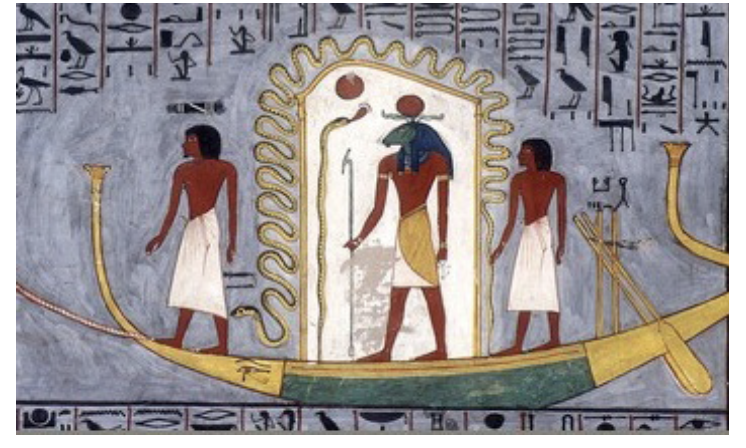
ラー（中央）が、他の神々を従えて自分の帆船で冥界を旅している様子  出典: wikipedia

古代中国

中国の伝統的な色彩には、五行説に基づく五色（青、赤、黄、白、黒）があり、それぞれが自然の要素や方位、季節に対応していました。例えば、青は春と東を象徴し、成長や新しい始まりを意味しました。黄色は中央と大地を象徴し、皇帝の色とされ、神聖視されました。

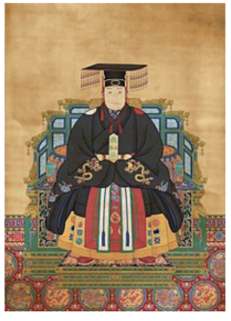

万暦帝の袞服（こんふく）。宝石付きの帽子が最大の特徴。  出典: wikipedia

ギリシャ・ローマ

古代ギリシャやローマでは、色が社会的地位や文化的価値を示すために使用されました。白は清潔さや純粋さを表し、黒は死や神秘を象徴しました。また、トガやガウンの色は社会的地位や職業を示す手段として使われました。
ギリシャの彫刻や陶器では、色がシンプルながらも象徴的な意味を持ち、白と黒のコントラストが重要視されました。特に白い彫刻は神聖さや理想化された美を表現しました。

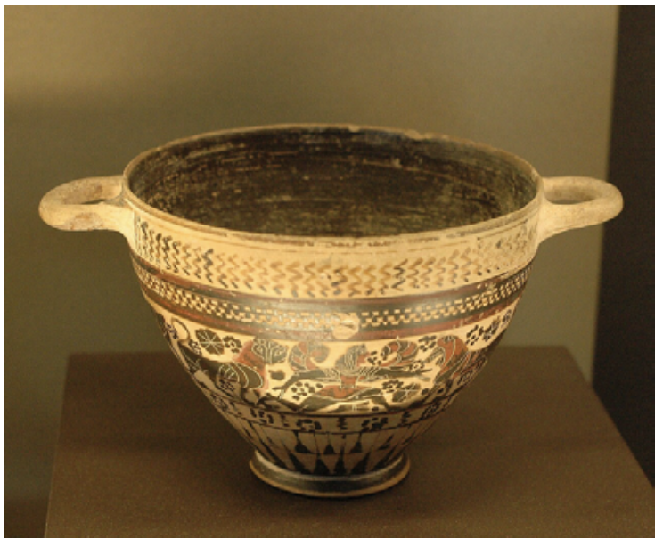

原コリント様式の大杯。紀元前625年ごろ（ルーヴル美術館）  出典: wikipedia

中世の色彩

中世ヨーロッパでは、色彩は階級や権力を示す手段として用いられました。

ヨーロッパ

中世ヨーロッパでは、色が宗教的な意味を持ち、特に教会や宗教的な儀式で使用されました。紫は高位の神職に属する者を示し、金色は神聖さや富を表現しました。中世のステンドグラスや宗教画に使われた色は、信仰や教義を視覚的に表現しました。
中世の教会のステンドグラスには、紫や金色が豊富に使われ、神聖さや権威を示しました。これにより、信者に宗教的なメッセージが視覚的に伝えられました。

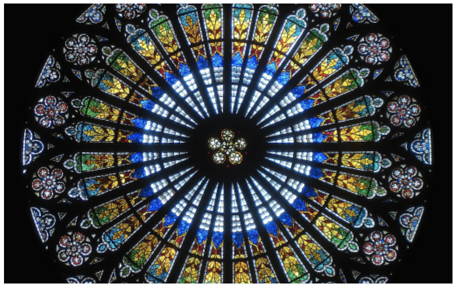

フランス・ストラスブール大聖堂のステンドグラス  出典: wikipedia

アジア

日本や韓国、中国などのアジアの文化では、色が社会的地位や文化的な意味を示しました。特に赤や白、金色などは重要な意味を持ち、祝い事や儀式に使われました。

日本の伝統的な着物や装飾品には、赤や金色が使用され、幸福や繁栄を願う意味が込められました。また、中国の紅包（お年玉）や韓国の伝統的な婚礼衣装にも色の象徴性が見られます。

近代の色彩

近代に入ると、色彩はさらに多様化し、新しい意味や用途が生まれました。

産業革命

19世紀の産業革命により、合成染料が発明され、色の選択肢が広がりました。これにより、より多くの色が手軽に入手できるようになり、デザインやファッションでの利用が広まりました。

合成染料の発明により、ビビッドな色彩が登場し、印刷物やファッションでの色使いが大きく変化しました。
また、19世紀後半から20世紀初頭にかけて、新しい色彩がデザインのトレンドとなりました。

現代の色彩

現代では、色彩はデザイン、マーケティング、ブランド戦略において非常に重要な役割を果たしています。

ブランドと色彩

多くのブランドは、特定の色を使用して消費者に特定のイメージや感情を伝えています。たとえば、コカ・コーラの赤は活力や情熱を、スターバックスの緑は自然や安心感を象徴しています。

デジタル時代の色彩

デジタルデザインやインターフェースデザインにおいて、色彩はユーザーエクスペリエンスを向上させる重要な要素です。色彩はナビゲーションを助け、視覚的な階層を構築し、感情的なつながりを強化します。

社会的メッセージと色彩

現代のアートや広告では、色彩を通じて社会的なメッセージを伝えることが増えています。ジェンダーや環境問題、人権など、さまざまなテーマに対して色彩が選ばれ、そのテーマに対する意識を高めるためのツールとして活用されています。

### Section 8-2　色の物理的性質の応用

色の物理的性質は、私たちが日常的に目にするあらゆる物体の色彩を決定する重要な要素です。この性質は、光が物体に当たったときにどのように反射、透過、そして吸収されるかに強く影響されます。これらの現象を理解することで、デザインや建築、アート、ファッション、科学技術に至るまで、様々な分野での色の応用が可能になります。

色の反射

色の反射は、物体の表面に光が当たり、その一部または全てが反射されることで見える色が決定されます。反射の特性は、表面の質感や材質、そして光の入射角度によって大きく変わります。この反射のメカニズムを理解することは、製品デザインや建築において視覚的効果を最大化するために不可欠です。

反射のメカニズム

鏡面反射 (Specular Reflection): 光が物体の表面で均等に反射し、鏡のように鮮明な像を作ります。物体の表面が非常に滑らかな場合に発生し、光の反射角度が入射角度と一致します。例としては、鏡、ガラス、磨かれた金属などが挙げられます。

鏡は鏡面反射の代表的な例であり、鮮明な像を映し出します。鏡の表面は非常に滑らかで、光をほぼ完全に均等に反射するため、対象物の鮮明な映像が映し出されます。この特性は、インテリアデザインや光の演出に利用されます。

散乱反射 (Diffuse Reflection): 光が物体の表面で不均等に反射し、ぼんやりとした像を作ります。これは、表面が粗いか、微細な凹凸がある場合に発生します。散乱反射は、視覚的な柔らかさや落ち着きを演出するために、マットな紙やペイントの表面でよく利用されます。

マットなペイントは散乱反射を利用して、落ち着いた仕上がりを提供します。光が不均等に反射されるため、表面が柔らかく、視覚的に快適であると感じられます。これにより、温かみのある落ち着いた空間を作り出すことができます。

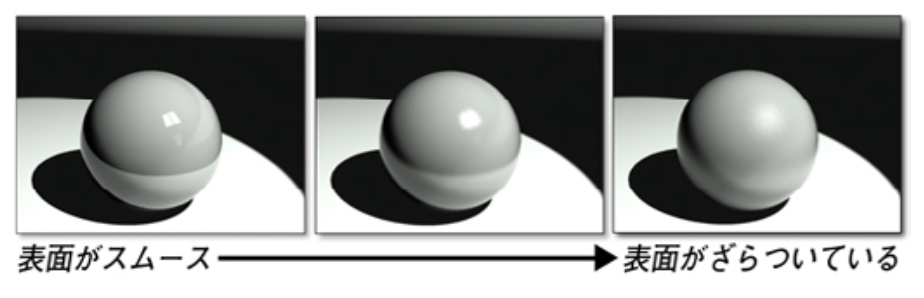

第1回：鏡面反射光 ハイライトの謎 | 宋さんの3ds Max キッチンスタジアム 出典: AREA JAPAN

色の透過

色の透過は、光が物体を通過する際に、どれだけの光が通過するかによって見える色が決定されます。物体がどの程度光を透過させるかは、その材質や厚さに依存します。透過の性質は、透明な素材や半透明の素材の選択において重要な要素となり、デザインや工学に応用されています。

透過のメカニズム

透明 (Transparent): 物体が光をほぼ完全に通過させ、その背後にある物がはっきりと見える状態です。透明な素材は、ガラスやクリアプラスチックなどがあり、これらは窓やディスプレイケースに利用され、視認性と防護を両立させます。

ガラスは透明な素材で、背後にある物が鮮明に見えます。光がほぼ完全に通過するため、物体の詳細がはっきりと視認できる特徴を持ちます。この特性は、窓ガラスやガラス製品において重要であり、視覚的な開放感と安全性を提供します。

半透明 (Translucent): 物体が部分的に光を通過させることで、背後にある物がぼんやりと見える状態です。半透明の素材は、乳白色のプラスチックやトレーシングペーパーがあり、これらは光を柔らかく拡散させる効果があり、プライバシーの確保やデザイン要素として利用されます。
トレーシングペーパーは半透明で、光が通過する一方で、背後にある物の輪郭がぼんやりと見えます。透過率が低いため、光を柔らかく拡散させ、デザインやプライバシー保護に利用されます。

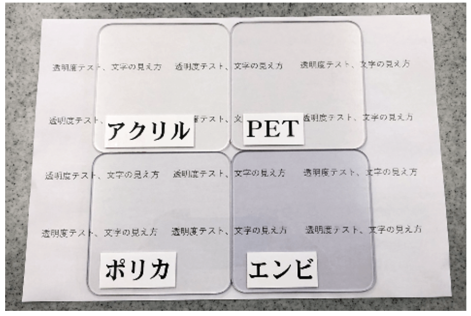

飛沫対策アクリル板、その他透明樹脂板、サイズ自由のオーダーメイド＆規格品製作販売します  出典:三栄プラテック

色の吸収

色の吸収は、物体が光の一部を吸収し、残りの光を反射することで見える色を決定します。物体がどの波長の光を吸収し、どの波長を反射するかにより、私たちが認識する色が変わります。この現象は、特定の色を選択する際に重要な役割を果たし、特にファッション、アート、インテリアデザインにおいて利用されます。

吸収のメカニズム

完全吸収 (Complete Absorption): 物体が全ての光を吸収し、黒に近い色に見える状態です。これは、光が反射されず全て吸収されるため、非常に暗く、影のような効果を生み出します。例としては、黒い布や墨が挙げられます。

黒い布は全ての光を吸収し、非常に暗い色として認識されます。この性質は、フォーマルな服装やシックなデザインに利用され、重厚感やエレガントさを演出します。

部分吸収 (Partial Absorption): 物体が一部の光を吸収し、残りの光を反射することで特定の色が見える状態です。たとえば、赤い布は青と緑の光を吸収し、赤色の光を反射するため、赤く見えます。このメカニズムは、あらゆるカラーアイテムの色彩を決定する基本的な原理です。

赤い布は青と緑の光を吸収し、赤色の光を反射することで赤く見えます。これにより、情熱やエネルギーを表現するためのデザイン要素として、広く用いられています。

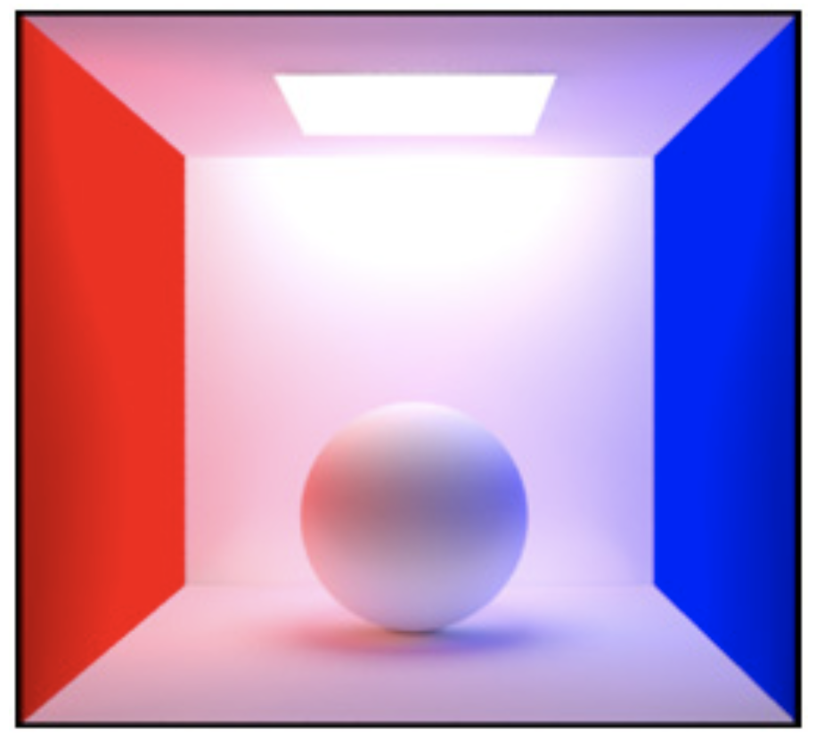

第5回：拡散反射光 RGBレベルに注意！ | 宋さんの3ds Max キッチンスタジアム  出典:AREA JAPAN

## 第9章　視覚効果

### Section 9-1　色の視覚的影響景

色は視覚体験に対して非常に強い影響を与え、感情や認識に大きな変化をもたらします。色の選び方や配置によって、デザインやアートの受け取られ方が大きく変わります。ここでは、色がどのように視覚的な印象を変えるかについて説明します。

色が感情に与える影響

色は私たちの感情や心理状態に大きな影響を与えることが研究により明らかになっています。
例えば、赤色は刺激的でエネルギーを感じさせ、情熱や興奮を引き起こすことが多いです。赤色の視覚的な効果は心拍数を上げることがあり、食欲を増進させるとも言われています。

逆に青色はリラックスや安心感をもたらし、冷静さや信頼性を示すことができます。青色は心拍数を下げ、心を落ち着ける効果があるとされています。

色で感情が動く！？色が持つ心理効果と活用方法 |  出典: 伝つくラボ

このように、色の心理的な影響は、マーケティングやデザインにおいて意図的に活用され、感情や行動を促すための手段として使用されます。例えば、飲食店での赤色やオレンジ色の使用は、食欲を刺激し、客の滞在時間を延ばす効果があります。

一方、青色のインテリアは落ち着いた雰囲気を作り出し、ストレスの軽減や集中力の向上に寄与します。

色の物理的影響

色は光の波長によって決まり、異なる波長の光が異なる色として認識されます。
例えば、赤い光は長い波長を持ち、青い光は短い波長を持ちます。これにより、色の見え方が変わり、物体の色は光の反射や透過によって決まります。

赤い色は長い波長を持ち、通常は他の色よりも遠くから見ても目立つため、視覚的な注意を引きやすいです。一方、青い色は短い波長を持ち、空や水などの自然界に多く見られる色です。
この物理的な色の特性は、デザインやアートにおいても重要な要素となります。色の選び方や組み合わせによって、視覚的な効果や感覚が大きく変わります。
たとえば、色のコントラストを利用することで、デザイン内での重要な要素を際立たせることができます。また、光の反射や透過の特性を活かして、特定の雰囲気や効果を演出することが可能です。

スペクトル  出典:コア東京Web

### Section 9-2　色の錯覚

色の錯覚は、視覚情報が脳によってどのように解釈されるかに基づく現象で、実際の色とは異なる見え方を引き起こします。これらの錯覚はデザインやアートにおいて意図的に利用されることがあります。

色相対比の錯覚

色相対比錯覚は、色が周囲の色との対比によって異なって見える現象です。背景色や隣接する色が中心の色の見え方に影響を与えるため、同じ色でも異なる見え方をします。

背景色と中心の色

例えば、青い円を黄色い背景に置くと、その青い円は実際よりも青く見えることがあります。これは、黄色が青い色の感覚を強調するためです。逆に、青い背景に赤い円を置くと、赤い円がより強く見えることがあります。

デザインへの応用

色相対比を利用して視覚的なインパクトを高めることができます。例えば、広告やポスターで特定の要素を目立たせたい場合、背景色と前景色の対比を強調することで、視覚的な引きつけを実現します。

補色対比の錯覚

補色対比は、色相環で互いに補色となる色が隣接することで、色がより強調される錯覚です。補色とは、色相環上で対極に位置する色であり、互いに強い対比を生み出します。

赤と緑の対比

例えば、赤と緑の補色が隣接すると、赤い部分がより鮮やかに、緑の部分もより鮮やかに見える現象です。補色同士の強い対比によって色の知覚が変わります。

彩度対比の錯覚

彩度対比は、色の彩度（色の鮮やかさ）が周囲の色の影響を受ける現象です。異なる彩度の色が隣接していると、色の彩度が変化して見えることがあります。特に、周囲の色が異なる彩度を持つ場合、中心の色がその影響を受けて見えることが多いです。

鮮やかさの違い

高彩度の色が隣接する低彩度の色の背景に置かれると、前景の色がより鮮やかに見えることがあります。例えば、鮮やかな青が暗い灰色の背景にあると、青はより鮮やかに感じられることがあります。逆に、同じ青が明るい黄色の背景にあると、青が少し鈍く見えることがあります。

明度対比の錯覚

明度対比はは、色の明るさが周囲の色の影響を受ける現象です。明度対比は、隣接する色の明度（明るさ）によって、対象の色が実際の明度よりも明るく、または暗く見えることがあります。これは、視覚的な周辺効果によって、色の明度の感覚が変化するためです。

明るさの違い

明るい色が隣接する暗い色の背景にあると、前景の色が実際よりも明るく見えることがあります。逆に、暗い色が明るい背景にあると、暗い色がより暗く見えることがあります。
例えば、白い円が黒い背景に置かれると、白は非常に明るく見えますが、同じ白い円が明るいグレーの背景にあると、白の明るさが相対的に低く感じられることがあります。

### Section 9-3　コントラスト効果

コントラスト効果は、色や明度、彩度の違いによって視覚的に強調される現象です。これにより、デザインやアートでの強調や視認性を向上させることができます。以下では、コントラスト効果の詳細とその応用について詳しく説明します。

色のコントラスト

色のコントラストは、隣接する色の違いが視覚的に強調される現象です。色のコントラストは、色相（色の種類）の違いによって引き起こされ、デザインにおいて重要な役割を果たします。

補色対比

色相環で対角線上にある補色同士のコントラストは非常に強力です。例えば、青とオレンジ、赤と緑、黄と紫の組み合わせは、色が互いに引き立ちます。補色対比によって、視覚的なインパクトを強め、デザインをより鮮やかにすることができます。

類似色のコントラスト

色相環で隣接する色同士もコントラストを生み出します。たとえば、青と緑、赤とオレンジなどがこれに当たります。これらの組み合わせは調和を保ちながらも、色の違いが視覚的に強調されます。

明度のコントラスト

明度コントラストは、色の明るさの違いが視覚的に強調される現象です。明るい色と暗い色が隣接すると、明度の違いが際立ち、視覚的なアクセントが加わります。

明暗対比

白と黒、または明るい灰色と暗い灰色などの明度の違いは、視覚的に強く感じられます。たとえば、黒い背景に白いテキストを配置すると、テキストが非常に際立ち、視認性が向上します。

明度グラデーション

明度が異なる色をグラデーションで配置することで、視覚的に滑らかな変化をもたらし、深みや立体感を加えることができます。

彩度のコントラスト

彩度コントラストは、色の鮮やかさ（彩度）の違いが視覚的に強調される現象です。高彩度の色が隣にある低彩度の色をより暗く感じさせ、逆に低彩度の色が高彩度の色をより明るく感じさせます。

鮮やかさの対比

たとえば、鮮やかな赤が隣にある淡いピンクは、赤がより強く感じられることがあります。明るい青の背景に鮮やかなオレンジの文字を置くと、オレンジの鮮やかさが引き立ちます。

彩度のグラデーション

彩度が異なる色をグラデーションで配置すると、色の鮮やかさが滑らかに変化し、視覚的な興味を引くことができます。

コントラスト効果の応用

コントラスト効果は、デザインやアート、広告、ウェブデザインなどさまざまな分野で応用されます。効果的にコントラストを利用することで、視覚的なインパクトを増し、重要な要素を強調することができます。

広告デザイン

コントラストを利用して、重要な情報やメッセージを際立たせるデザインがよく使われます。たとえば、赤い背景に白いテキストを配置することで、セールのメッセージが視覚的に強調されます。

ウェブデザイン

ウェブサイトのボタンやリンクにコントラストを利用することで、ユーザーの目を引き、クリック率を向上させることができます。たとえば、青いボタンに白い文字を配置することで、ボタンがより目立つようになります。

インテリアデザイン

部屋の色や家具にコントラストを利用して、視覚的なバランスやアクセントを加えることができます。たとえば、暗い家具に明るいカーペットを合わせることで、部屋の見た目が引き立ちます。

まとめ

コントラスト効果は、視覚的な認識や印象を大きく変える強力なツールです。デザインにおけるコントラストの使い方を理解し、適切に応用することで、より効果的で魅力的なビジュアルを作り出すことができます。

### Section 9-4　配色による視覚的効果

配色は、視覚デザインにおいて非常に重要な要素であり、色の組み合わせが視覚的な印象や感情、メッセージに大きな影響を与えます。以下では、配色がもたらす視覚的な効果について詳しく説明し、具体的な配色の手法やそれによる影響を解説します。

配色の基本概念

配色とは、色をどのように組み合わせるかによってデザイン全体の印象を決定するプロセスです。
適切な配色を選ぶことで、視覚的な調和を保ちつつ、特定の感情やメッセージを伝えることができます。

モノクロマティック配色

モノクロマティック配色は、同じ色相の異なる明度や彩度の色を使用する配色手法です。この配色は、色のバリエーションを持ちながらも、統一感を保つため、視覚的に落ち着いた印象を与えます。

特徴

統一感:	   	同じ色相の異なるトーンやシェードを使うことで、デザイン全体に一貫性と調和をもたらします。
柔らかさ:	色の変化が穏やかで、視覚的にリラックスした印象を与えます。
強調: 	   	色の強度や明るさによって、特定の要素やエリアに焦点を合わせることができます。

具体例
淡い青から濃い青: 青色のさまざまなトーンを使用することで、クールでプロフェッショナルな印象を作り出します。例としては、ビジネスプレゼンテーションやウェブサイトのデザインなど。

アナログ配色

アナログ配色は、色相環で隣接する色を使う配色手法です。この方法は、色の調和を高めるため、視覚的に穏やかで心地よい印象を与えます。

特徴

調和: 		隣接する色を使用することで、視覚的な一貫性と調和を実現します。
落ち着き: 	色の組み合わせが自然で、落ち着いた雰囲気を醸し出します。
豊かさ: 		色の選択によって、視覚的に豊かなデザインを作ることができます。

具体例

青、青緑、緑: 	この組み合わせは、自然な流れを作り出し、リラックスした空間を演出します。
例としては、インテリアデザインやトラベル関連のデザインなど。

ダイアード配色

ダイアード配色は色相環で対角線上に位置する色を使う配色手法です。この配色は、色の対比を強調し、高い視覚的インパクトを生み出します。

特徴

高コントラスト: 補色同士のコントラストが強いため、視覚的に鮮明で目を引きます。
強調: 		特定の要素やメッセージを際立たせるために使用されます。
動的: 		色の対比によって、デザインに活気や動きを与えます。

具体例

青とオレンジ、赤と緑:
この組み合わせは、視覚的な強調を生み出し、エネルギッシュで引き付けられる印象を与えます。
例としては、広告やスポーツチームのロゴなど。

トライアド配色

ドライアド配色は、色相環で等間隔に位置する三つの色を使う配色手法です。この方法は、色のバランスを取りながら、視覚的に豊かな印象を与えます。

特徴

バランス: 	三色を使用することで、視覚的に安定感とバランスを保ちながら、鮮やかさも提供します。
動的: 		色のコントラストが高く、視覚的に活力を感じさせます。
多様性:		色の組み合わせによって、多様なデザインオプションが可能です。

具体例

赤、青紫、黄: 	この組み合わせは、カラフルで動的な印象を与え、楽しい雰囲気を作り出します。
例としては、教育関連のデザインや子供向けのプロジェクトなど。

テトラード配色

テトラード配色は、色相環で矩形を形成する四つの色を使う配色手法です。この方法は、複数の色を使用して視覚的に豊かで多彩なデザインを実現します。

特徴

複雑性: 四つの色を使用するため、バランスを取るのが難しいですが、多彩で動的な印象を与えます。
調和: 	補色配色とアナログ配色の組み合わせで、視覚的にリッチなデザインを作ることができます。
柔軟性: 色の選び方によって、さまざまな感情やメッセージを伝えることができます。

具体例

青、赤紫、緑、オレンジ:
この組み合わせは、視覚的に非常に豊かで、複雑なデザインに適しています。
例としては、グラフィックデザインや複雑なビジュアルコンセプトなど。

スプリットコンプリメンタリー配色

スプリットコンプリメンタリー配色は、基本の補色配色（補色配色）を変化させたものです。基本的な補色配色は、色相環上で直接対面する二つの色を使用しますが、スプリットコンプリメンタリー配色では、補色の一方の隣接色を使用することによって、補色の高いコントラストと安定性を維持しつつ、より柔らかく調和のとれた配色を作り出します。

特徴

調和のとれたコントラスト: スプリットコンプリメンタリー配色は、補色配色のコントラストを保持しつつ、より調和のとれた印象を与えます。補色配色の強いコントラストの中に、隣接する二つの色を加えることで、より穏やかな印象を得ることができます。

色のバランス: 	色相環で補色の隣接色を使用するため、視覚的にバランスが取れたデザインになります。
補色の一方の隣接色を使用することで、より調和のとれた配色を実現します。
視覚的な安定感: 基本の補色配色に比べ、スプリットコンプリメンタリー配色は、色の対比が強すぎず、
より落ち着いた印象を与えるため、デザインに安定感をもたらします。
調和: 		補色配色とアナログ配色の組み合わせで、視覚的にリッチなデザインを作ることができます。

具体例

色相環で「青」を基本色とし、その補色である「オレンジ」の隣接色である「赤オレンジ」と「黄オレンジ」を使用する例。この配色は、青とオレンジの対比を維持しつつ、赤オレンジと黄オレンジの追加で調和を加えます。

### Section 9-5　色の実用的な応用

色彩は視覚的な影響を与えるだけでなく、さまざまな実用的な応用が存在します。ここでは、色がどのように実用的な場面で利用されているか、具体的な例とともに詳しく説明します。

マーケティングとブランディング

色はマーケティングやブランディングにおいて非常に重要な役割を果たします。企業や製品のイメージを形成する際に、色の選択が消費者の心理に与える影響は大きいです。

ブランド認識

ブランドのロゴやパッケージに使用される色は、消費者に特定の感情や印象を与え、ブランド認識を高めます。たとえば、赤色はエネルギーや情熱を、青色は信頼性や安定性を示すことが一般的です。

消費者の心理

色は消費者の購買意欲や行動に影響を与えます。暖色系（赤、オレンジ）は刺激を与え、緊急感を引き起こす一方、寒色系（青、緑）はリラックス感や安定感を提供します。

実例

例1: コカ・コーラの赤色のロゴは、情熱と活力を象徴し、消費者の注意を引くために使用されています。
例2: スターバックスの緑色は、環境への配慮やリラックスした雰囲気を伝えるために選ばれています。

ウェブデザインとUX

ウェブデザインにおいて、色はユーザーエクスペリエンス（UX）に大きな影響を与えます。色の選択は、サイトの使いやすさやナビゲーションのしやすさ、視覚的な魅力に関わります。

視覚的な階層

色を使って重要な情報やアクションボタンを強調することで、ユーザーがサイトをスムーズにナビゲートできるようにします。例えば、コール・トゥ・アクション（CTA）ボタンは目立つ色で表示されることが多いです。

アクセシビリティ

色は消費者の購買意欲や行動に影響を与えます。暖色系（赤、オレンジ）は刺激を与え、緊急感を引き起こす一方、寒色系（青、緑）はリラックス感や安定感を提供します。

実例

例1: Amazonの「カートに追加」ボタンは目立つオレンジ色で、ユーザーのアクションを促進します。
例2: Googleの検索画面は、シンプルで高いコントラストを持つ配色が、ユーザーの集中力を高めます。

製品デザインとUI

製品デザインやユーザーインターフェース（UI）の設計において、色は機能的な要素としても重要です。色の使い方によって、製品の使い勝手やユーザーの満足度が左右されます。

機能的な役割

色は製品の操作や機能を示す手段としても使用されます。たとえば、家電製品の操作ボタンには、機能に応じた色分けがされています。

ユーザーの心理的影響

色はユーザーの気分や使用体験にも影響を与えます。たとえば、リラックス効果のあるブルーを使用した製品は、ストレスの軽減に寄与します。

実例

例1: スマートフォンのインターフェースでは、重要な通知やメッセージに赤色が使われ、ユーザーの注意を引きます。
例2: 健康関連のアプリケーションでは、クリーンなホワイトやブルーが使用され、安心感や信頼感を与えます。

インテリアデザインと空間の演出

インテリアデザインにおいて、色は空間の雰囲気や感覚に大きな影響を与えます。色の使い方によって、空間の広さや温かさ、快適さが変わります。

空間の広がり

明るい色を使用すると空間が広く見え、逆に暗い色を使うと小さく感じることがあります。

雰囲気の演出

色を使って空間の雰囲気を作り出すことができます。暖色系の色を使用すると、空間が温かく感じられる一方、寒色系の色を使用するとクールで落ち着いた雰囲気が生まれます。

実例

例1: 小さな部屋には明るい色の壁を使用することで、部屋を広く感じさせることができます。
例2: リビングルームに暖色系の色を使用することで、家族や友人がリラックスできる温かい雰囲気を作り出します。

広告と視覚的な引きつけ

広告において色は視覚的な引きつけやブランドのメッセージを伝えるために使用されます。色の選択は、ターゲットオーディエンスに対して直接的な影響を与えます。

注意を引く

鮮やかな色や対照的な色を使用することで、広告の中で特定の要素に目を引くことができます。

ブランドの一貫性

広告キャンペーン全体で一貫した色使いをすることで、ブランドイメージを強化し、消費者の記憶に残りやすくします。

実例

例1: モバイル広告で使用される赤やオレンジの色は、消費者の関心を引き、クリック率を高めることができます。
例2: ブランドのキャンペーンで統一されたカラーパレットを使用することで、ブランドの認知度と記憶に残りやすさを高めます。

## 第10章　色彩心理・カラーイメージ

### Section 10-1　色彩心理の基礎

色彩心理学の基礎は、色が人間の感情や行動にどのように影響を与えるかを理解することから始まります。ここでは、色の知覚が感情にどのように結びつくか、また文化的および個人的な意味合いが色彩心理に与える影響について深く探ります。

色の知覚と感情の関係

色色は視覚的に感知される光の波長として脳に伝達され、感情や行動に直接的な影響を与えます。
以下に、各色が引き起こす感情的な反応について詳細に説明します。

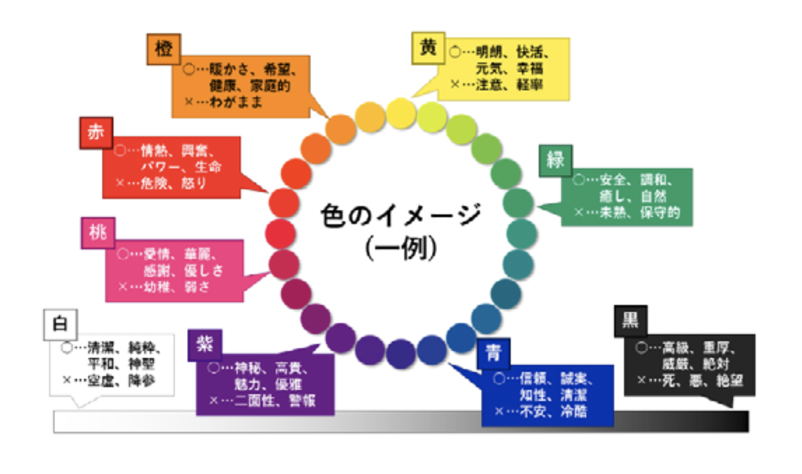

LPやECサイト等のCTA/コンバージョンボタン色に関する諸説まとめ | デジタルマーケティングTips　出典：株式会社マックスマウス

暖色系（赤、オレンジ、黄色）

暖色系の色はエネルギーや活力を喚起し、心拍数を上げる効果があります。赤色は情熱や興奮を象徴し、注意を引くために使用されます。オレンジ色は社交性や元気を感じさせ、コミュニケーションを促進します。黄色は喜びや創造性を刺激し、視覚的に明るさと活力を強調します。これらの色は、感情的な刺激を提供し、積極的な行動を促進します。

寒色系（青、緑、紫）

寒色系の色はリラックスや冷静さを促進します。青色は安心感や信頼感を提供し、冷静な思考を促します。緑色は自然とのつながりを感じさせ、リラックスや調和を助けます。紫色は神秘性や高貴さを連想させ、創造性や高級感を演出します。これらの色は、ストレスを軽減し、心の安定を促進します。

色の明るさと鮮やかさ

色の明るさや鮮やかさも感情に大きな影響を与えます。明るい色はポジティブな反応を引き起こし、暗い色は落ち着きや厳粛さをもたらします。例えば、明るいピンク色は幸福感を促進し、暗いグレーは冷静さや厳粛さを示します。

色の文化的および個人的な意味合い

色の意味は文化や個人の経験によって異なるため、異なる背景を考慮することが重要です。

文化的な違い

色が文化によって異なる意味を持つ例として、赤色があります。西洋文化では赤色が情熱や危険を象徴する一方、東洋文化では幸福や繁栄を意味します。白色も文化によって意味が異なり、西洋では純粋さや清潔さを象徴する反面、東洋では喪の色として認識されることがあります。

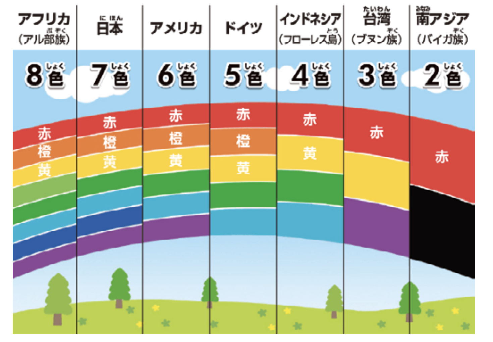
色のイメージは国や文化によって違うの？　出典：おしごとはくぶつかん

個人的な意味合い

色に対する個人的な反応は、その人の過去の経験によっても影響されます。たとえば、特定の色が特別な思い出や感情と結びついている場合、その色に対する反応が強くなることがあります。個人の色に対する感情的な反応は、デザインやマーケティング戦略において重要な要素です。

### Section 10-2　色彩と感情の関係

色彩が感情に与える影響を理解することは、デザインやマーケティングにおいて非常に重要です。このセクションでは、色彩が引き起こす感情反応や、その文化的背景について詳しく説明します。

色彩が引き起こす一般的な感情反応

色彩は感情に強い影響を与え、以下のような具体的な感情反応を引き起こします。

赤色

赤色はエネルギー、情熱、興奮を象徴します。警告サインや広告などでよく使用され、消費者の注意を引きつける効果があります。赤色は心拍数を上げ、興奮を引き起こすため、緊急性を伝える際に有効です。

青色

青色は信頼感、安心感、冷静さを提供します。企業のロゴや金融機関のブランディングに使用されることが多く、消費者に対して安心感を与えます。青色は集中力を高め、学習や仕事の環境にも適しています。

緑色

緑色は自然や調和を象徴し、リラックス感を促進します。スパやウェルネスセンターで使用されることが多く、ストレスの軽減や心の安定をサポートします。緑色は健康や新鮮さを連想させ、癒しの効果があります。

黄色

黄色は喜びや活力をもたらし、視覚的に明るさを強調します。子供向けの商品やサービスでよく使用され、エネルギーや創造性を刺激します。黄色はポジティブな感情を引き起こし、楽しい雰囲気を作り出します。

紫色

紫色は高貴さや神秘性を連想させ、高級感や創造性を表現します。高級ブランドやアート作品に使われることが多く、独自性や特別感を演出します。紫色は感性を刺激し、創造的な思考を促進します。

色彩と感情の文化的影響

色彩が感情に与える影響は文化によって異なります。以下に、色彩の文化的背景による影響について説明します。

白色の文化的影響

白色は西洋文化では純粋さや清潔さを象徴しますが、東洋文化では喪の色として使用されることがあります。このため、デザインやブランディングにおいてはターゲット市場の文化的背景を考慮することが重要です。

黒色の文化的影響

黒色は多くの文化で強さや権威を象徴する一方、悲しみや喪を表すこともあります。例えば、西洋では黒色が葬儀や喪に関連する色として認識される一方、ファッションやビジネスではエレガンスやプロフェッショナリズムを示します。

### Section 10-3　カラーイメージとブランディング

カラーイメージは、ブランドのアイデンティティや消費者の認識に大きな影響を与えます。ブランドカラーの選定は、ターゲット市場の文化的背景や心理的反応を考慮して行われるべきです。ここでは、異なるブランドのカラーイメージとその影響について詳しく説明します。

カラーイメージとは？

カラーイメージは、ブランドが消費者に与える印象や認識を視覚的に表現する要素です。ブランドカラーは、消費者の感情や行動に直接影響を与えるため、慎重に選定する必要があります。色彩は、ブランドのアイデンティティやメッセージを強調し、消費者の記憶に深く刻まれることがあります。

マクドナルドの赤と黄色

マクドナルドのブランドカラーである赤と黄色は、食欲を刺激し、親しみやすさと活気を演出します。赤色はエネルギーや興奮を象徴し、黄色は明るさと楽しさを示します。この色の組み合わせは、ファーストフードの迅速なサービスを促進し、子供から大人まで幅広い層にアピールします。実際、赤と黄色は視覚的に強いコントラストを生み出し、ブランドの存在感を強調します。

ニューバランスのグレー

ニューバランスはグレーを基調にしたカラーを使用し、シンプルさと信頼性を強調しています。グレーはニュートラルな色であり、洗練された印象を与えるため、ブランドの品質とパフォーマンスを際立たせます。グレーの使用は、スポーツシューズの性能や機能性を伝えるために効果的です。

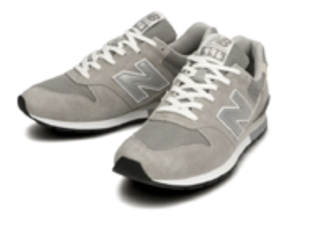

バーバリーのチェック柄

バーバリーの特徴的なチェック柄は、ブランドの伝統と高級感を象徴しています。ベージュ、黒、赤のチェックパターンは、エレガンスと歴史的なスタイルを表現し、ブランドの認知度を高めています。このパターンは、バーバリーのアイコンであり、ブランドの強い識別要素として機能しています。

## 第11章　配色ルール

### Section 11-1　カラーパレットの選定

カラーパレットの作成は、デザインプロセスの重要なステップであり、視覚的な一貫性と調和を保つために不可欠です。以下に、基本的なカラーパレットを作成する方法を説明します。

単色パレット

単色パレットは、同じ色相の異なる明度（明るさ）や彩度（鮮やかさ）を用いた配色です。色相が一つであるため、非常に統一感があり、シンプルでクリーンな印象を与えます。

作成方法

①基準色の選定: パレットの基準となる主色（例: 青）を選びます。この色がパレットの中心となります。

②明度の調整: 主色の明度を変更し、色の明るさを調整します。たとえば、青の基準色を明るい青から暗い青までのトーンに変えます。

③彩度の調整: 色の鮮やかさを調整します。鮮やかな色から、よりグレーがかった落ち着いた色までのバリエーションを作成します。

④バリエーションの作成: 明度と彩度の異なる色を組み合わせて、全体的なパレットを作成します。これにより、視覚的に深みと調和を持たせることができます。

https://color.adobe.com/ja/create/color-wheel　出典：Adobe Color CC

使用例

ウェブデザインやアプリのユーザーインターフェース（UI）で、ブランドカラーとして使われることが多いです。例えば、企業のロゴやウェブサイトの背景色、またはアプリの主要な操作ボタンなどに利用されます。
効果
単色パレットは、デザインに統一感をもたらし、クリーンで洗練された印象を与えます。色の変化が自然でありながら視覚的な深みを持たせるため、シンプルでありながらも洗練された印象を演出できます。

補色パレット

補色パレットは、カラーホイール上で互いに正反対に位置する色を組み合わせる方法です。例えば、赤と緑、青とオレンジが典型的な補色の組み合わせです。

作成方法

①基準色の選定: 補色パレットの基準となる色（例: 赤）を選びます。
②補色の特定: カラーホイールで基準色の反対側に位置する色（例: 緑）を特定します。
③組み合わせの決定: 基準色と補色を組み合わせ、視覚的に強いコントラストを生み出します。
④基準色と補色の比率や配置を調整し、デザイン全体にインパクトを与えるようにします。

https://color.adobe.com/ja/create/color-wheel　出典：Adobe Color CC

使用例

広告やポスターで、目立たせたいテキストや重要なアイコンに使用されることが多いです。特に、セールやキャンペーンの広告で目を引くために利用されます。

使用例

補色は高いコントラストを生み出し、視覚的に強いインパクトを与えます。重要な要素や情報を際立たせるために使用され、注意を引きたい部分に最適です。

類似色パレット

類似色パレットは、カラーホイール上で隣接する色を組み合わせる方法です。例えば、青と緑、赤とオレンジなどです

作成方法

①基準色の選定: 類似色パレットの基準となる色（例: 青）を選びます。
②隣接色の特定: カラーホイールで基準色の隣に位置する色（例: 青緑や青紫）を特定します。
③組み合わせの決定: 基準色と隣接色を組み合わせ、視覚的に調和の取れた配色を作成します。
④バリエーションの調整: 色の明度や彩度を調整し、全体的な調和

https://color.adobe.com/ja/create/color-wheel　出典：Adobe Color CC

使用例

インテリアデザインやウェブデザインで、落ち着いた印象を与えたい場合に使用されます。特に、リラックスできる空間や一貫性のあるブランドイメージに最適です。

効果

類似色は調和の取れた、落ち着いた印象を与えます。色が自然に溶け込み、柔らかい印象を作り出します。類似色を使用することで、視覚的な流れが自然になり、リラックスした雰囲気を作ることができます。

トライアドパレット

トライアドパレットは、カラーホイール上で均等に間隔を置いた3色を使用する方法です。例えば、赤、青、黄が典型的なトライアドパレットです。

作成方法

①基準色の選定: トライアドパレットの基準となる色（例: 赤）を選びます。
②他の2色の特定: カラーホイールで基準色と均等に間隔を置いた2色（例: 青、黄）を特定します。
③組み合わせの決定: 3色を組み合わせ、バランスの取れたカラーパレットを作成します。
④配色の調整: 色の比率や配置を調整し、視覚的に安定感を持たせるようにします。

https://color.adobe.com/ja/create/color-wheel　出典：Adobe Color CC

使用例

ブランドのカラーシステムや製品パッケージに使用され、全体的なカラーバランスを取るのに役立ちます。例えば、パッケージデザインや広告で効果的です。

効果

トライアドパレットは、バランスの取れたカラーパレットを提供し、色の調和と対比を両立させることができます。色のバランスが良く、視覚的に安定感があります。トライアドパレットを使用すると、デザインにリズムを持たせつつ、視覚的なバランスを確保できます。

テトラードパレット

テトラードパレットは、カラーホイール上で均等に配置された4色を使用する方法です。通常、2組の補色が組み合わさる形で、たとえば青、オレンジ、赤、緑の組み合わせなどです。

作成方法

①基準色の選定: テトラードパレットの基準となる色（例: 青）を選びます。
②他の3色の特定: カラーホイールで均等に配置された3色（例: 青、オレンジ、赤、緑）を特定します。
③組み合わせの決定: 4色を組み合わせ、視覚的に豊かなカラーパレットを作成します。
④配色の調整: 色のバランスや比率を調整し、全体的な調和を保つようにします。

https://color.adobe.com/ja/create/color-wheel　出典：Adobe Color CC

使用例

複雑なデザインやアート作品で、多彩な色合いを活用したい場合に適しています。例えば、アート作品やイベントのビジュアルデザインに利用されます。

効果

テトラードパレットは、複雑なカラーパレットを提供し、多様な色を使いたい場合に有効です。色のバランスを保ちながら、視覚的に豊かな表現が可能です。テトラードパレットは、色の多様性とバランスを両立させるため、デザインに深みを加えます。

### Section 11-2　色のバランスと調和

色のバランスと調和を理解することで、デザインにおける視覚的な重みや流れを巧みに操作し、全体の調和を取ることが可能になります。視覚的な重みでは、大きな面積に穏やかな色、小さな面積に鮮やかな色を使用することで、デザインのバランスを整えることができます。視覚的な流れを意識し、色のトーンや明度を使って視線を自然に誘導することで、デザイン全体の一貫性を保ちます。これにより、デザインが視覚的に魅力的で、情報が明確に伝わるようになります。

視覚的な重み

視覚的な重みとは、デザイン内での色の面積と配置が、全体のバランスにどのように影響するかを示す概念です。大きな面積に使用される色と、小さなアクセントカラーとのバランスが重要であり、色の面積が大きいほどその色は視覚的に「重く」、逆に面積が小さいほど「軽く」感じられます。これにより、デザインの視覚的な重心が調整され、全体の調和が取れます。

実践

色のバランスを取るためには、デザインの中で大きな面積には穏やかな色を使用し、小さな面積には鮮やかな色を使うのが効果的です。例えば、ウェブサイトの背景に淡い色を使用し、ボタンや重要な情報に対して鮮やかな色を使用することで、視覚的な焦点を作り出し、ユーザーの注意を引きます。これにより、全体のデザインの調和を保ちながら、重要な部分を強調することができます。

配色の基本】面積比（メイン、アクセント、ベース）と色相分割  出典：クモのようにコツコツと

具体例

ウェブサイトの背景を淡いグレーやベージュに設定し、主要なアクションボタンやリンクに鮮やかな青やオレンジを使用することで、ユーザーの目を自然に引き付けます。また、広告デザインにおいても、主要なメッセージやアクションを際立たせるために目立つ色を使用し、視覚的な重心を調整します。

視覚的な流れ

視覚的な流れとは、色の配置を通じて視線を誘導し、デザイン全体に一貫性を持たせる技術です。色の流れをうまく作ることで、視覚的に重要な要素へと自然に視線を導き、情報の伝達やユーザーの行動を促進します。視覚的な流れを意識することで、ユーザーがデザイン内で自然な動きを感じやすくなります。

実践

色のトーンや明度を活用して視線を導くデザインを作成します。明るい色を前景に使い、暗い色を背景に使用することで視覚的な焦点を作り出します。また、色の変化を用いて自然な視線の流れを作り、デザイン内でのユーザーの注意を引き、情報を効果的に伝えることができます。

具体例

ウェブページのレイアウトで、重要な情報やCTA（コール・トゥ・アクション）ボタンを明るい色で強調し、周囲の要素には淡い色を使うことで視線を自然に誘導します。広告バナーでは、主要なメッセージに明るい色を使用し、サブメッセージには落ち着いた色を使うことで、視線の流れを意識したデザインが可能です。

デザインにおける視線誘導の基本【N/F/Zの法則】　 出典：321web

アクセントカラーの使い方

アクセントカラーの使い方とは、主に落ち着いた配色の中に目を引く鮮やかな色を取り入れる方法です。アクセントカラーを使用することで、特定の要素を強調し、視覚的な焦点を作り出します。アクセントカラーは、デザイン内で特に重要な要素を際立たせるための強力なツールです。

実践

基本のカラーパレットに対して、目立たせたい部分に鮮やかな色を使うことで、重要な情報やアクションを強調します。ナビゲーションバーやボタンにアクセントカラーを使用することで、ユーザーの目を引きつけることができます。アクセントカラーの選択は全体のデザインバランスと調和を保ちながら行うことが重要です。

具体例

ウェブサイトのCTAボタンに鮮やかなオレンジや青を使用して、ユーザーがアクションを起こしやすくします。また、広告デザインで重要な情報や特典を強調するためにアクセントカラーを使い、視覚的なインパクトを高めることができます。

コーポレートサイトに使用する色の決め方と主な色の印象 出典：株式会社クーシー

トーンの調整

トーンの調整とは、同じ色相の異なるトーン（明るさや暗さ）を使ってデザインに深みや立体感を加えるテクニックです。トーンの違いを利用することで、視覚的な興味を引き、デザインに奥行きやニュアンスを持たせることができます。色相を変えずに明度を調整することで、より豊かな視覚的表現が可能です。

実践

色相を変えずに明度を調整することで異なるトーンを作り出します。例えば、青の色相を使って、明るい青から暗い青までのトーンを活用することで、視覚的に奥行きのあるデザインを作成します。トーンの変化を利用して、デザインに深みを持たせ、視覚的な興味を引き出します。

具体例

ウェブサイトの背景に淡いブルーを使用し、重要な要素には濃いブルーを使うことでデザインに奥行きを持たせることができます。また、プレゼンテーション資料で同じカラーパレットの異なるトーンを使用し、情報を階層的に整理することで視覚的な明確さを提供します。

https://www.fuji-koeki.co.jp/ 出典：株式会社富士交易

## 第12章　ユニバーサルデザイン（カラー）

### Section 12-1　ユニバーサルデザインの基本概念

ユニバーサルデザイン（Universal Design）は、すべての人々が利用しやすい環境や製品を設計するアプローチです。この考え方は、物理的なアクセシビリティだけでなく、視覚的なアクセシビリティにも及びます。特に色彩に関しては、異なる色覚を持つユーザーが情報を適切に認識できるように配慮することが求められます。

色彩におけるUD

ユニバーサルデザインの目的は、情報が視覚的に明確に伝わることを確保し、すべてのユーザーが平等に情報にアクセスできるようにすることです。この考え方は、以下の要素を含みます。

包括性

すべての人が利用できるデザインを目指す。特に視覚障害や色覚異常を持つ人々を考慮し、彼らが情報にアクセスしやすいように設計します。

柔軟性

さまざまな使用方法や条件に対応できるデザイン。例えば、異なる視覚能力や環境に合わせた調整ができるデザインが求められます。

シンプルさ

ユーザーが直感的に理解できるシンプルなデザイン。複雑な視覚的要素や過剰な装飾は避け、ユーザーが情報を簡単に受け取れるようにします。

考慮する事

ユニバーサルデザインを色彩に適用する際には、以下の点を考慮する必要があります。

視覚的なコントラスト

背景と前景のコントラストが十分でないと、視覚的に情報を認識するのが困難になります。例えば、明るい背景に暗い文字を使用することが推奨されます。

色の役割の補完

色だけでなく、形状やテクスチャーなどの視覚的要素も組み合わせて情報を提供することで、色覚異常のあるユーザーにも情報が伝わりやすくなります。

ユニバーサルデザインの基本概念を理解し、色彩におけるアクセシビリティを高めるための具体的な方法を考えていきましょう。

### Section 12-2　色覚のバリエーションと配慮

色覚のバリエーションにはさまざまな種類があり、それぞれに対して適切な配慮が必要です。
以下では、主要な色覚異常の種類とそれに対するデザイン上の配慮について詳しく説明します。

赤緑色覚異常

この状態では、赤と緑の区別が困難です。これは、赤と緑の波長が近いため、色覚異常を持つ人には混同しやすくなります。この場合、以下の対策が有効です。

色覚異常・色覚検査について 　出典：的場眼科クリニック

形状やパターンの追加: 赤と緑の区別を補うために、色に加えて形状やパターンを使用します。例えば、グラフや地図に異なるパターンを使うことで、視覚的に区別しやすくなります。

テキストの利用: 色だけでなく、テキストやラベルを使用して情報を伝えることも重要です。例えば、グラフの凡例にテキストを加えることで、色覚異常のある人にも情報が伝わりやすくなります。

青黄色覚異常

青と黄色の識別が難しい状態です。青と黄色の波長が近いため、この状態では色の違いがわかりにくくなります。この場合、以下の対策が有効です。

形状やアイコンの利用: 色だけでなく、形状やアイコンを使って情報を補完します。例えば、地図や図表で青と黄色の
代わりに異なる形状やシンボルを使うことで、色覚異常を持つ人にも情報がわかりやすくなります。
コントラストの調整:   色のコントラストを調整することで、青と黄色の違いをより明確にすることができます。
明るさや暗さの差を利用して視覚的に区別できるようにします。

全色盲

色を認識できない状態で、すべての情報が白黒に見えます。この場合、以下の対策が有効です。

色覚障碍（色覚多様性）と言ってもいろいろな見え方がある。タイプ別にみる物の見え方  出典：カラパイア

テクスチャーや形状の使用: 色以外の視覚的要素（例えば、テクスチャーや形状）を使って情報を伝えることが重要です。例えば、異なるテクスチャーを使ってグラフや地図の異なる部分を区別します。

高いコントラスト: 白黒のコントラストを十分に高く保つことで、情報の識別性を向上させます。例えば、黒と白の高コントラストな組み合わせを使用します。

発生率と影響

色覚異常は、全体の人口の一定割合に影響を与えます。特に男性に多く見られるため、デザインではこの点を考慮する必要があります。以下の点も考慮しましょう。

教育と認識

色覚異常についての認識を高めるために、教育や啓発活動を行うことが重要です。デザインにおいても、色覚異常の影響を理解し、対応策を講じることで、より多くの人が快適に情報を受け取れるようにします。

テストとフィードバック

色覚異常を持つユーザーからのフィードバックを受け取り、デザインの改善に役立てることが重要です。実際のユーザーによるテストを行い、実践的な改善点を見つけます。

### Section 12-3　色彩の識別性の確保

色彩の識別性を確保するためには、以下の要素を考慮することが重要です。

コントラストの確保

色のコントラストは、視覚的な情報の識別において重要な要素です。
以下の点に留意してコントラストを確保します。

背景と前景のコントラスト

背景色と前景色（テキストやアイコン）のコントラスト比を高く保つことが推奨されます。
例えば、白い背景に黒いテキストを使用することで、視認性を向上させることができます。

コントラスト比の基準

WCAG（Web Content Accessibility Guidelines）では、テキストと背景のコントラスト比が一定以上であることを推奨しています。
具体的には、普通のテキストで4.5:1以上、太字のテキストで3:1以上のコントラスト比が求められます。

文字色と背景色のコントラスト比は4.5:1以上にしましょう。7.5:1以上であると理想的です。　出典：UX DAYS TOKYO公式

色の役割の補完

色だけでなく、形状やテクスチャーなどの視覚的要素を組み合わせて情報を補完することが重要です。これにより、色覚異常のあるユーザーにも情報が伝わりやすくなります。以下の方法が有効です。

アイコンの使用

情報を視覚的に伝えるために、色と共にアイコンやシンボルを使用します。例えば、エラーメッセージには赤いアイコンに加えて、警告の形状を使用することが有効です。

テクスチャーの利用

色の違いを補うために、異なるテクスチャーを使用することで、視覚的な区別をつけることができます。たとえば、グラフのバーに異なるテクスチャーを追加することで、色覚異常のあるユーザーにも情報が伝わりやすくなります。

### Section 12-4　ユニバーサルデザインのガイドライン

ユニバーサルデザインを実践するためのガイドラインとツールを紹介します。

WCAG

WCAG（Web Content Accessibility Guidelines）は ウェブコンテンツのアクセシビリティを高めるためのガイドラインで、色のコントラスト比や色覚異常に配慮したデザインが推奨されています。以下のポイントに留意します。

コントラスト比の確保

前述の通り、テキストと背景のコントラスト比を基準にすることで、視覚的なアクセシビリティを高めます。

視覚的な補助

色だけでなく、形状やパターンを使って情報を補完することが推奨されています。これにより、色覚異常のあるユーザーにも情報が伝わりやすくなります。

アクセシビリティのチェックツール

色覚異常のシミュレーションツールやコントラストチェックツールを使用して、デザインのアクセシビリティを確認します。以下のツールが有効です。

Color Oracle

色覚異常をシミュレートするツールで、デザインがどのように見えるかを確認できます。

Contrast Checker

コントラスト比を測定するツールで、テキストと背景のコントラストが基準を満たしているかを確認します。

Adobe Color CC

色の組み合わせや配色を検討するツールで、色覚異常を考慮した配色の提案が受けられます。

### Section 12-5　実践例とケーススタディ

具体的なデザイン事例を通じて、ユニバーサルデザインの効果的な実施方法と成果を紹介します。

地図デザイン

色覚異常に対応した地図デザインでは、色だけでなくシンボルやパターンを使用して情報を伝えることが多いです。以下の工夫がされています。

異なるパターンの使用

地図の異なるエリアに異なるパターンを使用することで、色覚異常のあるユーザーにも区別しやすくしています。

明確なラベル

色で区別できない場合でも、明確なラベルや説明を追加することで、情報がわかりやすくなります。

京都市：わかりやすい印刷物のつくり方6　出典：京都市情報館

アプリのインターフェース

大手アプリケーションでは、色覚異常のあるユーザーを考慮して、視覚的なコントラストを強調し、色の使い方を工夫しています。以下の点が考慮されています。

高いコントラスト

背景と前景のコントラストを高く保ち、情報が見やすくなっています。

アイコンとテキストの併用

色だけでなく、アイコンやテキストを併用することで、情報がより明確に伝わります。

特務機関NERV防災」アプリ、アクセシビリティ機能を大幅強化　出典：ゲヒルン株式会社

ケーススタディ

具体的なケーススタディをいくつか紹介します。これらはユニバーサルデザイン、特に色彩のアクセシビリティに関する成功事例として知られているプロジェクトです。

London Underground Map

ロンドン地下鉄（London Underground）は、その複雑な路線図で知られています。この地図は視覚的にわかりやすいデザインで、多様なユーザー層に対応するために設計されています。特に色覚異常者にも配慮したカラーパレットを採用し、色だけでなく、線のパターンや形状を工夫することで、路線の識別を容易にしています。
このデザインは、多くのユーザーから高く評価されており、特に視覚障害を持つ人々に対するアクセシビリティが向上しました。色覚異常を持つユーザーからも、路線図が見やすくなったというフィードバックが多く寄せられています。これにより、公共交通機関を利用する際のユーザー体験が大幅に改善されました。

ロンドン地下鉄のマップが大改訂されます！　出典：ロンドンナビ

BBCのウェブアクセシビリティガイドライン

BBCは、自社のウェブサイトにおいて、アクセシビリティガイドラインを厳格に守っています。これには、色彩設計におけるアクセシビリティの確保も含まれます。特に、色覚異常を持つユーザーのために、コントラスト比の最適化や色の組み合わせに配慮したデザインを実施しています。

BBCのウェブサイトは、
WCAG（Web Content Accessibility Guidelines）基準を満たしており、多くのユーザーが快適に利用できるようになっています。特に視覚障害を持つユーザーからは、情報の見やすさや使いやすさが向上したという評価が寄せられています。この取り組みは、他の企業にも広く参考にされる成功事例となっています。

https://www.bbc.com/sport　出典：BBC

Microsoft Officeの色彩アクセシビリティ機能

Microsoftは、Office製品（Word、Excel、PowerPointなど）において、色覚異常を持つユーザーにも使いやすいデザインを導入しています。特に、ユーザーが色のカスタマイズやコントラスト調整を行える機能を提供し、色彩のアクセシビリティを向上させています。

これにより、色覚異常を持つユーザーでも文書やスプレッドシートをより簡単に操作できるようになりました。企業や教育機関などでの利用者からも、高い評価を受けており、アクセシビリティに対する取り組みの重要性を示す一例となっています。

Monzo Bankアプリ

Monzoは、色彩設計においてユニバーサルデザインの原則を取り入れたデジタルバンクアプリを提供しています。特に、色覚異常を持つユーザーがアプリ内での情報を適切に認識できるよう、色の選定やコントラスト比の調整に細心の注意を払っています。

Monzo：英国でアプリ評価が高いチャレンジャーバンク　出典：NCB Library

この取り組みにより、視覚障害を持つユーザーでも問題なくアプリを利用できるようになり、ユーザーエクスペリエンスが向上しました。アクセシビリティを重視したこのアプローチは、金融サービス業界でも注目されています。

## 第13章　ユーザビリティとアクセシビリティ

### Section 13-1　ユーザビリティの概要とその重要性

ユーザビリティ（使いやすさ）は、ウェブサイトやアプリケーションの設計において、ユーザーが直感的に操作でき、目標を達成しやすくするための重要な要素です。良好なユーザビリティは、サイトの効果的な運用に直結し、ユーザーの満足度と再訪問の可能性を高めるため、非常に重要です。

ユーザビリティの定義と要素

ユーザビリティとは、システムやアプリケーションがどれだけ使いやすく、効率的に目的を達成できるかを評価する指標です。ユーザビリティの良し悪しは、ユーザーがウェブサイトやアプリケーションを利用する際の体験に大きな影響を与えます。主な要素には、直感的なナビゲーション、操作の容易さ、エラーの発生頻度、そして全体的なユーザー満足度が含まれます。

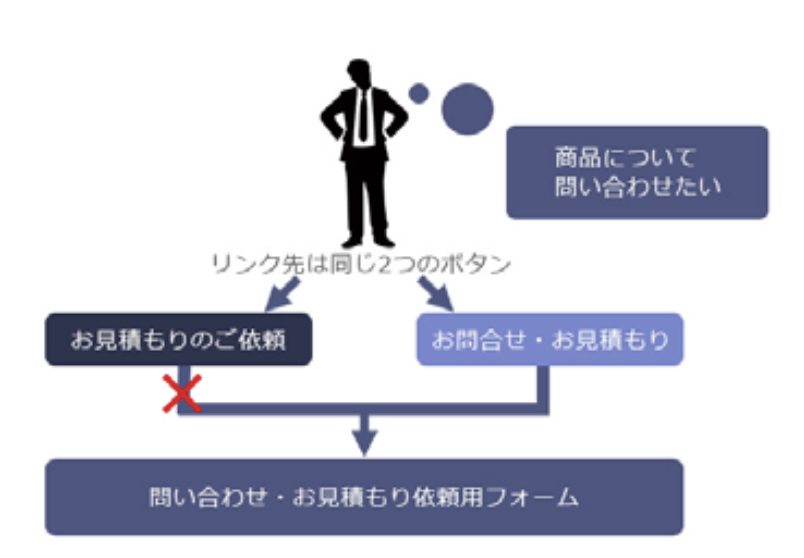
Webサイトにおけるユーザビリティの基本　出典： 群馬 ホームページ制作：MK-Design/MKデザイン「群馬県伊勢崎市」

ユーザビリティの主な要素 / 使いやすさ

直感的なナビゲーション:
ユーザーがウェブサイトを使う際には、ナビゲーションが直感的であることが求められます。ナビゲーションメニューの位置やラベルが明確で、ユーザーが必要な情報に迅速にアクセスできるように設計することが重要です。例えば、メニュー
項目は分かりやすくラベル付けし、ユーザーが迷うことなく目的のページにたどり着けるようにします。

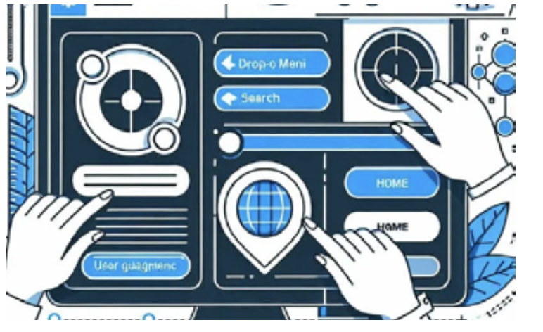
ウェブサイトのナビゲーション - 機能的なナビゲーションデザインの重要な要素　出典： Copymate

操作の容易さ:
ユーザーが特定のアクションを実行するための操作が簡単である必要があります。操作が複雑であったり、過剰な入力要求があったりすると、ユーザー体験が損なわれる可能性があります。ボタンの配置や入力フォームのデザインなど、操作を直感的に行えるように設計することが求められます。

ユーザビリティの主な要素 / 使いやすさ

タスクの迅速な達成:
ユーザーがウェブサイト上で目的を迅速に達成できるように、サイトはタスクを効率的にサポートする設計が求められます。無駄な手順を省き、スムーズなプロセスを提供することで、ユーザーが目標を効率的に達成できるようにします。たとえば、検索機能を充実させることで、ユーザーが必要な情報に素早くアクセスできるようにすることが考えられます。

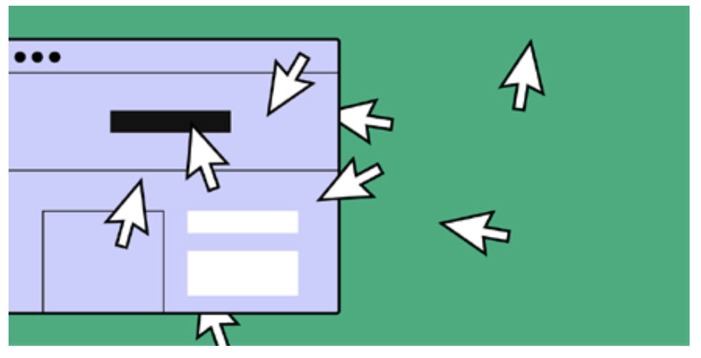
ユーザビリティテスト とは？成功させる6つの秘訣　出典：UXPin

ユーザビリティの主な要素 / エラー防止と修正

エラーメッセージの効果的な表示:
エラーが発生した際には、わかりやすいエラーメッセージを表示し、ユーザーが問題を迅速に修正できるようにします。エラーメッセージには、問題の詳細と解決策を示すことが重要です。ユーザーがエラーの原因を理解しやすく、対処方法を明確に示すことで、フラストレーションを軽減できます。

入力フォームにおけるエラーデザイン　出典：ベイジのUIラボ

ユーザビリティテストの実施

ユーザビリティテストは、実際のユーザーにウェブサイトやアプリケーションを使ってもらい、その使いやすさを評価するプロセスです。ユーザーが特定のタスクを実行する際の行動や反応を観察し、改善点を特定します。このテストにより、ユーザーの実際の体験に基づいたフィードバックを得ることができ、具体的な改善策を見つける手助けとなります。

テストの種類

モデレーテッドユーザビリティテスト:
モデレーテッドユーザビリティテストでは、テストのファシリテーターがユーザーの操作を観察し、リアルタイムでの反応を記録します。ユーザーがどのようにウェブサイトを操作するか、どの部分で困難を感じるかを把握し、ユーザビリティの問題点を特定します。モデレーテッドユーザビリティテストは、ユーザーの行動を直接観察することで、詳細なフィードバックを得ることができます。

リモートテスト:
リモートテストでは、ユーザーが自分の環境でテストを実施し、その様子をオンラインで共有します。これにより、ユーザーが普段使用する環境での体験を観察でき、実際の使用状況に近い形でのフィードバックを得ることができます。リモートテストは、地理的に離れた場所にいるユーザーとのテストにも対応できる利点があります。

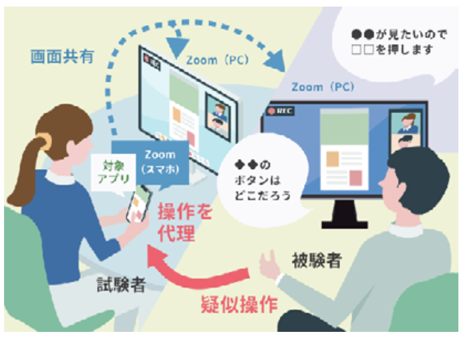
オンライン疑似操作でのユーザビリティテストの様子　出典：株式会社ルート・シー

### Section 13-2　アクセシビリティの概要とその重要性

アクセシビリティは、すべてのユーザー、特に障害を持つユーザーがウェブサイトやアプリケーションにアクセスし、利用できるようにするための設計と開発の考え方です。アクセシビリティの向上は、より多くの人々にサービスを提供し、法的要件を満たすためにも重要です。

アクセシビリティの定義と要素

アクセシビリティとは、障害を持つユーザーが情報や機能にアクセスできるように設計されたウェブサイトやアプリケーションの特性です。視覚障害、聴覚障害、運動障害などに対応する機能が含まれます。例えば、スクリーンリーダーによる読み上げ機能や、キーボードだけで操作できるインターフェースの設計がこれに該当します。

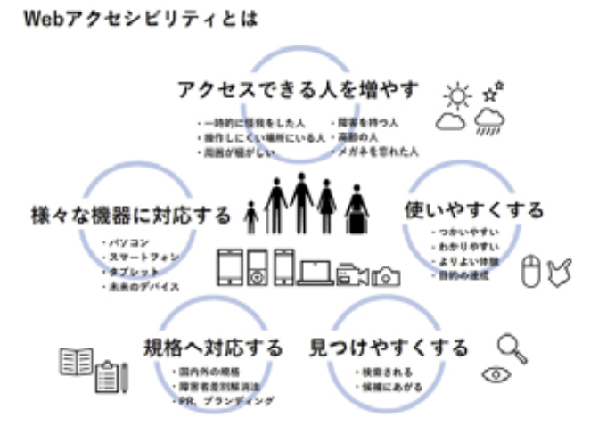
企業サイトのウェブアクセシビリティの今とこれから　出典： 株式会社コンセント

主要なアクセシビリティ基準

WCAG（Web Content Accessibility Guidelines）:
WCAGは、ウェブコンテンツのアクセシビリティに関する国際的なガイドラインです。これには、視覚的なコンテンツ、音声コンテンツ、インタラクティブ要素に関する基準が含まれています。WCAGは、すべてのユーザーがウェブコンテンツに平等にアクセスできるようにするための基準を提供しています。

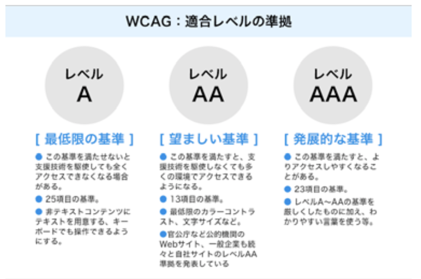
いま知っておきたい「アクセシビリティ」の基本と便利な確認ツール　出典： SINAP

デザインのアクセシビリティ

デザインのアクセシビリティ
カラーコントラストの最適化:
色のコントラストを最適化することで、視覚障害を持つユーザーがテキストや重要な情報を読みやすくします。十分なコントラスト比を維持することが重要であり、ウェブサイトのデザインにおいては、テキストと背景色のコントラストを適切に設定する必要があります。これにより、視覚的に情報を確認するのが困難なユーザーでも、内容を把握しやすくなります。

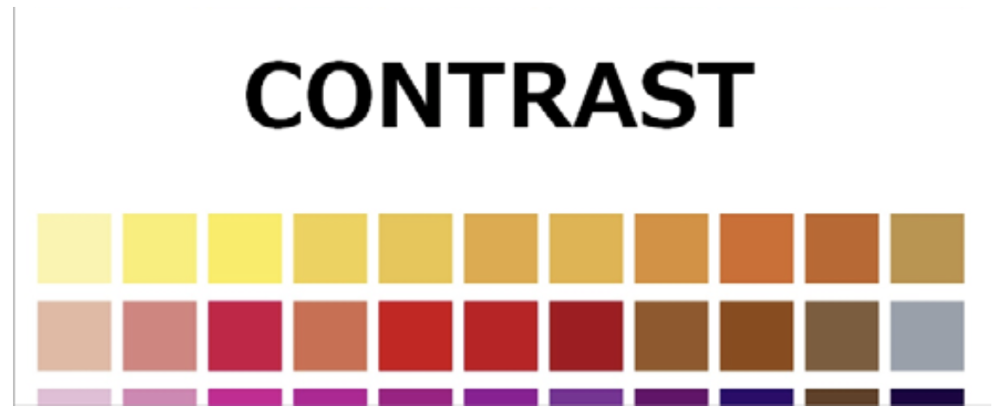
ウェブアクセシビリティ対応における「コントラスト比」とは？　出典： ShareWith

キーボードナビゲーションのサポート:
ユーザーがキーボードだけでウェブサイトを操作できるように設計することで、運動障害を持つユーザーにもアクセス可能にします。タブ順序やフォーカスの管理が重要です。キーボード操作だけですべての機能にアクセスできるようにし、操作のしやすさを確保します。例えば、タブキーを使ってフォームのフィールドを順に移動できるようにすることが挙げられます。

テストと評価

アクセシビリティテストのツール:
ウェブサイトのアクセシビリティをテストするためのツールとして、WAVE、Axe、Lighthouseなどがあります。これらのツールは、アクセシビリティの問題を自動的に検出し、改善提案を提供します。テストツールを使用することで、ウェブサイトのアクセシビリティに関する問題点を迅速に把握し、改善策を講じることができます。
Wave：https://wave.webaim.org/

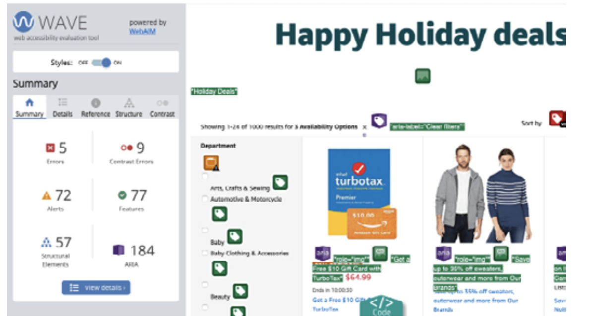
ウェブアクセシビリティ検証ツール「WAVE」(2019年10月アップデート版)　出典： Accessible & Usable

ユーザーテスト:
実際の障害を持つユーザーによるテストを実施することで、リアルな使用体験を評価し、実際の問題を把握します。これにより、より実践的な改善点を見つけることができます。ユーザーがどのようにウェブサイトを利用しているかを観察することで、実際のニーズに基づいた改善が可能になります。

## 第14章　Webの未来と新しいトレンド

### Section 14-1　Web技術の最新トレンドとその影響

ウェブ技術は驚異的な速度で進化しており、最新のトレンドや技術革新はウェブサイトの機能性、パフォーマンス、そしてユーザー体験に大きな変革をもたらしています。これらの新しい技術の理解と導入は、未来のウェブ開発において欠かせないものとなります。

新しいウェブ技術の進展

新しいウェブ技術の進展は、インターネットの可能性を飛躍的に広げ、ウェブサイトやアプリケーションのパフォーマンス、ユーザー体験、そして開発者の効率性に大きな影響を与えています。

現在、WebAssembly（Wasm）やProgressive Web Apps（PWA）といった技術が、ウェブ開発の新たなスタンダードとして台頭しており、これらは従来の技術を補完し、さらなる高機能なウェブ体験を提供することを可能にしています。

WebAssembly（Wasm）

WebAssembly（Wasm）は、ブラウザ上でのネイティブに近いパフォーマンスを提供する新しい技術です。JavaScriptでは達成が難しい高パフォーマンスなアプリケーションを実現し、ゲーム、3Dグラフィックス、高度なデータ処理を可能にします。WebAssemblyは、既存のウェブ技術と統合されることで、ウェブアプリケーションの新たな可能性を引き出します。

メリット

WebAssemblyは、C、C++、Rustなどの高パフォーマンス言語で書かれたコードをブラウザで実行できるようにコンパイルします。これにより、複雑な計算処理やグラフィックスのレンダリングを高速化し、従来のJavaScriptに比べて圧倒的に高いパフォーマンスを実現します。

クロスプラットフォーム対応

WebAssemblyは、異なるプラットフォーム間でのアプリケーション実行を可能にします。つまり、開発者は同じコードベースを使って、PC、スマートフォン、タブレットなど、さまざまなデバイスでアプリケーションをシームレスに展開できます。これにより、開発効率が劇的に向上します。

WebAssemblyとは？何ができるのか？できないことやユースケースをわかりやすく解説　出典：パーソルクロステクノロジー

WebAssembly（Wasm）の使用例

動画ストリーミングサービスでは、WebAssemblyを利用して、ビデオのデコードやエンコードを効率的に処理し、スムーズな再生体験を提供することが可能です。また、インターフェースの一部でWebAssemblyが使われることで、より高いパフォーマンスと応答性を実現している場合もあります。

出典：Amazon Prime Video

Progressive Web Apps（PWA）

Progressive Web Apps（PWA）は、ウェブアプリケーションにネイティブアプリのような体験を提供する技術です。PWAは、オフラインアクセス、プッシュ通知、ホーム画面への追加など、モバイルデバイスの利便性を最大限に引き出し、ユーザーにシームレスな体験を提供します。これにより、ユーザーはアプリのインストールなしで、ウェブサイトをより直感的かつ便利に利用できます。

メリット

オフライン対応:
PWAは、サービスワーカーと呼ばれるバックグラウンドスクリプトを活用することで、インターネット接続がない状態でも動作します。これにより、ユーザーはコンテンツをオフラインで閲覧でき、接続の不安定な環境でも快適に利用することが可能です。

モバイルユーザー体験の向上:
PWAは、モバイル端末に最適化されたユーザーインターフェース（UI）を提供し、アプリのような直感的でスムーズな操作を実現します。これにより、ユーザーはウェブサイトをアプリケーションのように利用でき、より高いエンゲージメントを獲得することができます。

PWA（Progressive Web Apps）とは？機能やメリット、事例から流行らない理由まで解説　出典：JITERA

Progressive Web Apps（PWA）の使用例

Progressive Web Apps（PWA）はスターバックスのアプリで使用されています。スターバックスは、PWAを導入することで、モバイルやデスクトップの両方で一貫したユーザー体験を提供することに成功しました。
スターバックスのPWAは、インターネット接続が不安定な環境でもスムーズに動作し、オフラインでのメニューの閲覧や注文の作成が可能です。これにより、ユーザーはアプリをダウンロードすることなく、ウェブサイトから直接注文を行うことができます。また、PWAの導入によって、アプリのサイズが小さくなり、低帯域幅の環境でも高速に読み込むことができるため、特に新興市場でのユーザーエクスペリエンスが向上しています。

このように、スターバックスはPWAを活用して、ユーザーがどのデバイスからでも、シームレスに同じ体験を得られるようにしているのです。

2023年】12つのPWAアプリの導入事例を詳しく紹介　出典：Miichisoft

AIと機械学習の活用

人工知能（AI）と機械学習は、ウェブサイトやアプリケーションにおいて、個別のユーザー体験を提供するための重要な技術です。AIを活用することで、ユーザーの行動データを分析し、ユーザーごとに最適化されたコンテンツやサービスをリアルタイムで提供することができます。これにより、よりパーソナライズされた体験が可能となり、ユーザーの満足度とエンゲージメントが向上します。

メリット

コンテンツ推薦:
AIを活用することで、ユーザーの過去の閲覧履歴や購入履歴に基づいて、関連性の高いコンテンツや商品を自動的に推薦することができます。これにより、ユーザーは自身の興味に合ったコンテンツにアクセスしやすくなり、サイトの滞在時間やコンバージョン率を向上させることができます。

カスタマーサポートの自動化:
チャットボットやAIベースのサポートシステムを導入することで、24時間365日、ユーザーの質問や問題に迅速に対応することができます。これにより、カスタマーサポートの効率が向上し、ユーザーの満足度を高めることが可能です。

AIによる自動生成コンテンツ「パーソナライズ特集」　出典：株式会社エニグモのプレスリリース

### Section 14-2　デザインとユーザーエクスペリエンスの未来

デザインとユーザーエクスペリエンス（UX）は、ウェブサイトの成功に不可欠な要素です。未来のトレンドを理解し、それらを適切にウェブサイトに適用することで、ユーザー体験を大幅に向上させることができます。

インタラクションデザインの進化

インタラクションデザインは、現代のウェブサイトやアプリケーションにおいて、ユーザーエクスペリエンス（UX）を向上させるための重要な要素となっており、ユーザーとシステムの間のやり取り（インタラクション）を設計することに焦点を当てています。具体的には、ユーザーが製品やサービスとどのように関わり、操作するか、そのプロセスを最適化することを目的としています。インタラクションデザインは、ユーザビリティ、操作性、フィードバック、タイミングなど、ユーザー体験全体に影響を与える要素を考慮に入れて設計されます。

ヒトとモノの相互作用をデザインする「インタラクションデザイン」の面白さとは　出典：はたらくビビビット

動的なユーザーインターフェース（UI）

動的なユーザーインターフェース（UI）は、ユーザーの操作に応じてリアルタイムで変化するインタラクティブな要素を含んでいます。アニメーションやインタラクティブなコンポーネントを使用することで、より魅力的で没入感のあるユーザー体験を提供します。これにより、ユーザーはウェブサイトとより深く関わり、操作のたびにフィードバックを得ることができます。

メリット

ユーザーエクスペリエンス（UX）の向上:
インタラクションデザインは、ユーザーが直感的に操作できるインターフェースを提供することで、使いやすさを向上させます。これにより、ユーザーがシステムを効果的に利用でき、満足度が高まります。また、視覚的なフィードバックやアニメーションなどを通じて、ユーザーにとって魅力的で楽しい体験を提供します。これがブランドの印象を高め、ユーザーのエンゲージメントを強化します。

効率的な操作と生産性の向上:
インタラクションデザインにより、ユーザーは迷うことなく目標に到達できます。わかりやすいインターフェースや簡単な操作手順が、生産性の向上につながります。また、操作に対する即時のフィードバックを提供することで、ユーザーは自分の操作が正しく認識されているかをすぐに確認でき、効率的に作業を進められます。

インタラクションデザインは、単に見た目を良くするだけでなく、ユーザーの行動を理解し、それに基づいてシステムの使いやすさを向上させることで、ユーザーとビジネスの両方に利益をもたらします。

バーチャルおよび拡張現実

バーチャルリアリティ（VR）や拡張現実（AR）は、ユーザーに新しいインタラクション体験を提供するための最先端技術です。これにより、ウェブサイトやアプリケーションに対して新しい次元のインタラクションが可能となり、特にエンターテインメント、教育、eコマースの分野で大きな影響を与えています。

利点と応用

体験の没入感:
VRやARは、ユーザーによりリアルで没入感のある体験を提供します。例えば、製品の3Dビューや仮想ツアーを提供することで、ユーザーが製品やサービスをより深く理解し、購買意欲を高めることができます。

今さら聞けない「xR」とは？　出典：NTT東日本 | デジタルデザイン部情報発信メディアD3

新たなマーケティング手法:
AR技術を活用することで、リアルタイムで製品のカスタマイズやバーチャル試着を提供することができます。これにより、ユーザーは製品を実際に手に取って確認するかのような体験が可能となり、購入決定をサポートします。

誰にでも使いやすいデザイン

アクセシビリティとインクルーシブデザインは、すべてのユーザーがウェブサイトを快適に利用できるようにするための重要な要素です。
アクセシビリティを考慮したデザインは、障害を持つユーザーや高齢者、異なる言語や文化背景を持つユーザーにとっても、利用しやすいウェブ体験を提供します。

インクルーシブデザインとは？ユニバーサルデザインとの違いや原則を事例も交えて解説！　出典：株式会社ニジボックス

排除を考えることから始めるインクルーシブデザイン　出典：Goodpatch Blog グッドパッチブログ

ユーザー層の拡大

アクセシビリティに配慮することで、より多くのユーザーにウェブサイトを利用してもらうことが可能になります。これにより、企業やブランドの認知度が向上し、新たな顧客層を獲得することができます。

### Section 14-3　セキュリティとプライバシー保護の新たな潮流

ウェブサイトのセキュリティとプライバシー保護は、ますます重要な課題となっています。特に、サイバー攻撃やデータ漏洩のリスクが増大する中、最新のセキュリティ技術とプライバシー保護の対策を理解し、導入することが不可欠です。

ゼロトラストアーキテクチャ

ゼロトラストアーキテクチャは、ネットワークセキュリティの新しいモデルです。
このモデルでは、内部・外部問わずすべてのアクセスを信頼しない前提で設計されており、ユーザーやデバイスごとに認証を行うことで、セキュリティを強化します。
特にリモートワークやクラウドサービスの利用が拡大する中で、ゼロトラストはより重要なセキュリティモデルとなっています。

ゼロトラストとは？意味・定義　出典：NTTコミュニケーションズ

メリット

強固なセキュリティ:
ゼロトラストアーキテクチャは、企業ネットワークのあらゆる部分でのセキュリティを強化し、内部からの脅威や不正アクセスを防止します。これにより、組織の重要なデータや資産を保護することができます。

アクセスの柔軟性:
ゼロトラストモデルでは、ユーザーやデバイスの認証を細かく管理することで、必要なときに必要なリソースへのアクセスを柔軟に制御できます。これにより、業務効率を維持しつつ、高いセキュリティを確保することが可能です。

GDPRとデータ保護

欧州連合（EU）の一般データ保護規則（GDPR）は、データプライバシーの基準を世界的に高める大きな役割を果たしています。
GDPRに準拠することで、企業は個人データの収集、使用、保管に対する透明性を確保し、消費者の信頼を獲得することができます。

GDPR｜用語集　出典：デジマール株式会社

消費者の信頼向上

GDPRに準拠することで、消費者は自分のデータが適切に扱われることを確信し、企業に対する信頼感が増します。これにより、ブランドの信頼性が向上し、顧客との長期的な関係を築くことができます。

法的リスクの軽減

GDPRに違反した場合、高額な罰金や法的措置が取られる可能性があります。したがって、GDPRに準拠することで、法的なリスクを回避し、企業の持続可能な成長をサポートすることができます。

まとめ

これらの新たな潮流により、セキュリティとプライバシー保護のアプローチはより高度化し、ユーザーの信頼を得るための重要な要素となっています。企業や個人は、これらのトレンドを理解し、適切な対策を講じることで、安全で信頼性の高いデジタル環境を維持する必要があります。
